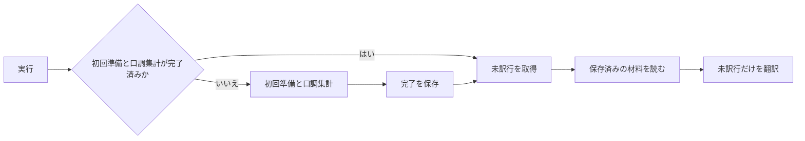

# Design: retry-untranslated-records

`design.md` は「どう実装するか」を人間が読んで判断するための説明を持つ。
要求は `plan.md`、確定仕様は `spec.md` が持つ。両者が食い違う場合は `spec.md` を優先する。

---

## R-1 未訳件数を表示する

### 現況の理解

`internal/store/target_plugin.go` の `CountUntranslated` は、対象 plugin の `narration`、`line`、`proper_noun` に残る `status = 0` を同じ数え方で合計する。機械派生した人名の部分形は翻訳対象から外す。

`internal/api/app.go` の `RunExtractAndTranslate` は、同期翻訳が完了した後に `CountUntranslated` を呼び、`RunResult.UntranslatedCount` で frontend へ返す。翻訳自体が失敗した場合は未訳件数を成功結果として返さない。

`frontend/src/ui/screens/translation-run/TranslationRunContainer.svelte` の `onRun` と `frontend/src/ui/screens/translation-run/translation-run-presentation.ts` の `untranslatedNotice` は、未訳が 1 件以上残った場合に件数と再実行の案内を表示する。未訳が 0 件の場合は案内を表示しない。

| | 単位 |
| --- | --- |
| 要求が扱う対象 | 同期翻訳の完了後に未訳のまま残った翻訳対象 1 件 |
| 受け皿が持つキー | `narration.id`、`line.id`、`proper_noun.id`。対象 plugin の集計キーは `plugin` |

### あるべき形

同期翻訳の完了結果は、対象 plugin に残る未訳の件数を持つ。画面は未訳が残る場合だけ、その件数を表示する。

実行時タグの欠落または翻訳時の飛ばせる失敗は、訳文を書き戻さず `status = 0` を保つ。未訳件数は、同じ対象を数える。

### 変更点

既存の `internal/store/target_plugin.go` の `CountUntranslated`、`internal/api/app.go` の `RunExtractAndTranslate`、`frontend/src/ui/screens/translation-run/translation-run-presentation.ts` の `untranslatedNotice` が要求を満たしているため、振る舞いを変更しない。R-2 の再実行経路でも、翻訳完了後は同じ `CountUntranslated` と `untranslatedNotice` を通す。

---

## R-2 未訳だけを再実行する

### 現況の理解

`target_plugin` は plugin ファイル名を主キーに持ち、選択したフルパスと初回登録時刻を保存する。`internal/store/target_plugin.go` の `UpsertTargetPlugin` は `internal/api/app.go` の `prepareForTranslation` の先頭で呼ばれるため、初回準備が途中で失敗した場合も登録行が残る。登録行の存在だけでは、未訳行を直接翻訳できる状態か判定できない。

`internal/api/app.go` の `RunExtractAndTranslate` は、初回実行と登録済み plugin の再実行を区別しない。どちらも `prepareForTranslation` を通り、Data フォルダ全体の既訳収集、対象 plugin の抽出、横断辞書の派生、取込を実行する。

`internal/engine/engine.go` の `Engine.Run` は、対象 plugin の `status = 0` の固有名、叙述文、台詞だけを取得する。一方、未訳行を翻訳する前に `GeneratePersonas` で全話者の口調を再集計する。機械置換そのものは `translateNarrations` と `translateLines` が持つ未訳行のループ内だけで行われる。

未訳行の送信文面を組むためには、保存済みのプロンプトテンプレート、指示文、横断辞書、plugin 内訳語、既訳、口調を読む必要がある。既訳の再収集、plugin の再抽出、横断辞書の再派生、取込、全話者の口調再集計は必要ない。

| | 単位 |
| --- | --- |
| 要求が扱う対象 | 登録済み plugin に残る未訳の翻訳対象 1 件 |
| 受け皿が持つキー | `target_plugin.plugin` と、各翻訳対象の `id`、`plugin`、`status` |

### 現況

再実行でも初回と同じ経路を通る。未訳行の件数が少なくても、B から F までが繰り返される。

### あるべき形

`target_plugin` は、同期翻訳が未訳行を直接処理できる状態かを `sync_retry_ready` で保存する。`sync_retry_ready = 1` は、既訳収集、抽出、横断辞書の派生、取込、全話者の口調集計が完了したことを表す。登録済みであっても `0` の行は初回経路を通る。

再実行は `status = 0` の行だけを読み、保存済みの材料から各未訳行の送信文面を組む。機械置換は読み出した未訳の叙述文と台詞にだけ適用する。辞書の材料や口調は作り直さない。

対象 plugin の成果を削除すると `target_plugin` の行も消える。削除後の実行は初回経路へ戻る。batch 翻訳の準備を行う場合は `sync_retry_ready` を解除する。batch が全話者の口調集計と本文の送信文面の組み立てを完了した時点で `1` へ戻し、後の同期再実行が保存済みの材料を使えるようにする。

### 変更点

- `db/migrations/0020_sync_retry_ready.sql`: `target_plugin` に `sync_retry_ready` を追加する。既存行は、訳のある翻訳対象が 1 件以上あり、かつ `batch_translation.stage = 'proper_noun'` の進行中 batch が無い場合だけ `1` へ移す。同期翻訳では訳文を書き戻す前に全話者の口調集計が完了する。batch では `body` 段へ進む前に全話者の口調集計が完了する。固有名段の batch と、完了を判定できない全件未訳の既存行は `0` のままにする。
- `internal/store/target_plugin.go`: `UpsertTargetPlugin` が初回準備の開始時に `sync_retry_ready = 0` を書く。同期翻訳の準備と口調集計が完了した時に `1` を書く関数と、現在値を読む関数を追加する。削除は既存どおり `target_plugin` の行ごと消す。
- `internal/api/app.go` の `Store` と `RunExtractAndTranslate`: `sync_retry_ready` を読む。`0` の場合は `prepareForTranslation` と `Engine.GeneratePersonas` を実行してから `1` を保存し、未訳行の翻訳へ進む。`1` の場合は両処理を呼ばず、未訳行の翻訳へ直接進む。完了結果の未訳件数は R-1 と同じ経路で返す。
- `internal/engine/engine.go` の `Engine.Run`: 全話者の口調集計と、保存済みの材料を使う未訳行の翻訳を分ける。既存の `Run` は両方を順に呼ぶ振る舞いを保つ。`RunExtractAndTranslate` からは、初回だけ `GeneratePersonas` を呼び、その後は未訳行の翻訳部分を呼ぶ。未訳行の取得、送信文面の組み立て、翻訳結果の書き戻し、飛ばせる失敗の扱いは共通処理を使う。
- `internal/engine/batch.go` の `BatchStore` と `submitBodyBatch`: `planBodyRequests` が全話者の口調集計と本文の送信文面の組み立てを完了した後、`sync_retry_ready = 1` を保存する。固有名 batch の反映前と、`planBodyRequests` が失敗した場合は `0` を保つ。
- `frontend/src/ui/screens/translation-run/TranslationRunContainer.svelte`: 実行開始時に抽出段を決め打ちせず、backend が最初に送る進捗を待つ。初回は `prepareForTranslation` の抽出段が表示され、再実行は未訳行の翻訳段から表示される。表示部品、文言、layout、style は変更しない。

---

## 検討が必要なこと

- なし
