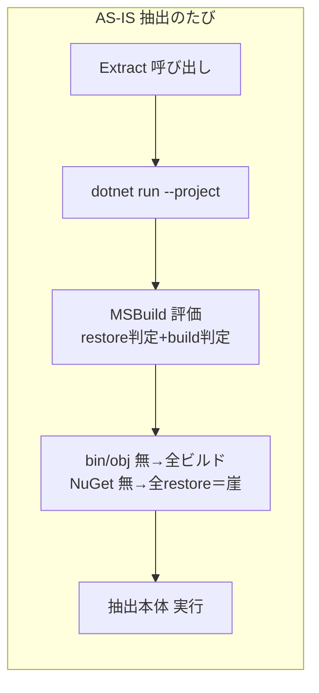
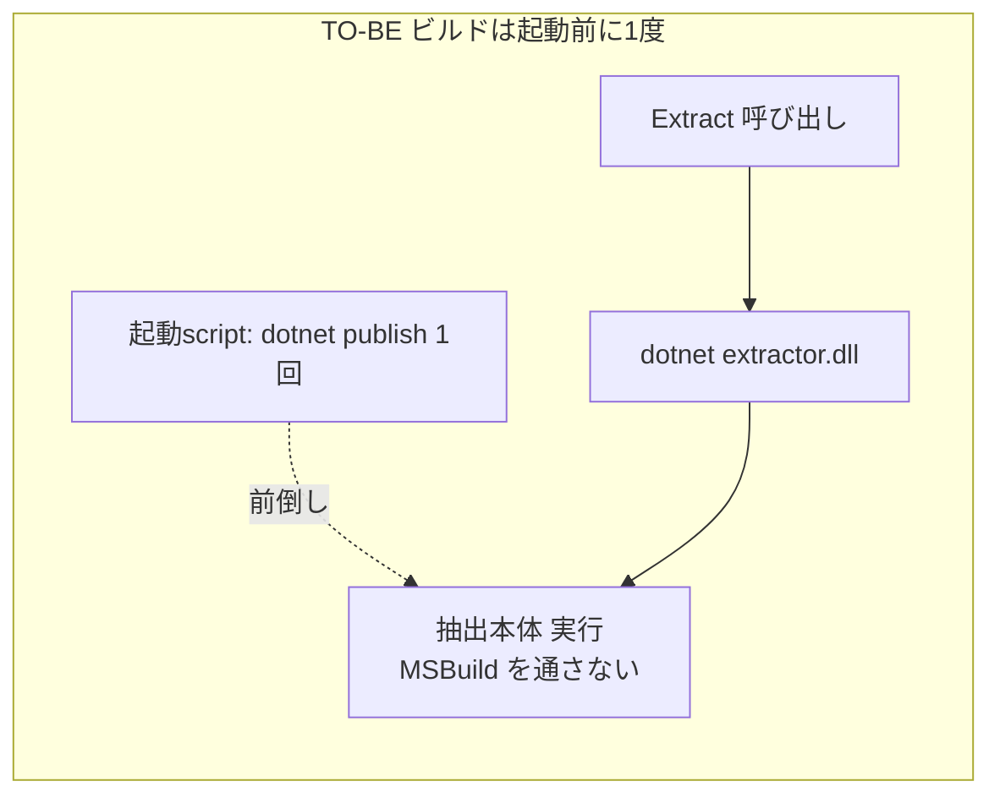
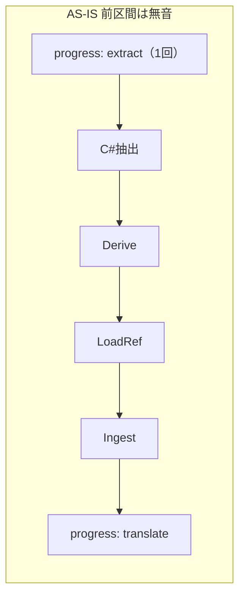
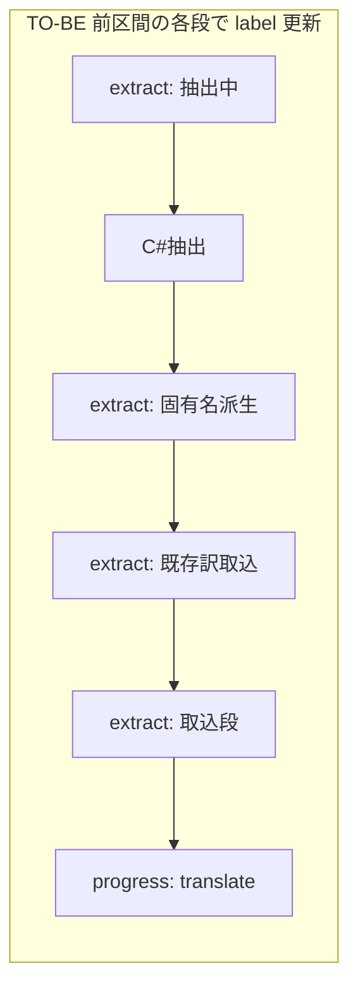

# Design: slow-plugin-extraction

`design.md` は「どう直すか」だけを持つ。再現確認・原因究明は `investigation.md` が持つ。

`investigation.md` の確定は「抽出処理そのものは高速。6 分は available データで再現せず、最有力原因は初回 `dotnet run` の NuGet restore ＋ビルド崖」。よって本設計は、症状（体感の遅さと固まり）を生む構造を恒久的に直す 2 件を主とし、非線形リスクの予防 1 件を従に置く。

## 実装方針

### 修正1: C# 抽出子を publish 済み DLL 直実行へ切り替える（ビルド/restore 崖を消す）

**AS-IS（現状）**

`DotnetExtractor.Extract`（`internal/api/app.go:77`）が抽出のたびに `dotnet run --project tools/extractor -- <args>` を起動する（引数組立 `buildExtractorArgs` は `app.go:800`）。`dotnet run` は毎回 MSBuild を評価する（restore 判定 ＋ build 判定）。bin/obj が無ければ全ビルド、NuGet キャッシュが無ければ Mutagen 一式を全 restore する。この restore ＋全ビルドが崖で、初回や キャッシュ消失時に数分かかりうる（観測 6 分の最有力候補）。

**TO-BE（変更後）**

抽出子のビルドを「抽出のたび」から「起動前に 1 度」へ移す。抽出時は毎回、ビルド済み DLL を `dotnet <extractor.dll> <args>` で直接実行する（MSBuild を通さないので sub-second で起動する）。

- ビルドの起動点: dev 起動 script `scripts/dev/run-wails.sh` に、`wails dev` の前で `dotnet publish tools/extractor`（または `dotnet build`）を 1 度実行する行を足す。崖を app 操作前へ前倒しし、抽出時にはビルドを起こさない。Go 側のフォールバック build は持たせない（起動点を script に一本化する。人間確定）。
- 呼び出しの変更: `ExtractorConfig` が持つのを「project パス」から「ビルド済み DLL パス（または publish 出力ディレクトリ）」へ変える。`buildExtractorArgs` を `run --project <proj> --` から `<dll> --` へ変える。`DotnetExtractor.Extract` は `dotnet <dll> <args>` を起動する。
- DLL 不在時の扱い: 抽出時に DLL が無ければ、無言でビルドせず「抽出子が未ビルド」と分類できるエラーを返す（抽出経路を毎回 sub-second・決定的に保つ）。
- 配布 app 対応は今回やらない。dev 経路の DLL 化に絞る。配布 app での抽出子同梱（self-contained publish ＋ `wails build` 成果への同梱 ＋ packaged パス解決 ＋ 配布フロー新設）は規模が大きいため `docs/known-issues.md` 課題6 に残し、`feature-workflow` の別 task で扱う（人間確定）。

### 修正2: 翻訳前区間にサブ進捗を出す（無音で固まって見えないようにする）

**AS-IS（現状）**

`RunExtractAndTranslate`（`internal/api/app.go:413`）は開始時に `ProgressEvent{Stage:"extract"}` を 1 回だけ push し、その後 C# 抽出子 → `DeriveMasterTerms` → `LoadReferenceTranslations` → `Ingest` を進捗イベントなしで実行する。次のイベントは翻訳段の `Stage:"translate"` まで飛ぶ。frontend の `ProgressStage`（`translation-run-view.ts:8`）は `extract | translate` の 2 値で、翻訳前区間の間はずっと単一の `extract` 表示になる。遅いとき、進んでいるのか固まったのか区別できない。

**TO-BE（変更後）**

翻訳前区間のサブ段の境界ごとに進捗イベントを出し、どの段まで進んだかを表示する。修正1で C# 区間が数秒に収まるため、各サブ段は短時間で切り替わり、無音区間が消える。

- `ProgressEvent` に段内の位置を表す label を 1 つ足す（段の種別は `extract` のまま増やさない）。C# 抽出完了・`DeriveMasterTerms` 完了・`LoadReferenceTranslations` 完了・`Ingest` 完了の 4 点で label 付きイベントを push する。
- frontend は `extract` 段のとき label を添えて表示する（進捗バーは翻訳段のまま。前区間は件数を持たないため label 表示にとどめる）。

### 修正3（予防）: OwnsRecord の Normalize 再計算を memoize する

**AS-IS（現状）**

`PluginEnvironment.OwnsRecord`（`tools/extractor/PluginEnvironment.cs:33`）は、override record ごとに own 側と全 master 側の `RecordDataIndex.Normalize`（`RecordDataIndex.cs:97`。zlib 展開 ＋ 2 回 Sort）を呼ぶ。`Normalize` は memoize されておらず、同じ FormKey でも呼ぶたび再計算する。available データ（master 連鎖 6 件）では数百 ms に収まり顕在化しないが、master 依存が数十件に及ぶ mod では record 数 × master 数に比例して効く。

**TO-BE（変更後）**

`RecordDataIndex` に FormKey → 正規化 data の cache（`Dictionary<FormKey, byte[]>`）を持たせ、`Normalize` を初回計算・以降 cache 返却にする。抽出結果（所有判定の真偽）は変えず、再計算だけを省く。available データで実測が悪化しないこと、master 多数 mod で計算量が record 数 × master 数から実質 record 数へ下がることを狙う。

この項は観測で顕在化していない予防的効率化だが、master 多数 mod への備えとして今回 scope に含める（人間確定）。

### 動かす範囲と観測点

- 修正1・2: 実 app（`npm run dev:wails:run`、`http://localhost:34115`）で Outfit などを抽出し、翻訳前区間でビルドが起きないこと（初回以外は DLL 直実行のみ）と、前区間の label が段ごとに切り替わることを目視で確かめる。
- 修正3: C# 抽出子を該当 mod で実行し、抽出行数が memoize 前と一致（正しさ不変）し、所要が悪化しないことを実測で確かめる。
- 最小実装・空実装で満たしたことにしない。前区間でビルドが起きず、label が切り替わり、抽出結果が不変であることまでを「動く」とする。

## 検討が必要なこと

なし（下記のとおり人間修正レビューで確定済み）。

- 修正1 のビルド起動点: dev 起動 script での事前 publish に一本化する（Go フォールバックなし）。
- 修正1 の packaged app 対応: 今回やらない。dev 経路の DLL 化に絞り、配布対応は `known-issues.md` 課題6 で `feature-workflow` の別 task に回す。
- 修正3（Normalize memoize）: 今回 scope に含める。
