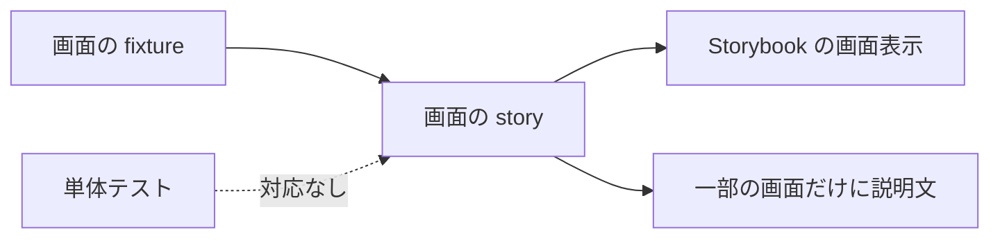
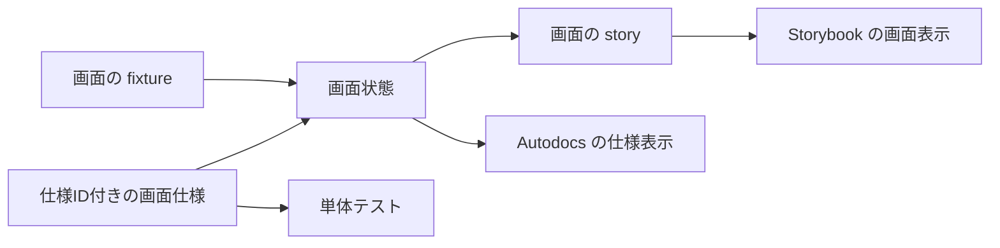

# Design: storybook-screen-spec-harness

`design.md` は、画面仕様を人間が読む経路と、単体テストが同じ仕様IDを消費することを確かめる経路を説明する。
要求は `plan.md`、確定仕様は `spec.md` が持つ。

---

## R-1 screens の画面仕様を Autodocs で読めるようにする

### 現況の理解

対象は `frontend/src/ui/screens/` にある三つの画面である。

| 画面 | 画面の story | 現在の状態 |
| --- | --- | --- |
| 翻訳対象プラグイン | `target-plugins/TargetPluginsScreen.stories.ts` | 7つの画面状態とfixtureを持つ。`Autodocs` と画面仕様の説明は持たない。 |
| プロンプトテンプレート | `template-editor/TemplateEditorScreen.stories.ts` | 4つの画面状態とfixtureを持つ。`Autodocs` と画面仕様の説明は持たない。 |
| 翻訳実行 | `translation-run/TranslationRunScreen.stories.ts` | 6つの画面状態を持つ。`Autodocs` と、各storyの前提条件・期待値を文章で持つ。仕様IDは持たない。 |

既存のstoryが持つ画面状態について、story間で異なるfixtureの値がSvelteコンポーネントの直接の分岐で変える画面仕様と、storyの説明文が明記する非表示を次に固定する。
storyのコメントと説明文は、画面状態を置いた意図の根拠に使う。
状態間で変わらずstoryの説明文にもない表示と、画面部品の内部で意味が閉じる表示は画面仕様へ加えない。

#### 翻訳対象プラグイン画面

| 画面状態 | 画面仕様ID | 人間が観測する画面仕様 |
| --- | --- | --- |
| 空状態 | `target-plugins.empty.proceed-disabled` | pluginを選んでいない時は「翻訳へ進む」が無効になる。 |
| 空状態 | `target-plugins.empty.list-empty` | pluginの一覧が空であることを案内する。 |
| 読み込み中 | `target-plugins.loading.list-loading` | 読み込み中の表示と「プラグインを読み込んでいます。」を表示する。 |
| 一覧 | `target-plugins.list.count` | 一覧にあるpluginの件数を表示する。 |
| 一覧 | `target-plugins.list.progress-badges` | 各行の件数に対応して「完了」「未着手」「翻訳中」の状態バッジを表示する。 |
| 一覧 | `target-plugins.list.row-actions` | 各行に結果を開くbuttonと削除buttonを有効な状態で表示する。 |
| plugin選択済み | `target-plugins.selected.proceed-enabled` | pluginを選んだ時は「翻訳へ進む」が有効になる。 |
| 削除確認中 | `target-plugins.confirm-delete.prompt` | 削除対象の行だけに削除確認を表示する。 |
| 削除確認中 | `target-plugins.confirm-delete.actions-enabled` | 「削除する」と「取消」を有効にする。 |
| 削除実行中 | `target-plugins.deleting.progress` | 「削除中…」と処理中の表示を出す。 |
| 削除実行中 | `target-plugins.deleting.actions-disabled` | 「削除中…」と「取消」が無効になる。 |
| エラー | `target-plugins.error.message` | エラーの内容を画面に表示する。 |

#### プロンプトテンプレート画面

| 画面状態 | 画面仕様ID | 人間が観測する画面仕様 |
| --- | --- | --- |
| ベースtab | `template-editor.base.content` | ベースtabを選択状態にし、ベースの指示文を表示する。 |
| ベースtab | `template-editor.base.unsaved-hidden` | 未保存の案内を表示しない。 |
| ベースtab | `template-editor.base.actions-disabled` | 「戻す」と「保存」が無効になる。 |
| レコード別tab | `template-editor.record.content` | レコード別tabを選択状態にし、口調とレコード別の指示文を表示する。 |
| レコード別tab | `template-editor.record.unsaved-hidden` | 未保存の案内を表示しない。 |
| レコード別tab | `template-editor.record.actions-disabled` | 「戻す」と「保存」が無効になる。 |
| 口調とPC性別を変更 | `template-editor.tone-edited.unsaved` | 「未保存の変更」を表示する。 |
| 口調とPC性別を変更 | `template-editor.tone-edited.actions-enabled` | 「戻す」と「保存」が有効になる。 |
| 指示文を変更 | `template-editor.directive-edited.unsaved` | 「未保存の変更」を表示する。 |
| 指示文を変更 | `template-editor.directive-edited.actions-enabled` | 「戻す」と「保存」が有効になる。 |

#### 翻訳実行画面

| 画面状態 | 画面仕様ID | 人間が観測する画面仕様 |
| --- | --- | --- |
| 未開始 | `translation-run.not-started.phase-badge` | 状態バッジに「未実行」を表示する。 |
| 未開始 | `translation-run.not-started.main-action` | 「バッチ実行」を有効にする。 |
| 未開始 | `translation-run.not-started.manual-actions-hidden` | 状態確認ボタンと手動取り込みボタンを表示しない。 |
| 実行中 | `translation-run.running.phase-badge` | 状態バッジに「実行中」を表示する。 |
| 実行中 | `translation-run.running.main-action` | 処理中の表示を伴う「実行中…」を無効にする。 |
| 実行中 | `translation-run.running.manual-actions-hidden` | 状態確認ボタンと手動取り込みボタンを表示しない。 |
| 途中停止 | `translation-run.paused.phase-badge` | 状態バッジに「未実行」を表示する。 |
| 途中停止 | `translation-run.paused.main-action` | 「バッチ実行を再開」を有効にする。 |
| 途中停止 | `translation-run.paused.manual-actions-hidden` | 状態確認ボタンと手動取り込みボタンを表示しない。 |
| 完了・未訳なし | `translation-run.done.phase-badge` | 状態バッジに「完了」を表示する。 |
| 完了・未訳なし | `translation-run.done.main-action` | 「完了」を無効にする。 |
| 完了・未訳なし | `translation-run.done.manual-actions-hidden` | 状態確認ボタンと手動取り込みボタンを表示しない。 |
| 完了・未訳なし | `translation-run.done.notice` | 本文の取り込みと翻訳の完了を案内する。 |
| 完了・未訳あり | `translation-run.done-untranslated.phase-badge` | 状態バッジに「完了」を表示する。 |
| 完了・未訳あり | `translation-run.done-untranslated.main-action` | 「未訳だけを再送信」を有効にする。 |
| 完了・未訳あり | `translation-run.done-untranslated.manual-actions-hidden` | 状態確認ボタンと手動取り込みボタンを表示しない。 |
| 完了・未訳あり | `translation-run.done-untranslated.notice` | 未訳件数を表示する。 |
| 失敗 | `translation-run.failed.phase-badge` | 状態バッジに「失敗」を表示する。 |
| 失敗 | `translation-run.failed.main-action` | 「バッチ実行を再開」を有効にする。 |
| 失敗 | `translation-run.failed.manual-actions-hidden` | 状態確認ボタンと手動取り込みボタンを表示しない。 |
| 失敗 | `translation-run.failed.error` | 外部batch IDと失敗理由を表示する。 |

各画面の Svelte コンポーネントは、propsで受けた画面状態から表示と操作可否を決める。
`TargetPluginsScreen.svelte` は、新しいpluginの選択、一覧の読み込み、空状態、削除確認、削除実行、エラー、進捗の状態バッジを扱う。
`TemplateEditorScreen.svelte` は、表示するtab、未保存、保存中、保存と戻す操作の可否を扱う。
`TranslationRunScreen.svelte` は、provider、翻訳処理の状態、状態バッジ、主操作、進捗、エラー、結果一覧を扱う。

provider選択とモデル取得は既存の六つの翻訳実行画面storyで変わらないため、今回の画面仕様へ含めない。
結果一覧は`ResultsPanel`の内部で意味が閉じ、`UI Components`のstoryが扱うため、今回の画面仕様へ含めない。

要求が扱う単位は、画面状態のもとで人間が観測する一つの表示、状態バッジ、ボタンの文言、またはボタンの操作可否である。
既存のstoryが持つ単位は、複数の表示と操作可否をまとめて再現する画面状態である。

| | 単位 |
| --- | --- |
| 要求が扱う対象 | 画面状態のもとで観測する一つの表示、状態バッジ、ボタンの文言、またはボタンの操作可否 |
| 既存のstoryが持つキー | 画面ごとのexport名と画面状態のfixture |

### あるべき形

画面ごとに、画面状態と画面仕様を同じ定義へ置く。
画面状態はstory名、前提条件、fixtureを持つ。
画面仕様は画面仕様IDと、人間が観測する表示、状態バッジ、ボタンの文言、またはボタンの操作可否を一つ持つ。
一つの画面状態は複数の画面仕様を持てる。

storyは画面状態のfixtureを表示する。
`Autodocs` は同じ画面状態から、画面状態の前提条件と仕様ID付きの画面仕様を表示する。
`Autodocs` は画面仕様を人間が読む入口であり、テスト実行を担当しない。

画面仕様の対象は、`Screens/<画面名>` に置く画面storyだけに限定する。
`UI Components` とナビゲーション確認用のstoryは対象に含めない。

#### 現況

画面状態はstoryとfixtureで再現できる。
画面仕様の説明と単体テストの対応は、画面ごとに異なる。

#### あるべき形

画面状態が、Storybookの表示とAutodocsの説明を結ぶ。
画面仕様の仕様IDが、Autodocsと単体テストを結ぶ。

### 変更点

- `frontend/src/ui/screens/screen-spec.ts` を追加する。`ScreenSpec`、`ScreenState`、`defineScreenState`、`screenStateDescription`、`screenSpecIds`を定義する。
- `frontend/src/ui/screens/target-plugins/target-plugins-screen-specs.ts` を追加する。`targetPluginScreenStates`として、上表の画面状態、画面仕様ID、画面仕様、既存fixtureを持つ。
- `frontend/src/ui/screens/template-editor/template-editor-screen-specs.ts` を追加する。`templateEditorScreenStates`として、上表の画面状態、画面仕様ID、画面仕様、既存fixtureを持つ。
- `frontend/src/ui/screens/translation-run/translation-run-screen-specs.ts` を追加する。`translationRunScreenStates`として、上表の画面状態、画面仕様ID、画面仕様、既存fixtureを持つ。
- `TargetPluginsScreen.stories.ts`の`Empty`、`Loading`、`List`、`Selected`、`ConfirmDelete`、`Deleting`、`Errored`を変更する。対応する画面状態のfixtureと、`screenStateDescription`が作る説明文を使い、`Autodocs`を有効にする。
- `TemplateEditorScreen.stories.ts`の`BaseTab`、`RecordTab`、`RecordTabToneDefaultEdited`、`RecordTabDirty`を変更する。対応する画面状態のfixtureと、`screenStateDescription`が作る説明文を使い、`Autodocs`を有効にする。
- `TranslationRunScreen.stories.ts`の`NotStarted`、`Running`、`Paused`、`Done`、`DoneWithUntranslated`、`Failed`を変更する。対応する画面状態のfixtureと、`screenStateDescription`が作る説明文を使う。
- 対応表にない画面状態、画面仕様ID、画面仕様は追加しない。画面表示、画面の処理、既存fixtureの値は変更しない。

---

## R-2 画面仕様を単体テストが消費していることをハーネスで確かめる

### 現況の理解

`frontend/vitest.config.ts` は `src/**/*.test.ts` を `jsdom` で実行する。
`TranslationRunScreen` の周辺にはSvelteコンポーネントと表示用関数の単体テストがある。
`TargetPluginsScreen` と `TemplateEditorScreen` には、画面単位の単体テストがない。
どの単体テストも、画面仕様の仕様IDをkeyとして持たない。

backendの `test-oracle/specs.json` と `internal/harness/oracle_test.go` は、仕様IDと検証関数のkey集合を比較して不足を検出する。
frontendには同じ役割を持つ仕組みがない。

要求が扱う単位は一つの画面仕様IDである。
単体テストの受け皿は、一つの画面仕様IDに対応する一つの検証関数とする。

| | 単位 |
| --- | --- |
| 要求が扱う対象 | 一つの画面仕様ID |
| 単体テストが持つキー | 一つの検証関数へ対応する画面仕様ID |

### あるべき形

画面ごとの単体テストは、画面仕様IDと検証関数の組を配列へ登録する。
検証関数は、画面仕様が属する画面状態のfixtureで画面を表示し、画面仕様IDが指す表示、状態バッジ、ボタンの文言、またはボタンの操作可否を検証する。

ハーネスは、画面仕様にある仕様IDと、検証関数にある仕様IDを比較する。
ハーネスは、配列の比較前に画面仕様側と単体テスト側の重複を検出する。
ハーネスは、不足、余分、重複を失敗にする。
ハーネスは、登録した検証関数を仕様IDごとに単体テストとして実行する。

仕様IDは対応の存在を確かめるkeyである。
仕様文と検証内容が意味的に一致することはコードから自動判定できない。
人間はAutodocsの仕様文と、失敗時に表示される仕様IDを使って対応を確認する。

Storybookの `play` は使わない。
単体テストはVitestとTesting Libraryを使い、propsで画面状態を固定したSvelte画面を直接表示する。
backend、Wails境界、gateway、containerの処理は呼ばない。

### 変更点

- `frontend/src/test/screen-spec-harness.ts` を追加する。`ScreenSpecCheck`、`validateScreenSpecCoverage`、`runScreenSpecHarness`を定義する。`validateScreenSpecCoverage`は不足、余分、画面仕様側の重複、単体テスト側の重複を検出する。`runScreenSpecHarness`は画面仕様IDをtest case名に含め、検証関数を実行する。
- `frontend/src/test/screen-spec-harness.test.ts` を追加する。`validateScreenSpecCoverage`が一致を通し、不足、余分、画面仕様側の重複、単体テスト側の重複をそれぞれ失敗にすることを検証する。
- `frontend/src/ui/screens/target-plugins/TargetPluginsScreen.spec.test.ts` を追加する。`targetPluginScreenChecks`として、翻訳対象プラグイン画面の各画面仕様IDと検証関数を登録し、`runScreenSpecHarness`へ渡す。
- `frontend/src/ui/screens/template-editor/TemplateEditorScreen.spec.test.ts` を追加する。`templateEditorScreenChecks`として、プロンプトテンプレート画面の各画面仕様IDと検証関数を登録し、`runScreenSpecHarness`へ渡す。
- `frontend/src/ui/screens/translation-run/TranslationRunScreen.spec.test.ts` を追加する。`translationRunScreenChecks`として、翻訳実行画面の各画面仕様IDと検証関数を登録し、`runScreenSpecHarness`へ渡す。
- 既存の単体テストは変更しない。新しい画面単位の単体テストは、既存の単体テストと別のfileへ置く。

---

## 検討が必要なこと

- なし。
