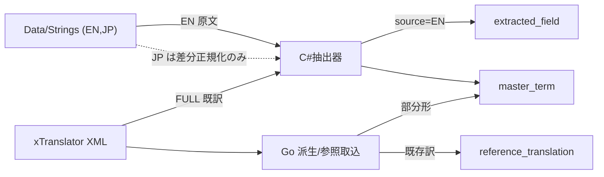
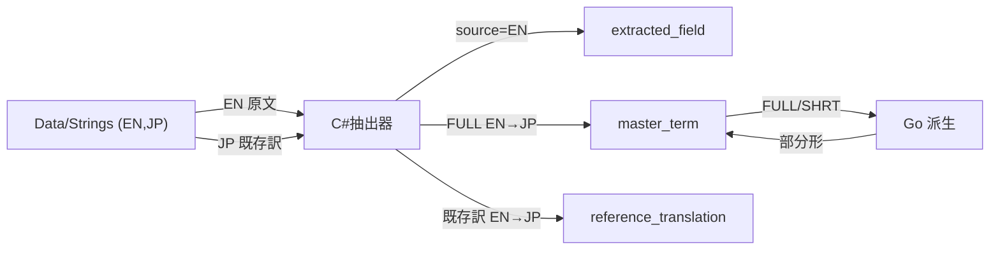

# Design: strings-based-reference

`design.md` は「どう実装し、どう直すか」だけを持つ。実装範囲の scope 列挙とテスト設計は持たない（実装モジュールが扱う）。

## 実装方針

**結論**: 日本語の既存訳と固有名の権威訳を、xTranslator 英日 XML でなく Data フォルダの Strings（english / japanese）から解決する。日本語本文を DB へ書く経路を C# 抽出器に新設し、xTranslator XML を供給源から外す。

### AS-IS（現状）

固有名辞書（master_term）と参照訳（reference_translation）は、いずれも xTranslator 英日 XML を供給源にしている。

- **固有名の base 既訳**: C# 抽出器 `MasterTermXmlWriter` が xTranslator XML の `REC:FULL` 行から `master_term (source, dest)` を書く（XML ディレクトリが無ければ skip）。
- **固有名の部分形**: Go `DeriveMasterTerms` が XML から名のみ・短名を派生し `master_term` へ追記する（XML ディレクトリが無ければ error）。
- **参照訳**: Go `LoadReferenceTranslations` が XML の `REC:Source/Dest` を `reference_translation (rec, field, source, dest)` へ取り込む（XML ディレクトリが無ければ error）。翻訳段は原文が完全一致する行で既存訳を流用し、AI 翻訳を省く。
- **Data の Strings**: C# 抽出器は english と指定言語の Strings を読む機能を持つが、用途は差分正規化（無変更 stub の判定）に限る。`extracted_field` に書く原文は english のみで、japanese 本文は DB に落ちない。抽出器は既定言語 english で動く（Go は `--language` を渡さない）。

現状は xTranslator XML が必須依存で、`dictionaries/xTranslatorXMLs` を削除済みのため、いま実行すると Go の派生・参照取込が「XML が無い」で失敗する。

### TO-BE（変更後）

日本語の解決を C# 抽出器の Strings 読みへ寄せ、その結果を DB へ書く。

- **抽出器が english と japanese の Strings を対で読む**: 翻訳対象 record ごとに english 原文と、japanese Strings があれば japanese 既存訳を得る。現状の「取れた 1 言語だけ保持」を「english と japanese を対で保持」へ変える。
- **既存訳を DB へ書く**: japanese Strings がある record は、english 原文と japanese 既存訳の対を `reference_translation (source=EN, dest=JP)` として書く。翻訳段は現状どおり完全一致で既存訳を流用する（翻訳段のロジックは変えない。供給元だけ替える）。
- **固有名の権威訳を Strings 由来にする**: `NPC_:FULL` などの固有名フィールドの english 原文と japanese 既存訳の対を `master_term (source=EN, dest=JP)` として書く。Go の部分形派生は、供給元を XML から Strings 由来の対へ替えて再利用する（派生ロジック自体は変えない）。
- **xTranslator XML を供給源から外す**: Go の `DeriveMasterTerms` / `LoadReferenceTranslations` の XML 読みと、C# `MasterTermXmlWriter` の XML 読みを撤去し、供給を Strings へ一本化する。XML が無くても翻訳前処理は破綻せず進む。

**役割は不変**: `reference_translation`（原文と既存訳の対を完全一致で流用し AI 翻訳を省く）と `master_term`（固有名の権威訳）の役割は変えない。供給源を XML から Strings へ替えるだけで、テーブルの意味・翻訳段の使い方は同一。変わるのは供給源と、そこから来るカバレッジ（どの対が存在するか）だけ。

**片方しか無い時の画面警告**: Strings を使う plugin（localized）は、その時点でローカライズの意図がある。english / japanese の Strings が揃わず片方しか無い場合、対が欠けて既存訳を作れないため、画面に警告を出す。警告を出したうえで、既存訳なしで全文 AI 翻訳へ進む。localized でない plugin（Strings 不使用）はローカライズ意図が無いため警告しない。

**どこまで動かすか**: english と japanese の Strings が揃う Data フォルダを指定して抽出すると、既存訳と固有名権威訳が Strings 由来で DB に入り、翻訳段が既存訳を流用する。片方しか無い localized plugin は画面警告のうえ全文 AI 翻訳へ進む。

**観測点**:
- 実データ（english と japanese の Strings を持つ Data フォルダ）で実画面から抽出→翻訳を通し、既存訳が流用されることを確認する。
- 単体テストで、Strings の english/japanese 対から `reference_translation`・`master_term` を作る解決を確認する。

### AS-IS 図（現状の供給フロー）

### TO-BE 図（変更後の供給フロー）

**AS-IS から消える要素**: `xTranslator XML` ノードと、そこから `C#抽出器`・`Go 派生/参照取込` への供給線。Go が XML を読む経路も消える。
**TO-BE で増える要素**: `Data/Strings` の JP から `C#抽出器` を経て `master_term`・`reference_translation` へ日本語既存訳が書かれる供給線。現状 JP は DB に落ちていない。

## 決定済み（人間回答で解消）

- **役割は不変**: 参照訳・固有名権威訳の意味と役割は変わらない。供給源とカバレッジだけが変わる。「意味の変化」という論点は成立しない。
- **片方しか無い時**: 画面に警告を出したうえで、全文 AI 翻訳へ進む。条件は localized plugin で english / japanese の Strings が片方しか無い場合。
- **XML は完全撤去**: 任意の補助 import としても残さず、供給を Strings へ一本化する。
- **下流経路**: 画面警告の追加は表示変更のため `storybook-module` を経由し、その後 `implementation-module` へ進む。

## 検討が必要なこと

- なし（人間回答で全て解消）。
