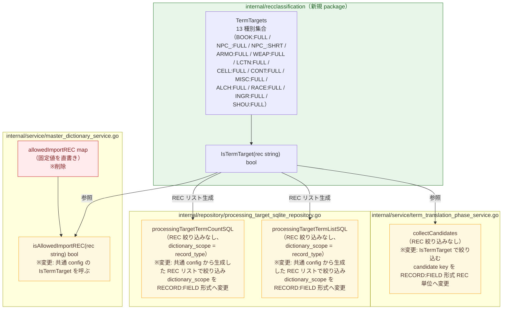

# term-target-rec-config 設計差分図

## 概要

- 図化目的: 単語翻訳フェーズ対象 REC と XML 辞書取り込み対象 REC を同一の 13 種別集合に統一し、共通判定関数 `IsTermTarget` を 1 つだけ作る内部構造変更を人間設計レビューで確認する。
- 根拠参照: `docs/exec-plans/active/term-target-rec-config/plan.md`、`internal/service/master_dictionary_service.go:28`、`internal/service/term_translation_phase_service.go:1667`、`internal/repository/processing_target_sqlite_repository.go:247,282`
- 範囲: 共通 config 新規追加、`master_dictionary_service.go` の `allowedImportREC` 削除と `isAllowedImportREC` 変更、`term_translation_phase_service.go` の `collectCandidates` 変更、`processing_target_sqlite_repository.go` の 2 SQL 変更、`dictionary_scope` 形式変更

## コンポーネント図

## 差分凡例

- 赤: 削除する要素または経路を示す。
- 緑: 追加する要素または経路を示す。
- 黄色: 変更する要素または経路を示す。

## 各箱の説明

- `internal/recclassification`（新規 package）: 単語翻訳対象 REC と XML 辞書取り込み対象 REC を共通の 13 種別集合として保持する共通 config。`IsTermTarget` 判定関数を 1 つだけ公開する。`XMLImportAllowed` 集合や `IsXMLImportAllowed` 関数は作らない。
- `TermTargets`: 単語翻訳フェーズと XML 辞書取り込みの両方で有効な REC 13 種別を集合として定義する。`BOOK:FULL` から `SHOU:FULL` の `RECORD:FIELD` 形式で保持する。`DOOR:FULL`、`FLOR:FULL`、`FURN:FULL` はこの集合に含まれない。
- `IsTermTarget`: 引数 `rec` が 13 種別集合に含まれるかを返す判定関数。`collectCandidates`、`isAllowedImportREC`、SQL 生成のすべてから呼ばれる。
- `allowedImportREC map`（削除）: `master_dictionary_service.go` に直書きされていた固定 map。共通 config の `IsTermTarget` へ移行するため削除する。
- `isAllowedImportREC`（変更）: `allowedImportREC` を直接参照する実装から、共通 config の `IsTermTarget` を呼ぶ実装へ変更する。
- `collectCandidates`（変更）: REC 絞り込みなしで全候補を作っていた実装を、`IsTermTarget` で 13 種別に絞り込む実装へ変更する。candidate key を `record.RecordType + ":" + field.SubrecordType` で組み立てた `RECORD:FIELD` 形式へ変更し、`NPC_:FULL` と `NPC_:SHRT` を別候補として区別できるようにする。
- `processingTargetTermCountSQL`（変更）: `dictionary_scope = record_type` で REC 絞り込みなしだった SQL を、共通 config から生成した 13 種別リストで `record_type IN (...)` 絞り込みを追加し、`dictionary_scope` の比較対象を `RECORD:FIELD` 形式へ変更する。
- `processingTargetTermListSQL`（変更）: 同上。

## 検証観点との対応

| 検証観点 | 対応する変更箇所 |
| --- | --- |
| 単語翻訳フェーズ候補に 13 種別だけが含まれる | `collectCandidates` の `IsTermTarget` 絞り込み、SQL の `IN (...)` 絞り込み |
| XML 辞書取り込み対象も同じ 13 種別であり、DOOR/FLOR/FURN は含まれない | `isAllowedImportREC` が `IsTermTarget` を呼ぶ。`allowedImportREC` 固定 map は削除される |
| `NPC_:FULL` と `NPC_:SHRT` が別候補として扱われる | `collectCandidates` の candidate key を `record.RecordType + ":" + field.SubrecordType` で組み立てる形式へ変更 |
| 処理対象一覧（repository）と実行対象（service）が同じ REC 集合で一致する | 両者が同じ `IsTermTarget` および共通 config から生成した REC リストを参照する |
| 共通辞書完全一致 REC は AI 対象から除外される | SQL の `NOT EXISTS` 節は現状維持、`dictionary_scope` を `RECORD:FIELD` 形式へ揃える |

## 検証

- Mermaid 記述確認: `flowchart TB` 宣言あり、`subgraph` による package 境界の箱あり、追加（緑）・削除（赤）・変更（黄色）の `classDef` と `class` 割り当てあり、矢印による参照関係の接続あり。
- Markdown 確認: 概要、差分凡例、各箱の説明、検証観点との対応テーブルがすべて揃っている。
