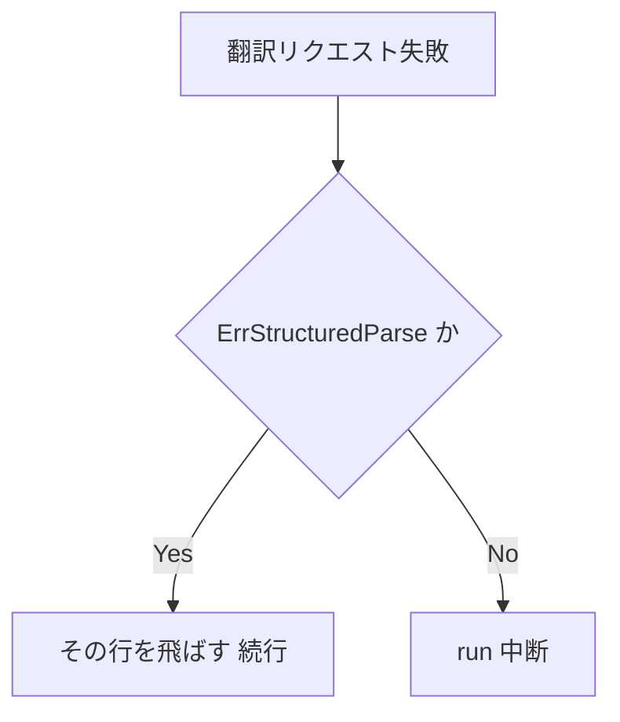
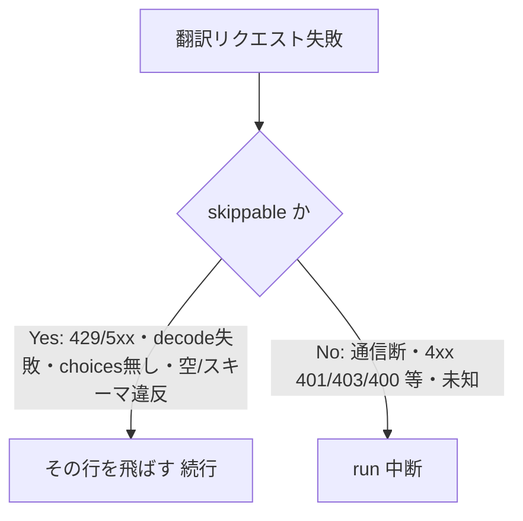

# Design: translate-run-failure-isolation

`design.md` は「どう実装し、どう直すか」だけを持つ。実装範囲の scope 列挙とテスト設計は持たない（実装モジュールが扱う）。修正フローの再現確認・原因究明は持たない（`investigation.md` が持つ）。

## 実装方針

`investigation.md` の確定原因は 2 つ。engine の本文フェーズ loop が `ErrStructuredParse` の 1 種類だけを飛ばし他を全部 run 中断にすること、provider が「その行だけ飛ばせる失敗」と「run を止めるべき失敗」を engine へ区別させる手掛かりを持たないこと。両方を直す。

方針は、失敗を種別で 2 分し、engine は分類だけを見て「その行を飛ばして続行」か「run を止める（fail-fast）」かを決める。分類は人間が確定した線引き（下表）に従う。

### 失敗種別ごとの分類（確定した線引き）

| 失敗種別 | 発生箇所 | 分類 | engine の挙動 |
| --- | --- | --- | --- |
| リクエスト生成失敗（marshal・newRequest） | provider `Translate` 前段 | fatal | run 中断 |
| 通信失敗（接続拒否・断・timeout・context 中断） | `client.Do` がエラー | fatal | run 中断 |
| 非 200 のうち 4xx かつ 429 以外（401/403 認証・400 不正・404 等） | status 判定 | fatal | run 中断 |
| 非 200 のうち 429（rate limit）・5xx（サーバ一時） | status 判定 | skippable | その行を未訳のまま飛ばす |
| 応答エンベロープの decode 失敗 | envelope decode | skippable | その行を未訳のまま飛ばす |
| 応答に `choices` が無い | choices 判定 | skippable | その行を未訳のまま飛ばす |
| content が空・スキーマ違反（`ErrStructuredParse`） | `extractTranslation` | skippable | その行を未訳のまま飛ばす（現状維持） |

engine の継続条件は「skippable と判別できた失敗だけ飛ばす。それ以外（fatal・分類できない未知の失敗）は run を止める」とする。未知の失敗を既定で止めるのは安全側に倒すためで、将来 provider に新しい失敗経路が増えても、黙って飛ばさず run を止めて人間に見せる。

分類の受け渡し方式（番兵エラーの構成、判定関数の置き場所）は実装モジュールで決める機械的帰結とする。HTTP status から skippable/fatal を分ける規則は入力から出力が一意に決まる純粋規則のため、実装モジュールで純粋関数へ分離し単体テストで固める。

### どこまで動かすか

- 観測点は単体テスト（engine の本文フェーズ loop と provider の失敗分類）とする。fatal を注入すると run が中断し、skippable を注入するとその行だけ未訳で残り run が最後まで続く、を fail-test で先に赤にしてから直す。
- skippable で飛ばした行は、既存の未訳流用と同じく再実行で拾える（`Run` は未訳行だけを対象にするため冪等）。

### AS-IS → TO-BE（1 リクエスト失敗時の分岐）

変わるのは「1 リクエストが失敗した時に run を止めるか、その行を飛ばして続けるか」を決める分岐条件だけである。AS-IS は飛ばせる失敗が `ErrStructuredParse` の 1 種類に固定され、TO-BE は skippable 集合（429/5xx・decode 失敗・choices 無し・空/スキーマ違反）へ広がる。fatal 集合（通信断・4xx の 401/403/400 等・未知）は run を止める側に残る。

**AS-IS（現状）**

**TO-BE（変更後）**

AS-IS から TO-BE で消える要素は無い。分岐の Yes 側の判定が「`ErrStructuredParse` だけ」から「skippable 集合」へ広がり、No 側（run 中断）に残るのは fatal 集合だけになる。箱の並びと命名は 2 図で同じにし、変わった判定条件だけが差として浮かぶようにした。

### 対症療法の回避

- 新しい status 値や状態フラグを行へ足して症状を隠す直し方は採らない。行の未訳・仮訳・確定訳の既存状態モデルはそのまま使い、飛ばした行は従来どおり未訳のまま残す。
- provider の失敗を握り潰して常に成功扱いにする直し方は採らない。fatal は必ず run を止めて人間へ見せる。

### 確認してほしい点（方針の帰結。ブロッカーではない）

- 通信失敗を fatal にしたため、1 リクエストの一時的な通信途絶（瞬断・timeout）でも run が止まる。これは「通信断は止める」の選択の帰結で、リトライ機構は本 task の scope 外とする。
- 429・5xx を飛ばす扱いにしたため、サーバ過負荷時は未訳行が増えるが run は完走する。残りは再実行で拾える（未訳行だけが対象で冪等）。

## 検討が必要なこと

- なし（失敗種別ごとの線引きは人間が確定済み）。
