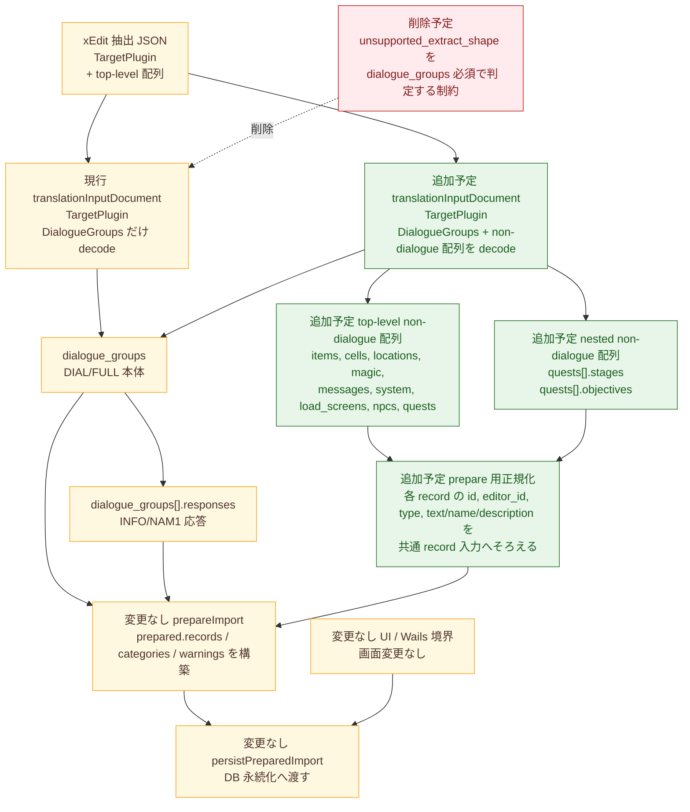

# translation-input-import-non-dialogue design diff

## 概要

- 図化目的: `internal/service/translation_input_import_service.go` の import 準備が `dialogue_groups` のみを扱う現行構造から、top-level と nested の non-dialogue record を `prepareImport` へ流せる構造へ変わる境界を固定する。
- 根拠参照: `docs/exec-plans/active/translation-input-import-non-dialogue/plan.md`、`internal/service/translation_input_import_service.go`、`dictionaries/Lucien.esp_Export.json`、`dictionaries/Dawnguard.esm_Export.json`
- 範囲: backend の JSON parse と import 準備の最小範囲だけを示す。画面変更、Wails DTO、永続化後段の transaction 境界は変更しない前提で範囲外とする。

## コンポーネント図

## 差分凡例

- 赤: 削除する制約または経路を示す。
- 緑: 追加する要素または経路を示す。
- 黄色: 変更しない要素または経路を示す。

## 図の説明

- 現行 `decodeTranslationInputDocument` は `TargetPlugin` と `dialogue_groups` しか `translationInputDocument` に受けず、`dialogue_groups` が空だと unsupported shape として失敗する。
- 現行 `prepareImport` は `dialogue_groups` を `prepareDialogueGroup` で処理し、nested `responses` を `prepareResponse` で処理する。結果として DIAL/FULL と INFO/NAM1 だけが `prepared.records` に入る。
- 変更後は `translationInputDocument` に top-level の non-dialogue 配列を追加し、`quests[].stages` と `quests[].objectives` の nested 配列も `prepareImport` 側へ流す。
- 変更後の追加処理は、配列ごとの差を `Normalize` で吸収し、各要素から `id`、`editor_id`、`type`、本文候補を共通 record 入力へそろえてから既存 `prepareImport` の集約先へ渡す。
- 永続化先の `persistPreparedImport` と transaction 境界は維持する。画面導線と Wails 境界も維持する。

## 各箱の説明

- `xEdit 抽出 JSON`: 実機 JSON の入力全体を示す。`target_plugin` と複数 top-level 配列を持つ。
- `現行 translationInputDocument`: 現行 struct の decode 範囲を示す。`dialogue_groups` 以外を保持しない。
- `削除予定`: 現行の「`dialogue_groups` がなければ import 不可」という制約を示す。
- `dialogue_groups`: 既存 import 対象の会話グループ本体を示す。
- `dialogue_groups[].responses`: 既存 import 対象の会話応答を示す。
- `追加予定 translationInputDocument`: non-dialogue 配列を保持できるように広げる decode 境界を示す。
- `追加予定 top-level non-dialogue 配列`: `items`、`cells`、`locations`、`magic`、`messages`、`system`、`load_screens`、`npcs`、`quests` を示す。
- `追加予定 nested non-dialogue 配列`: `quests` の子配列である `stages` と `objectives` を示す。
- `追加予定 prepare 用正規化`: 配列ごとに本文 key が異なる差を吸収し、record/field 化へ渡す前処理を示す。
- `変更なし prepareImport`: import 単位の集約先を示す。`prepared.records`、`categories`、`warnings` をここで蓄積する。
- `変更なし persistPreparedImport`: DB 永続化への受け渡し境界を示す。
- `変更なし UI / Wails 境界`: 本 task が画面変更なしであることを示す。

## 根拠

- `internal/service/translation_input_import_service.go:312` の `translationInputDocument` は `DialogueGroups []translationInputDialogueGroup` だけを持つ。
- `internal/service/translation_input_import_service.go:357-371` の `decodeTranslationInputDocument` は `TargetPlugin` が空、または `DialogueGroups` が 0 件の時に unsupported shape を返す。
- `internal/service/translation_input_import_service.go:521-557` の `prepareImport` は `document.DialogueGroups` をループし、`prepareDialogueGroup` と `prepareResponse` の結果だけを `prepared.records` に追加する。
- `dictionaries/Lucien.esp_Export.json` と `dictionaries/Dawnguard.esm_Export.json` の top-level key は `cells`、`dialogue_groups`、`items`、`load_screens`、`locations`、`magic`、`messages`、`npcs`、`quests`、`system`、`target_plugin` で一致する。
- `dictionaries/Lucien.esp_Export.json` の `items` は `id`、`editor_id`、`type`、`name`、`description` を持つ。`locations` は `name` を持つ。`magic` は `name` と `description` を持つ。`quests` は `stages` と `objectives` の nested 配列を持つ。
- `dictionaries/Dawnguard.esm_Export.json` の `messages` は `text` と `title` を持つ。`system` は `name` と `description` を持つ。`load_screens` は `text` を持つ。`npcs` は `name` を持つ。
- `cells` は Lucien/Dawnguard の両サンプルで空配列だった。`plan.md` が取り込み対象に含めているため、図では空配列でも decode 対象に含める前提で示す。

## 検証観点

- Mermaid 記述確認: flowchart TB、箱、接続、差分凡例の色分けが読めることを確認する。
- 構造確認: 現行が `dialogue_groups` と `responses` だけを `prepareImport` へ流していることを図で追跡できることを確認する。
- 差分確認: 追加後に top-level non-dialogue 配列と `quests[].stages`、`quests[].objectives` が `prepareImport` へ到達することを図で追跡できることを確認する。
- 範囲確認: `persistPreparedImport` より後段、UI、Wails DTO を変更範囲に含めていないことを確認する。
- サンプル整合: Lucien と Dawnguard の JSON key から、top-level 配列名と nested 配列名が図の表記と一致することを確認する。
