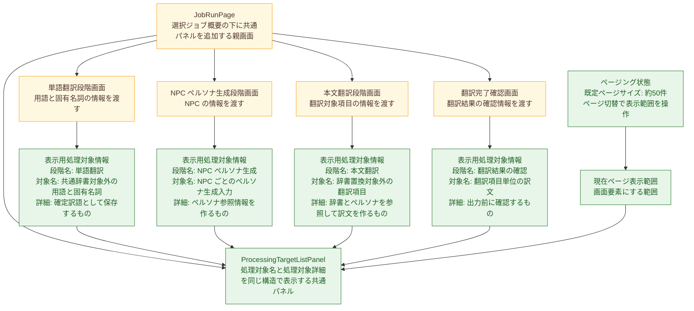

# 設計差分図: 翻訳ジョブステップ処理対象一覧表示パネル

## 概要

- 図化目的: `JobRunPage` の下に共通 `ProcessingTargetListPanel` を追加し、4 段階が同じ表示用情報を渡す予定変更箇所だけを固定する。
- 根拠参照: `detail-spec-diff.md`、`screen-design-diff.job-run.md`、`screen-design-diff.term-translation-phase.md`、`screen-design-diff.persona-generation-phase.md`、`screen-design-diff.body-translation-phase.md`、`screen-design-diff.translation-complete.md`
- 範囲: `JobRunPage`、4 段階の既存画面、追加予定の `ProcessingTargetListPanel`、段階ごとの表示用処理対象情報、ページング状態、現在ページ表示範囲に限定する。

## コンポーネント図

## 差分凡例

- 赤: 削除する要素または経路を示す。今回の設計差分では削除予定はない。
- 緑: 追加する要素または経路を示す。
- 黄色: 維持する要素または経路を示す。

## 各箱の説明

- `JobRunPage`: 共通パネルの配置先であり、4 段階画面の既存接続先を維持する。
- `ProcessingTargetListPanel`: 4 段階で共通の見た目を使い、処理対象名と処理対象詳細だけを表示する追加予定部品である。
- ページング状態: 約 50 件を既定ページサイズとして扱い、ページ切替で現在ページ表示範囲を操作する追加予定状態である。
- 現在ページ表示範囲: 数万件レベルの処理対象でも、画面要素にする範囲を現在ページへ限定する追加予定範囲である。
- 4 段階画面: 既存の段階画面として残り、現在段階に応じた表示用処理対象情報を共通パネルへ渡す。
- 表示用処理対象情報: 段階名、処理対象名、処理対象詳細を持つ表示データである。

## 追加予定

- `JobRunPage` の選択ジョブ概要の下に `ProcessingTargetListPanel` を追加する。
- 単語翻訳、NPC ペルソナ生成、本文翻訳、翻訳完了確認の 4 段階は、同じ共通パネルへ段階ごとの表示用処理対象情報を渡す。
- `ProcessingTargetListPanel` は、ページング状態から得た現在ページ表示範囲を表示する。
- 処理対象一覧にページング状態を追加する。
- 共通パネルは約 50 件を現在ページ表示範囲として扱う。
- 数万件レベルの処理対象では、現在ページ表示範囲を画面要素として扱う。

## 削除予定

- なし。

## 維持する接続先

- `JobRunPage` が 4 段階画面を切り替える既存構造は維持する。
- 各段階画面の本来の状態表示、操作、結果表示の責務は維持する。

## 検証

- Markdown 確認: 見出し、Mermaid コードブロック、差分凡例、各箱の説明、追加予定、削除予定、維持する接続先が揃っていることを確認した。
- Mermaid 記述確認: `flowchart TB`、箱、接続、`classDef` のみで構成し、差分凡例に必要な赤、緑、黄色のクラスを定義していることを確認した。

## 未決事項

- なし。
