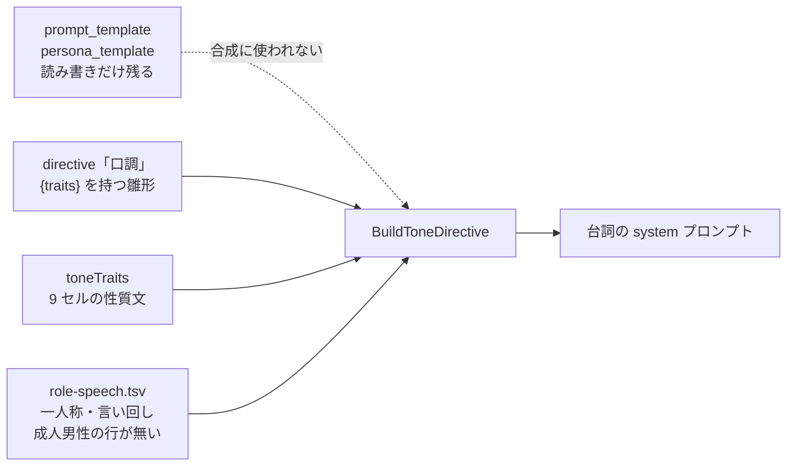
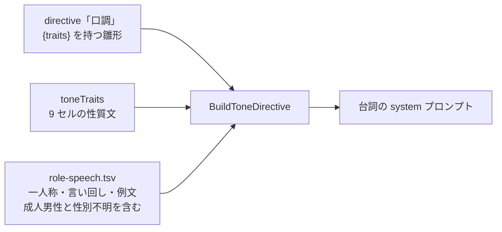

# Design: translation-prompt-revision

`design.md` は「どう実装し、どう直すか」だけを持つ。実装範囲の scope 列挙とテスト設計は持たない（実装モジュールが扱う）。

## 実装方針

翻訳 AI へ送る指示文の既定値を、4 つの層に分けて決め直す。層は「全リクエストに乗る base 翻訳指示文」「REC:FIELD ごとの指示文（directive）」「台詞の口調」「口調の雛形の置き場所」である。層ごとに変える理由が違うため、層ごとに扱いを分ける。

前提として、現状のプロンプト合成は 3 つの箱で経路が分かれる。`prompt.ComposePrompt`（`internal/core/prompt/prompt.go:31`）が `base 指示 + directive + 原文` を組み、原文に実行時タグがあれば `runtimetag.GuardInstruction`（`internal/core/runtimetag/runtimetag.go:76`）をタグ保護指示として末尾へ足す。

| 箱 | directive の引き方 | 原文の前処理 |
| --- | --- | --- |
| 叙述文・定型句（`narration`） | `record_type_master` の割り当てから引く（`internal/engine/engine.go:261`） | 機械置換あり |
| 固有名（`proper_noun`） | 「固有名」の指示文で固定（`internal/engine/engine.go:198`） | 機械置換なし |
| 台詞（`line`） | 「口調」の指示文を雛形に話者の性質を差し込む（`internal/engine/engine.go:184`） | 機械置換あり |

### 層1: base 翻訳指示文を、構造化出力と機械置換の前提に合わせる

**AS-IS**: 既定文は 2 文である（`db/migrations/0004_prompt_template.sql:20`）。1 文目が役割と方針、2 文目が「訳文だけを出力し、説明や注釈は加えないでください」という出力形の指示である。

現状の文面には 3 つの不整合がある。

1. 出力形の指示が構造化出力と食い違う。provider は `response_format` に `json_schema` を常に付け、`translation` 1 フィールドだけを許して追加フィールドを拒む（`internal/provider/openai_compatible.go:186`、`translationSchema`）。schema を守らない応答は `ErrStructuredParse` で該当行を未訳のまま飛ばす（同 `extractTranslation`）。出力形は schema が強制しており、指示文が重ねて述べる必要が無い。
2. 本文が「日本語混じりの英文」で届くことを述べていない。`prepareSource`（`internal/engine/engine.go:292`）が機械置換辞書を当てるため、user メッセージの原文には確定訳の日本語固有名が既に埋まっている。既訳語をそのまま残す指示が無く、モデルが表記を揺らす余地が残る。
3. 出力の崩れ方への制約が「説明や注釈を加えない」の 1 つだけである。改行数の変化、原文に無い鍵括弧・句点の付加、英単語の残存は述べていない。

**TO-BE**: 既定文を 4 段落にする。役割と方針、機械置換済み固有名の保持、出力の崩れ方の禁止、口調と原文尊重の優先順位を、1 段落 1 論点で並べる。

```
あなたは The Elder Scrolls V: Skyrim の Mod を日本語へ訳す翻訳者である。与えられた英語の本文を、意味を変えずに自然な日本語へ訳す。

本文には日本語へ置き換え済みの固有名が混ざる場合がある。日本語で書かれた部分はそのまま残し、訳し直したり表記を変えたりしない。

原文の改行の数と位置を保つ。原文に無い鍵括弧・句点・感嘆符を足さない。英単語を訳さずに残さない。

続く指示で口調を指定する場合、口調は語の選び方と語尾に反映する。原文の意味を変える理由にはしない。
```

4 段落目を置く理由は、口調指示が「この人物像に合う口調と人称で訳すこと」と強く求める一方、base 指示が「意味を変えずに」と求めるため、衝突したときにどちらを採るかが現状では未定義である点にある。

### 層2: directive の粒度を、要求される文体の違いに合わせる

**AS-IS**: 指示文は 7 種で、`record_type_master` が REC:FIELD を 1 種へ割り当てる（`db/migrations/0006_record_type_translation.sql:24` が指示文の seed、同 48 行以降が割り当ての seed）。粒度が実態と合わない箇所が 2 つある。

- 「説明体」1 種が 13 個の REC:FIELD を受け持つ。うち `SPEL:DESC`・`ENCH:DESC`・`PERK:DESC`・`SHOU:DESC`・`MGEF:DNAM` は数値と実行時タグを含む効果の記述で、`WEAP:DESC` などの物の説明とは求められる文体が違う。`RACE:DESC` は種族の世界観を述べる地の文である。
- 「定型句」1 種が 5 個を受け持つ。`ACTI:RNAM`・`FLOR:RNAM`・`TREE:RNAM` は操作名（動詞）、`MESG:ITXT` はボタン文言（名詞句）、`WOOP:TNAM` は龍語の語義（語釈）で、出力すべき品詞から違う。

加えて、固有名の指示文は「文脈に依存しない簡潔な訳とし、既存の確定訳語があればそれに合わせること」だけで、音写を基本にするか意味訳を許すかを述べていない。表示幅の制約も述べていない。固有名と定型句はゲーム UI に出るため、長い訳は表示が欠ける。

**TO-BE**: 7 種を 9 種にする。分割は 2 箇所、割り当ての移動は 1 箇所である。

| 指示文キー | 扱い | 割り当てる REC:FIELD |
| --- | --- | --- |
| 物品説明 | 「説明体」を改称し対象を狭める | `WEAP/ARMO/AMMO/ALCH/SCRL/INGR:DESC`、`MESG:DESC` |
| 効果説明 | 新規。数値と実行時タグを含む効果の記述 | `SPEL/ENCH/PERK/SHOU:DESC`、`MGEF:DNAM` |
| 世界観断片 | 対象を広げる | `LSCR:DESC`、`RACE:DESC` |
| 書物体 | 据え置き | `BOOK:DESC` |
| 日記体 | 据え置き | `QUST:CNAM`、`QUST:NNAM` |
| 固有名 | 文面へ音写方針と長さ制約を足す | 据え置き（`FULL` ほか） |
| 操作名 | 「定型句」を改称し対象を狭める | `ACTI/FLOR/TREE:RNAM`、`MESG:ITXT` |
| 語義 | 新規。語の意味を述べる短文 | `WOOP:TNAM` |
| 口調 | 文面は層3 で扱う | 据え置き（`INFO:NAM1/RNAM`、`DIAL:FULL`） |

効果説明の指示文には、数値と実行時タグを保ったまま体言止めで短く訳す方針を書く。操作名の指示文には、動詞の終止形で短く訳し表示幅を意識する方針を書く。固有名の指示文には、カタカナ音写を基本とし意味訳を避ける方針と、原語より大きく長くしない制約を書く。

### 層3: 口調を、説明文だけでなく例文でも固定する

**AS-IS**: 口調指示は最大 4 行の箇条書きで、`BuildToneTraits`（`internal/core/personatone/personatone.go:67`）が組む。内訳は基底口調 9 セルの性質文（同 18 行の `toneTraits`）、役割語（`assets/role-speech.tsv` 由来の一人称と言い回し）、種族訛り、台詞感情である。

3 つの欠落がある。

1. 役割語テンプレートに成人男性の行と成人の性別ワイルドカード行が無い。`assets/role-speech.tsv:16-22` は `child` 3 行、`elder` 3 行、`adult female` 1 行の 7 行のみで、`Lookup("adult","male",*)` と `Lookup("adult","",*)` は一致を返さない。成人男性の台詞は口調指示が基底口調の性質文 1 行だけになる。
2. 口調を例文で固定する仕組みが無い。`internal/core/personatone/personatone.go:17` のコメントが「一人称・語尾を確定する few-shot 例文は後続の精緻化で足す」と未着手を記録している。台詞は 1 件 1 リクエストで送るため、同じ話者の複数台詞が独立に推論され、説明文だけでは語尾が行ごとに揺れる。`docs/exec-plans/rejected/japanese-tone-persona/persona-known-issues.md` の系列で観測済みの症状である。
3. 汎用台詞の性別不明経路が役割語を引かずに打ち切る。`freeRoleSpeechLine`（同 150-153 行）が性別空文字で `Lookup` を呼ばずに戻る。`line_condition` は条件で性別を定められた台詞だけを持つため（`internal/store/line_condition.go:25`）、大半の汎用台詞が該当する。

**TO-BE**: 3 つを同じ層で埋める。

役割語テンプレートへ成人男性のセル別行と成人の性別ワイルドカード行を足す。一人称だけをセル別に決め、言い回し列は空にする。セルごとの口調は `toneTraits` が既に出しており、役割語側で重ねると同趣旨の指示が 2 行並ぶためである。対人段階が尊大の 3 セルと感情段階が激情で中立の 1 セルを「俺」とし、残る 5 セルは既定行の「私」で拾う。

例文の列を役割語テンプレートへ足し、6 列目に「英語原文 → 日本語訳文」の 1 対を置く。引くキーが役割語と同じ（種族区分 × 性別 × セル）ため、別ファイルにすると同じキーで 2 つの表を引くことになる。`BuildToneTraits` は例文を `- 例:` の行として口調指示へ足す。`provider.Prompt` は `System` と `User` の 2 つしか持たないため、例文は messages の対ではなく system 内の例示として置く。型を変えずに済む。

`freeRoleSpeechLine` の性別空チェックを外し、性別が空でも `Lookup` を呼ぶ。空文字はワイルドカード行に一致するため、成人の性別ワイルドカード行へ落ちる。撤去は PC 発話（選択肢）へも波及する。`BuildFreeToneTraits` は汎用台詞と PC 発話の両方から呼ばれ（`internal/engine/engine.go:664-675`）、PC 発話が渡す性別は既定が空の `defaults.PcSex` である（同 668 行、`internal/store/seed_test.go:150-151`）。PC 性別の未設定は「性別を取れない話者」と同じ状態なので、汎用台詞と同じ扱いにする。

### 層4: 口調の雛形を 1 箇所へ寄せる

**AS-IS**: 口調の雛形が 2 箇所にある。実際に使われるのは `directive` テーブルの「口調」の指示文で、翻訳実行（`internal/engine/engine.go:184`）と結果一覧の実プロンプト再構成（`internal/api/app.go:682`）の両方が `instructionByKey["口調"]` を渡す。

もう 1 箇所の `prompt_template.persona_template` は、DB の読み書き（`internal/store/prompt_template.go:16, 34`）、api の型（`internal/api/app.go:328, 342, 354`）、frontend の型と受け渡し（`frontend/src/gateway/template-gateway.ts:16, 53`、`frontend/src/ui/screens/template-editor/template-editor-view.ts:15`）に現れる。ただし編集する画面は無い。`TemplateBasePane.svelte:28-33` は `baseDirective` の textarea 1 つだけを持ち、`TemplateEditorContainer.svelte:28` のコメントが「編集中の base 値。personaTemplate は口調 directive へ畳んだため編集せず、保存時の素通し用に保持する」と述べている。値は state（同 30 行）として保持され、読み込み（同 104 行）と保存（同 132 行）で素通しされるだけである。

つまり `persona_template` は、読み書きの経路だけが残り、編集もされずプロンプト合成にも使われない列である。`db/migrations/0006_record_type_translation.sql:23` のコメントが「口調の instruction は `prompt_template.persona_template` を畳んだもの」と述べており、directive へ移した際に旧側の経路を残したことが読み取れる。

`internal/core/prompt/prompt.go:16` の `FillVariables` も呼び出し箇所が無い。`directive.variables` 列（`{traits}` の宣言）は画面が差し込み口を説明するために持ち、実際の差し込みは `BuildToneDirective`（`internal/core/personatone/personatone.go:184`）の `strings.ReplaceAll` が行う。

**TO-BE**: `prompt_template.persona_template` を廃止し、`directive` の「口調」を唯一の雛形にする。列の削除ではなく、読み書きの経路の削除で扱う。削る対象は Go 側の store・model・api の型と、frontend 側の gateway 型・view 型・`TemplateEditorContainer` の state と素通し処理である。編集画面が無いため、編集欄の削除は発生しない。SQLite の `ALTER TABLE DROP COLUMN` は C# 抽出器が全 migration を毎回 ensure する制約（`db/migrations/0007_generic_tone.sql` の注記）と相性が悪いため、列は残して参照を止める。

`FillVariables` は呼び出し箇所が無いまま残すか削るかを層4 の一部として決める。

### AS-IS（現状）: 口調指示の組み立て



### TO-BE（変更後）: 口調指示の組み立て



AS-IS から消える要素は `prompt_template.persona_template` である。合成に使われないまま読み書きだけが残っている経路を、Go 側と frontend 側の型から消す。TO-BE で増える箱は無く、`role-speech.tsv` が持つ列が増える（例文列）とともに、欠落していた行が埋まる。

### どこまで動かすか

観測点は単体テスト、結合テスト、実画面の 3 つとする。

- 単体テスト（`internal/core/rolespeech`、`internal/core/personatone`）: 6 列のテンプレートを解析できること。成人男性の 9 セルすべてと成人の性別不明が一人称を返すこと。汎用台詞経路が性別空でワイルドカード行へ落ちること。口調指示に例文の行が乗ること。
- 結合テスト（`internal/harness`）: 台詞の system プロンプトへ一人称と例文の行が乗ること。叙述文が分割後の指示文（効果説明・操作名・語義）を受け取ること。harness は合成役割語表を使うため（`internal/harness/run.go:87`）、実表の行の欠落は検出しない。実表を読んで全区分が一致を返す観測点は `internal/core/rolespeech` 側へ置く。
- 実画面: 指示文の編集画面（`DirectiveEditor`）に 9 種が並び、各指示文の対象 REC:FIELD が分割後の割り当てで出ること。テンプレート編集画面が `persona_template` の削除後も保存できること。

実データによる訳文の品質確認は本 task の観測点に置かない。中心 DB（`db/aitranslation.dev.sqlite3`）の `speaker`・`line` が 0 件で、抽出対象を指定する `.env` も `dictionaries/` の中身も無く、実 plugin から抽出して訳文を得る手段が揃っていない。

### 画面表示の変更

画面に出る内容は変わるが、表示構造は変わらない。`DirectiveEditor` は指示文を `{#each sections as s (s.key)}` で動的に並べるため（`frontend/src/ui/screens/template-editor/DirectiveEditor.svelte:22`）、7 種から 9 種への増加は行の増加として現れ、layout も表示構造も変えずに済む。`TemplateBasePane` は `baseDirective` の編集欄 1 つだけを持ち、`persona_template` の編集欄を元から持たないため、削除で欄が消えることはない。

変わるのは story の fixture である。`frontend/src/ui/screens/template-editor/template-editor.fixtures.ts` は `DEFAULT_PERSONA` を 2 箇所で使っており、11 行目で定義し、21 行目で `personaTemplate` へ、61 行目で指示文「口調」の `instruction` へ与えている。21 行目は削除の対象、61 行目は据え置きの対象で、扱いが分かれる。指示文の 9 種化でも fixture の指示文一覧と対象一覧を作り直す必要がある。

fixture の作り直しと、9 種が並んだ状態の見え方の確認が要るため `storybook-module` を経由する。

### AS-IS → TO-BE

| 変更点 | AS-IS（現状） | AS-IS の根拠ソース | TO-BE（変更後） | 変更予定箇所と実現主張 |
| --- | --- | --- | --- | --- |
| base 翻訳指示文 | 2 文。出力形の指示が構造化出力と重複し、機械置換済み固有名の保持と出力の崩れ方の禁止が無い | `db/migrations/0004_prompt_template.sql:20`、`internal/provider/openai_compatible.go:186`（`response_format` を常に付ける）、`internal/engine/engine.go:292`（機械置換） | 4 段落。役割、固有名の保持、崩れ方の禁止、口調と原文尊重の優先順位 | 新規 migration で `prompt_template` の既定値を更新する。`INSERT OR IGNORE` は既存行を書き換えないため、既定値の変更を既存 DB へ反映するには `UPDATE` を条件付きで行う必要がある（層の扱いは `検討が必要なこと` 1） |
| 指示文の粒度 | 7 種。説明体が 13 個、定型句が 5 個の REC:FIELD を受け持つ | `db/migrations/0006_record_type_translation.sql:24`（指示文の seed）と同 48 行以降（割り当ての seed） | 9 種。効果説明と語義を新設し、説明体を物品説明へ、定型句を操作名へ狭める。`RACE:DESC` を世界観断片へ移す | 新規 migration で `directive` へ 2 行を追加し、`record_type_master` の該当行の `directive` 列を更新する。`internal/engine/engine.go:404` の `directiveLookups` はキーを固定で持たないため（DB の行をそのまま map へ入れる）、種類の増減にコード変更は要らない。指示文キーを名指しする箇所は 3 つで、`internal/engine/engine.go:398` の定数 `directiveTone`、同ファイルの `directiveProperNoun`、`internal/api/app.go:682` の生文字列 `"口調"` である。3 つとも据え置くキーを指すため、9 種化の影響を受けない |
| 役割語テンプレートの欠落 | `Lookup("adult","male",*)` と `Lookup("adult","",*)` が一致を返さない | `assets/role-speech.tsv:16-22`、`internal/core/rolespeech/rolespeech.go:62`（`Lookup`）、同 79（`matchScore`） | 尊大 3 セルと率直・興奮は「俺」、残る 5 セルと性別不明は「私」を返す | `assets/role-speech.tsv` へセル別 4 行、`adult male *`、`adult * *` を足す。`matchScore` の具体度優先がセル別行を先に採るため、追加行だけで成立する |
| 口調の例文 | 例文を持つ仕組みが無い | `internal/core/personatone/personatone.go:17`（未着手のコメント）、`internal/core/rolespeech/rolespeech.go:36`（5 列で解析） | 役割語テンプレートの 6 列目に「英語原文 → 日本語訳文」を置き、口調指示へ `- 例:` の行として乗せる | `internal/core/rolespeech` の `Template` へ例文のフィールドを足し、`ParseRoleSpeech` を 6 列目の任意読み取りへ広げる（現状は `len(f) < 5` でエラー、5 列目までしか読まない）。`internal/core/personatone` の `BuildToneTraits` と `BuildFreeToneTraits` へ例文行の組み立てを足す。`provider.Prompt`（`internal/provider/openai_compatible.go:22`）は変えず、system 内の例示に留める |
| 汎用台詞の性別不明経路 | 性別が空文字の時点で `Lookup` を呼ばずに戻る | `internal/core/personatone/personatone.go:150-153` | 性別が空でも `Lookup` を呼び、ワイルドカード行へ落ちる | `freeRoleSpeechLine` から性別空の早期 return を削る。`Lookup` の `ok=false` 判定は残し、一致が無い場合は空文字を返す挙動を保つ |
| PC 発話で PC 性別が未設定の場合 | `defaults.PcSex` が空のまま渡り、早期 return で一人称が付かない | `internal/engine/engine.go:664-675`（PC と汎用が同じ `BuildFreeToneTraits` を通る）、同 668、`internal/store/seed_test.go:150-151` | 成人の性別ワイルドカード行の「私」が付く | 変更箇所は汎用台詞と同一で、早期 return の撤去だけである。PC 発話だけ従来どおり打ち切るには `BuildFreeToneTraits` へ rec・field を渡す構造変更が要るため採らない |
| 口調の雛形の置き場所 | `directive`「口調」と `prompt_template.persona_template` の 2 箇所にあり、後者は読み書きの経路だけが残り、編集画面が無くプロンプト合成にも使われない | `internal/engine/engine.go:184` と `internal/api/app.go:682`（どちらも `instructionByKey["口調"]`）、`internal/store/prompt_template.go:16, 34`、`internal/api/app.go:328, 342, 354`、`frontend/src/gateway/template-gateway.ts:16, 53`、`frontend/src/ui/screens/template-editor/template-editor-view.ts:15`、`TemplateEditorContainer.svelte:28, 30, 51, 75, 104, 132`（素通しの保持）、`TemplateBasePane.svelte:28-33`（編集欄は `baseDirective` のみ） | `directive`「口調」だけを雛形にする。`persona_template` の読み書きの経路を削る | Go 側は `internal/store/prompt_template.go` の SELECT と UPSERT から列を外し、`internal/model/prompt_template.go` の `PersonaTemplate` と `internal/api/app.go:328, 342, 354` の型から削る。frontend 側は `frontend/src/gateway/template-gateway.ts:16, 53` の型とマッピング、`template-editor-view.ts:15` の view 型、`TemplateEditorContainer.svelte` の state（30 行）・入力分岐（75 行）・読み込み（104 行）・保存（132 行）を削る。`TemplateBasePane.svelte` は `baseDirective` だけを編集しており変更が要らない。fixture は `template-editor.fixtures.ts:21` の `personaTemplate` を削り、同 61 行（指示文「口調」の `instruction`）は据え置く。DB 列は残す（`db/migrations/0007_generic_tone.sql:7-8` の注記のとおり、C# 抽出器が全 migration を毎回 ensure するため `ALTER TABLE` を避ける） |
| 未使用の変数差し込み関数 | `FillVariables` に呼び出し箇所が無い | `internal/core/prompt/prompt.go:16`、`grep` で呼び出し 0 件（定義とテストのみ） | 削るか残すかを決める | 削る場合は `internal/core/prompt/prompt.go` から関数とテストを消す。差し込みは `BuildToneDirective`（`internal/core/personatone/personatone.go:184`）が担っており、削っても合成経路は変わらない |

## 検討が必要なこと

5 件とも人間の回答なしに先へ進めない。

1. **既定値の更新を既存 DB へ反映するか。** 現状の seed は `INSERT OR IGNORE` で、既に行があれば書き換えない（編集結果を保つ方針）。既定文を変えても、既存の中心 DB を使う利用者には旧文面が残る。新 migration で `UPDATE` するなら利用者の編集を上書きすることになる。上書きするか、旧文面のまま残して画面から手で直させるか。
2. **base 翻訳指示文から「訳文だけを出力し、説明や注釈は加えないでください」を落としてよいか。** 出力形は `response_format` の schema が強制しており、指示文は不要と判断した。ただし schema を守らないモデルでは該当行が未訳のまま飛ぶため、指示文でも重ねて求める安全側の選択もある。
3. **指示文キーの改称をどう扱うか。** 「説明体」を「物品説明」へ、「定型句」を「操作名」へ改める案である。キーは `record_type_master.directive` の外部キーで、`directive` テーブルの主キーでもある。新キーを足して割り当てを付け替えると、旧キーの行が編集済みの文面を抱えたまま孤立する。旧キーの行を削るか、残すか。改称せず既存キー名のまま対象を狭める選択もある。
4. **口調の例文を役割語テンプレートの 6 列目に置いてよいか。** 引くキーが役割語と同じため 1 つの表に収めた。ただし 1 行が長くなり、TSV の可読性が落ちる。例文専用の外部ファイルへ分ける代替案もある。
5. **例文を何セル分用意するか。** 9 セル × 性別 2 × 年齢区分 3 の全組み合わせは 54 通りで、埋めきるのは現実的でない。ワイルドカード行に代表例だけを置く案と、台詞量の多い区分（成人男性・成人女性の 9 セル）だけを埋める案がある。
