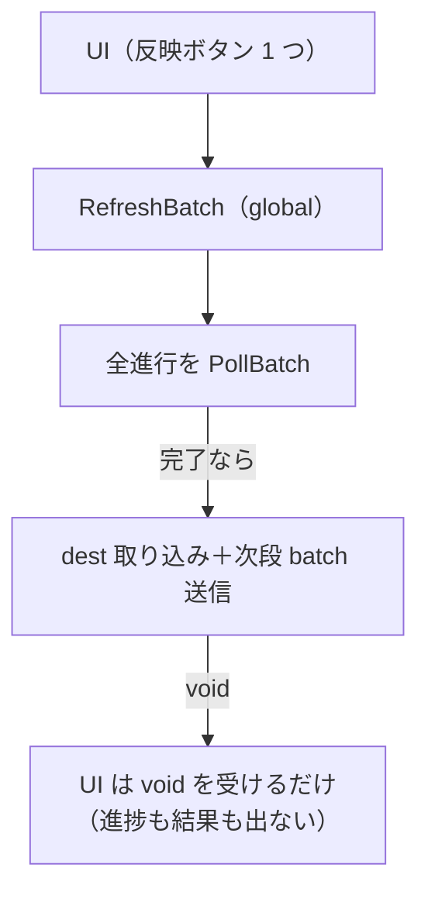
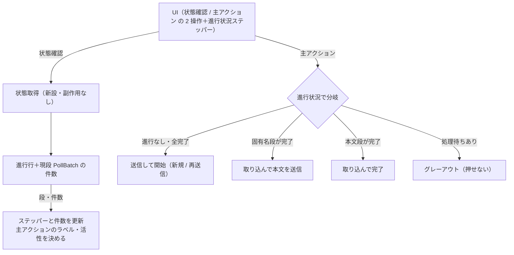

# Design: xai-batch-progress

本 task は xAI batch 翻訳の進行状況を画面で見えるようにし、観測（状態確認）と前進（取り込み）の操作を分ける。前段 task `xai-batch-ui`（配送方式選択・送信・反映の配線）は master 済み。

## 実装方針

### AS-IS: 反映が観測と前進を兼ね、結果が画面に出ない

現状の xAI batch は、送信のあと「反映」ボタン 1 つで状態確認と前進をまとめて行う。

- `RefreshBatchTranslations`（`BatchRunner.RefreshBatch`）は、進行中の全 batch 進行を `PollBatch` で状態確認し、現段が完了（`num_pending == 0`）なら結果を dest へ取り込み、固有名段なら続けて本文 batch を送る。全 plugin をまとめて処理する global 操作で、戻り値は `void`。
- 画面は反映を押しても `void` を受けるだけで、何が起きたか（本文が送られたか・まだ処理中か・完了したか）が分からない。進行段や件数の表示も無い。
- 状態確認と前進が同じ 1 操作に同居するため、進捗だけ見たい時も取り込み・送信の副作用が走る。

### TO-BE: 状態確認と取り込みを分け、進行状況をパネルで見せる

観測（副作用なし）と前進（取り込み＋次段送信）を別操作にし、進行状況を画面へ出す。

- 状態確認: xAI に問い合わせて進行状況（段・現段 batch の件数）を取り、進行状況パネルへ出す。dest への取り込みも次段送信もしない。何度押しても副作用が無い。観測専用の操作として独立させる。
- 主アクション（送信と取り込みを 1 ボタンに束ねる）: 送信と取り込みは進行状況によってどちらか一方しか意味を持たない（進行が無い時は送信、完了段がある時は取り込み、処理中はどちらも押せない）。排他のため 1 つの主アクションボタンに束ね、進行状況に応じて役割とラベルを変える。押すと何が起きるかをラベルで明示する。
  - 進行なし・全完了: 「送信して開始」。新しい batch を送る（全完了後は未訳の残りを再送信）。
  - 固有名段が完了: 「取り込んで本文を送信」。固有名を dest へ取り込み、続けて本文 batch を送る。
  - 本文段が完了: 「取り込んで完了」。本文を dest へ取り込み、進行を完了にする。
  - 処理待ちが残る間: グレーアウト（状態確認で待つ）。
- ボタン構成は「状態確認」＋「主アクション」の 2 つにする。旧「反映」ボタンは廃す。有効・無効とラベルは状態確認で得た進行状況で決める。
- 進行状況パネルは「固有名 → 本文 → 完了」のステッパーにして、全体で 2 段（固有名・本文）あることと現在地を常に見せる。現在段の件数（総数・処理待ち・成功・失敗）も出す。「取り込み」が固有名の取り込みと本文の送信を兼ねる二重動作であることが、ステッパーの現在地と主アクションのラベル（取り込んで本文を送信）で操作前に読める。処理待ちが残る間は主アクションがグレーアウトする理由が件数で読める。
- 状態確認・主アクションは、開いている翻訳対象 plugin の進行 1 件に絞る（`batch_translation` は plugin と 1 対 1）。現状の全 plugin まとめ（global）から plugin 単位へ変える。状態確認は手動ボタンだけで行い、画面を開いた時の自動取得はしない。
- backend に、副作用なしで進行状況を返す状態取得の公開面を足す。既存の進行行（`batch_translation` の段・外部 ID）と `PollBatch` の件数から組む。取り込み（主アクションの前進側）は現状の `RefreshBatch` の中身（完了段の取り込み＋次段送信）を plugin 指定に絞って使う。

### backend に状態取得の独立ルートを足す（既存の翻訳経路に影響を与えない）

副作用なしで進行状況を返す公開面を、既存の翻訳経路から独立した新ルートとして新設する。既存の永続構造（テーブル）も、同期翻訳・batch の結果適用ロジックも変えない。

- 既存関数の再利用: 状態確認は既存の確認関数 `PollBatch` を read-only で呼ぶだけにする。状態確認のための新しい確認ロジックは作らない。進行段・外部 ID は既存の進行行（`batch_translation`）を読むだけで組む。
- 副作用ゼロ: 状態取得ルートは dest を書かず、batch を送らず、進行段を進めない。DB への書き込みも起こさない。よって既存の翻訳・取り込みの振る舞いに一切影響しない。
- 返す内容: 対象 plugin の進行について、進行段（固有名 / 本文 / 完了）・現段の外部 batch の件数（総数・処理待ち・成功・失敗・取消）・その段が完了（処理待ち 0）か。件数は現段の外部 batch を `PollBatch` して得る。
- 完了段の有無: 状態取得の結果に「取り込める完了段があるか」を含め、UI の「取り込み」ボタンのグレーアウト判定に使う。
- 取り込みの公開面: 現状の `RefreshBatchTranslations`（`RefreshBatch`・全 plugin まとめ）を、plugin を指定して 1 進行だけ前進させる形へ変える。前進の中身（`refreshOne` の完了段取り込み＋次段送信）は変えず、対象進行の選び方だけを「全進行」から「指定 plugin の 1 進行」へ絞る。前段 task で frontend が呼ぶ配線（接続情報だけを渡す形）も plugin 指定へ合わせて直す。
- 状態取得・取り込みとも plugin を指定して 1 進行に絞る（`batch_translation` は plugin と 1 対 1）。

### どこまで動かすか（観測できる振る舞い）と観測点

- 観測できる振る舞い: xAI batch を送信・取り込みしたあと、状態確認を押すと進行段と件数（例: 本文段・111/113・処理待ち 2）がパネルに出る。処理待ちが残る間は取り込みがグレーアウトし、処理待ちが 0 になると取り込みが有効化され、押すと dest へ取り込まれて（固有名段なら本文 batch が送られて）次段へ進む。
- 観測点（backend 単体）: 進行状況を組む純粋な変換（進行行＋件数 → パネル表示値、完了段の有無判定）を単体テストする。`PollBatch`・DB の IO は fake で検査する。
- 観測点（frontend 単体）: 状態確認・取り込みハンドラの配線と、取り込みボタンの有効・無効判定を確かめる。
- 観測点（storybook）: 進行状況パネルの各状態（処理中・完了段あり・完了）と、取り込みボタンの有効・グレーアウトを story で確かめる。
- 観測点（手動 e2e）: 実 xAI batch API への疎通は課金するため手動で確かめる。自動テストは実 API に触れない。

## 検討が必要なこと

未解決の論点は無し。2 点を次のとおり確定した（2026-07-21 の回答）。

- 進行状況と取り込みの単位: **開いている plugin 単位**。パネルも取り込みも今開いている翻訳対象 plugin の進行 1 件に絞る。backend の取り込みを plugin 指定へ変える。他 plugin の進行はその plugin を開いて見る。
- 状態確認の取得契機: **手動ボタンのみ**。「状態確認」を押した時だけ xAI へ問い合わせて更新する。画面を開いた時の自動取得はしない（接続情報を永続化しないため）。
