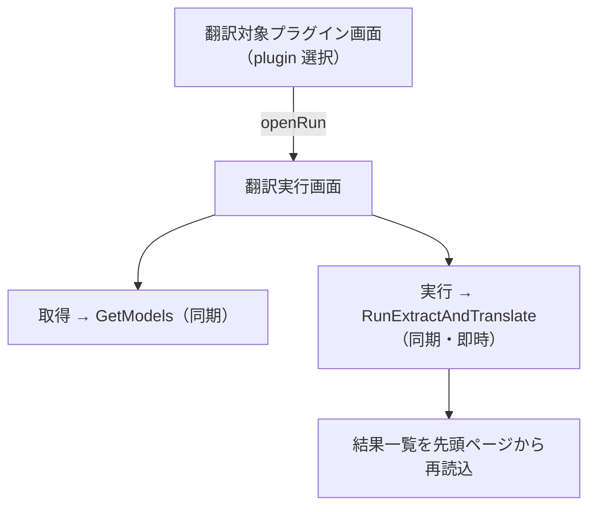
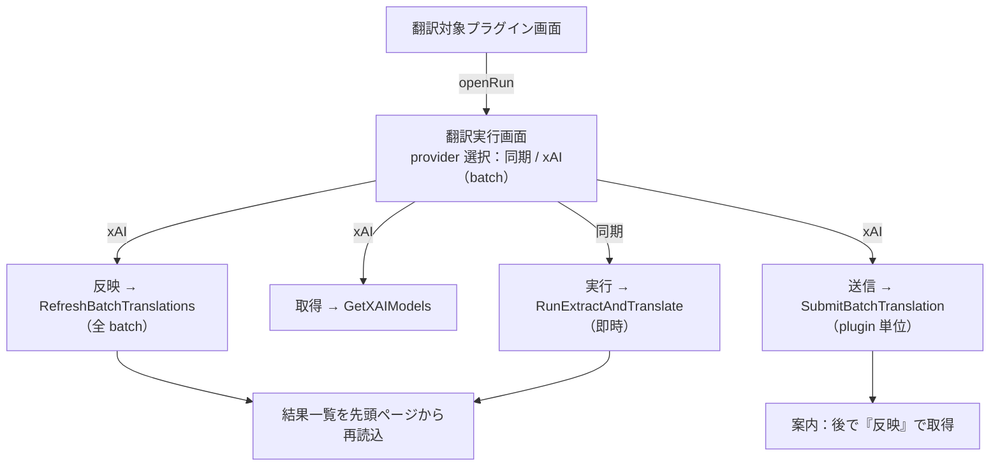

# Design: xai-batch-ui

本 task は、master 済みの xAI batch 翻訳 backend を frontend の画面から使えるようにする。backend の翻訳ロジック・provider・永続は変えず、生成済みの Wails 公開面（`SubmitBatchTranslation`・`RefreshBatchTranslations`・`GetXAIModels`）を画面へ配線する。

## 実装方針

### AS-IS: 翻訳実行画面は同期翻訳だけを起動する

現状の翻訳実行画面（`translation-run/`）は、接続先・モデルを入れて「実行」を 1 回押すと同期翻訳が即時に走り、結果一覧へ反映される。

- 画面構成は表示専用 Screen（props・callback）＋ Container（`$state`・gateway 配線）＋ view（型）／presentation（定数）の 4 ファイル。
- 接続情報（endpoint・API key）は store を持たず Container のローカル `$state` に持ち、実行のたびに `RunRequest`／`ConnRequest` で backend へ渡す。永続化しない。
- モデル一覧は「取得」ボタンで `GetModels`（同期・OpenAI 互換）から取る。provider 種別を選ぶ UI は無く、接続先 URL で送り先を切り替える前提。
- 起動は plugin 単位で 1 回・即時完結。送信と反映が分かれる概念は無い。

### TO-BE: 同じ画面で provider を選び、xAI は送信と反映の 2 操作で動く

翻訳実行画面に provider 選択を足す。同期（OpenAI 互換・LM Studio）を選ぶと現状のまま。xAI（batch）を選ぶと、モデル取得先が xAI になり、起動操作が「送信」と「反映」の 2 つへ分かれる。

- provider 選択: 同期 / xAI（batch）を選ぶ。選択は Container の `$state` に持つ。表示部品は既存 `SelectField` を踏襲する。
- xAI 選択時の差し替え:
  - モデル取得は `GetXAIModels`（batch 非対応モデルを除外済み）から取る。endpoint 未入力なら backend が xAI 既定接続先を補うため、endpoint 既定値は xAI 用（`https://api.x.ai`）へ切り替える。
  - 起動操作は「送信」（`SubmitBatchTranslation`、plugin 単位）と「反映」（`RefreshBatchTranslations`）の 2 ボタンにする。同期の「実行」ボタンは xAI 選択時は出さない。
  - 送信後は「batch を送信した。しばらく後に『反映』で結果を取得する（最大約 24 時間）」の案内を出す。この時点では結果一覧は変わらない。
  - 反映は Container が今入力している接続情報（endpoint・API key）で `RefreshBatchTranslations` を呼び、その後に結果一覧を先頭ページから読み直す。完了していれば訳が入り、未完了なら一覧は変わらない。
- 反映の適用範囲: `RefreshBatchTranslations` は plugin 引数を取らず、進行中の全 batch をまとめて確認・反映する global 操作である。送信は plugin 単位、反映は全体という非対称を画面文言で示す（「進行中の batch をまとめて反映する」）。反映後は開いている plugin の結果一覧を読み直す。
- 反映のトリガは手動ボタンだけにする。接続情報を永続化しないため起動時の自動反映はできず、backend も常駐ポーリングを持たない方針に合わせ、ポーリングもしない。
- 結果一覧・訳状態は同期と共通のまま。batch で反映した行と同期で訳した行は、一覧・`dest`・訳状態のいずれでも区別が付かない（backend の不変条件をそのまま画面へ出す）。

### 配線の置き場所（既存構成を踏襲する）

- gateway（`translation-gateway.ts`）に batch 3 関数のラッパを足す。generated wailsjs の import は gateway 境界だけに閉じる既存方針に従う。
- Container（`TranslationRunContainer.svelte`）に provider 選択と xAI 用の操作ハンドラ（送信・反映・xAI モデル取得）を足す。接続情報・モデル state は同期と共有する。
- Screen・view・presentation に provider 選択の表示と、xAI 選択時のボタン出し分けを足す。表示部品（`SelectField`・`TextField`・`button`・`StatusBadge`・`alert`）は既存を再利用する。

### どこまで動かすか（観測できる振る舞い）と観測点

- 観測できる振る舞い: 翻訳実行画面で xAI（batch）を選び、xAI のモデルを取得し、送信でき、後から反映で結果が結果一覧へ入り、同期翻訳と区別なく訳済として見える。
- 観測点（frontend 単体）: gateway ラッパと Container のロジック（provider 出し分け、送信・反映ハンドラ）を frontend のテストで確かめる。
- 観測点（storybook）: provider 選択・xAI 用ボタン・送信後の案内・反映の各表示状態を story で確かめる（UX 変更のため storybook を経由する）。
- 観測点（手動 e2e）: 実 xAI batch API への疎通と、送信 → 反映 → 結果反映の一連は、課金するため手動 e2e で人間が実画面で確かめる。自動テストは実 API に触れない。

## 検討が必要なこと

未解決の論点は無し。進行状況の可視化は最小（frontend のみ）で確定した（2026-07-20 の回答）。

- 進行状況の可視化: **最小**。送信・反映と、送信後のテキスト案内だけを出す。batch の進行段（固有名 → 本文 → 完了）や pending／完了の状態表示は本 task では持たず、backend の状態取得公開面も足さない。進行の判断は反映で結果一覧が変わるかで行う。
- provider 選択 UI: 本 task に**含める**。翻訳実行画面で同期 / xAI（batch）を選び、xAI 選択時にモデル取得先と起動操作（送信・反映）を切り替える。
