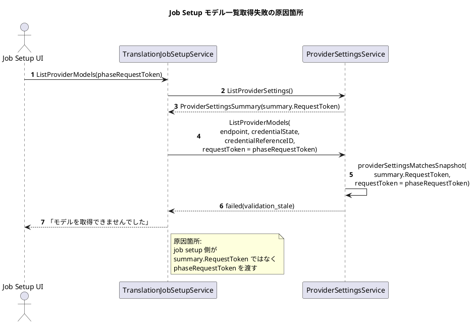

# 原因箇所シーケンス図

## 図

- PlantUML source: [cause-sequence.puml](/Users/iorishibata/Repositories/AITranslationEngineJP/docs/exec-plans/active/2026-05-07-job-setup-model-list-token-fix/cause-sequence.puml)
- 描画結果: [cause-sequence.svg](/Users/iorishibata/Repositories/AITranslationEngineJP/docs/exec-plans/active/2026-05-07-job-setup-model-list-token-fix/cause-sequence.svg)

## 問題点

- `TranslationJobSetupService.listProviderModelsViaProviderSettings` は provider 設定 summary から `summary.RequestToken` を読んでいるが、`ProviderSettingsService.ListProviderModels` には `result.RequestToken` を渡している。
- `ProviderSettingsService` は `providerSettingsMatchesSnapshot` で request token 一致を必須にしているため、Job Setup 画面操作用 token を渡すと `validation_stale` で失敗する。
- マスターペルソナ側は `summary.RequestToken` をそのまま渡すため、同じ provider 設定境界でも失敗しない。

## 修正方針

- `TranslationJobSetupService.listProviderModelsViaProviderSettings` から `ProviderSettingsService.ListProviderModels` へ渡す `RequestToken` を、Job Setup 画面操作用 token ではなく provider 設定 summary の `RequestToken` に揃える。

## 根拠参照

- [human-observation.md](/Users/iorishibata/Repositories/AITranslationEngineJP/docs/exec-plans/active/2026-05-07-job-setup-model-list-token-fix/human-observation.md)
- [translation_job_setup_service.go](/Users/iorishibata/Repositories/AITranslationEngineJP/internal/service/translation_job_setup_service.go)
path:line `internal/service/translation_job_setup_service.go:564`
path:line `internal/service/translation_job_setup_service.go:583`
- [provider_settings_service.go](/Users/iorishibata/Repositories/AITranslationEngineJP/internal/service/provider_settings_service.go)
path:line `internal/service/provider_settings_service.go:687`
path:line `internal/service/provider_settings_service.go:1117`
- [master_persona_service.go](/Users/iorishibata/Repositories/AITranslationEngineJP/internal/service/master_persona_service.go)
path:line `internal/service/master_persona_service.go:395`
path:line `internal/service/master_persona_service.go:400`
