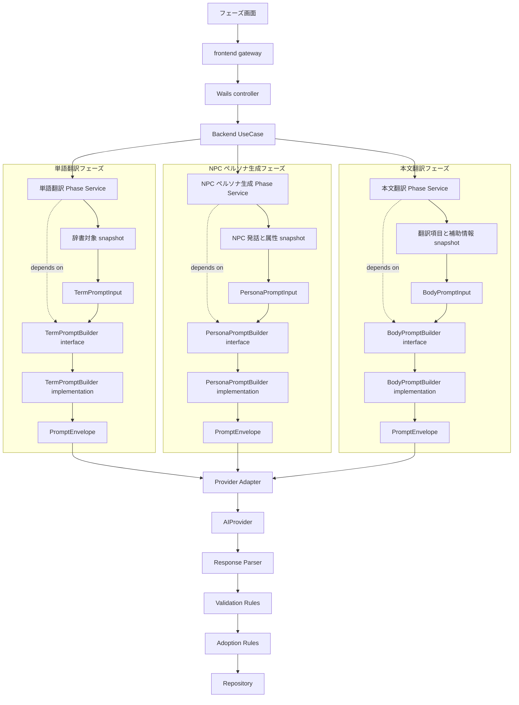

# Task Plan: 2026-05-25-phase-prompt-builder-boundary

- `workflow`: work
- `status`: completed
- `lane_owner`: implement_lane
- `task_id`: 2026-05-25-phase-prompt-builder-boundary
- `task_mode`: design-before-implementation
- `request_summary`: 各翻訳フェーズのプロンプト生成処理を、既存フェーズを安定した運用単位に保ちながら、フェーズ内部の変更に強い境界として整理する。
- `goal`: 単語翻訳、NPC ペルソナ生成、本文翻訳の既存フェーズを保ち、プロンプト生成、要求データ、検証、採用規則を変更しやすい task-local 設計入力へ固定する。
- `constraints`: この plan は task-local 設計入力だけを扱う。翻訳フェーズはほぼ増えない前提で、単語翻訳、NPC ペルソナ生成、本文翻訳の内部構造を対象にする。プロンプト生成、要求データ、検証、採用規則は現在の規則を差し替えやすくする。各規則をそれぞれバージョニングしたいわけではない。利用者向け情報は raw prompt ではなく要約、件数、失敗分類を中心にする。
- `close_conditions`: detail-spec-diff が人間レビュー可能な粒度で作成され、PromptBuilder 境界、フェーズ別 PromptInput、検証規則、採用規則、provider adapter 連携が未決事項と分離されている。
- `worktree_path`: `/Users/iorishibata/.codex/worktrees/991e/AITranslationEngineJP`
- `source_branch`: `codex/2026-05-25-phase-prompt-builder-boundary`
- `target_branch`: `master`

## Artifact Index

- `ux_task_frame`: `N/A`
- `screen_design_diff`: `N/A`
- `storybook_review_loop_input`: `N/A`
- `storybook_review_loop_evidence`: `N/A`
- `frontend_human_review`: `N/A`
- `storybook_design_alignment`: `N/A`
- `approved_frontend_protection`: `N/A`
- `detail_spec_diff`: `ready-for-human-review: ./detail-spec-diff.md`
- `design_diff_diagram`: `ready-for-human-review: ./design-diff.phase-prompt-builder-boundary.md`
- `implementation_scope`: `ready-for-implementation: ./implementation-scope.md`
- `implementation_handoff_input`: `BE-01 completed: ./backend-implementation-input.BE-01.md`; `BE-02 completed: ./backend-implementation-input.BE-02.md`; `BE-03 completed: ./backend-implementation-input.BE-03.md`; `BE-04 completed: ./backend-implementation-input.BE-04.md`; `TU-01 completed: ./unit-test-input.TU-01.md`; `SCN-01 completed: ./scenario-test-input.SCN-01.md`; `OBS-01 completed: ./observability-input.OBS-01.md`; `VAL-BE-01 completed: ./backend-validation-fix-input.VAL-BE-01.md`; `SYS-01 completed: ./system-test-harness-fix-input.SYS-01.md`; `DOC-01 completed: ./docs-canonicalization-input.DOC-01.md`
- `backend_implementation_result`: `BE-01 implemented-with-validation-blocker: ./backend-implementation-result.BE-01.md`; `BE-02 implemented-with-validation-blocker: ./backend-implementation-result.BE-02.md`; `BE-03 implemented-with-validation-blocker: ./backend-implementation-result.BE-03.md`; `BE-04 implemented-with-validation-blocker: ./backend-implementation-result.BE-04.md`
- `unit_test_result`: `TU-01 completed-with-external-blockers: ./unit-test-result.TU-01.md`
- `scenario_test_result`: `SCN-01 completed-with-known-backend-local-blocker: ./scenario-test-result.SCN-01.md`; `SYS-01 completed: ./system-test-harness-fix-result.SYS-01.md`
- `observability_result`: `OBS-01 completed-with-known-backend-local-blocker: ./observability-result.OBS-01.md`
- `docs_canonicalization_result`: `DOC-01 completed: ./docs-canonicalization-result.DOC-01.md`
- `detail_spec_target`: `docs/detail-specs/term-translation-phase.md`, `docs/detail-specs/persona-generation-phase.md`, `docs/detail-specs/body-translation-phase.md`

## Routing Notes

- `required_reading`: `docs/spec.md`, `docs/architecture.md`, `docs/er.md`, `docs/detail-specs/term-translation-phase.md`, `docs/detail-specs/persona-generation-phase.md`, `docs/detail-specs/body-translation-phase.md`, `internal/service/term_translation_provider_adapter.go`, `internal/service/persona_generation_provider_adapter.go`, `internal/service/body_translation_prompt_builder.go`, `internal/service/body_translation_provider_adapter.go`
- `canonicalization_targets`: `docs/detail-specs/term-translation-phase.md`, `docs/detail-specs/persona-generation-phase.md`, `docs/detail-specs/body-translation-phase.md`
- `detail_spec_id`: `phase-prompt-builder-boundary`
- `validation_commands`: `rg -n "Build.*Prompt|ProviderRequest|PromptDigest|REQUEST_V1" internal/service docs/detail-specs`

## Branch Status

- `worktree_checkout`: current worktree
- `branch_ready`: created
- `branch_prepare_evidence`: `git switch -c codex/2026-05-25-phase-prompt-builder-boundary` succeeded in `/Users/iorishibata/.codex/worktrees/991e/AITranslationEngineJP`.
- `commit_hash`: `d15c9cdb40d6a24f3824842a0962d84df9f1c636`
- `remote_operation`: `not-performed`

## HITL Status

- `detail_spec_hitl`: `approved`
- `detail_spec_review_feedback`: `addressed: implementation-plan-like wording was rewritten as product specification differences`
- `design_diff_hitl`: `approved`
- `storybook_review_loop_input`: `not-required`
- `storybook_review_loop_evidence`: `not-required`
- `frontend_human_review`: `not-required`
- `storybook_design_alignment`: `not-required`
- `approval_record`: `approved by human reply "approve" on 2026-05-25`

## Design Decisions From Wall Discussion

### Decision 1: 既存 3 フェーズを安定した運用単位にする

- `決定`: 単語翻訳、NPC ペルソナ生成、本文翻訳の 3 フェーズを、利用者が開始、停止、再開、再試行を判断する運用単位として扱う。翻訳フェーズはほぼ増えない前提にする。
- `理由`: 単語翻訳は訳語一貫性、NPC ペルソナ生成は口調と文体の一貫性、本文翻訳は実訳文作成を担当しており、利用者が独立して開始、停止、再開、再試行する運用単位として足りている。
- `影響`: 後続設計は 3 フェーズの内部にあるプロンプト生成、要求データ、検証、採用規則を変更単位にする。phase type、画面導線、`JOB_PHASE_RUN` 状態種別、進捗集計は安定した外側の契約として扱う。
- `未決事項`: なし。

### Decision 2: フェーズ内部の変更点を PromptBuilder 境界で囲む

- `決定`: 各フェーズのプロンプト生成処理は `PromptBuilder` 相当の境界で囲む。
- `理由`: 変更したい対象はフェーズ追加ではなく、要求データ、プロンプト生成、検証、採用規則である。PromptBuilder 境界がない場合、prompt 文言変更や要求データ変更が service 本体または provider adapter へ散らばる。
- `影響`: 後続設計では、Phase Service、PromptBuilder、Provider Adapter、Response Parser、Validation、Adoption の責務を分ける。単語翻訳、NPC ペルソナ生成、本文翻訳はそれぞれ専用の PromptBuilder を持つ。
- `未決事項`: `PromptBuilder` の配置を `internal/service` 直下にするか、フェーズ別 file に閉じるかは detail-spec-diff で固定する。

### Decision 3: フェーズ別 PromptInput を使い、入力 JSON へ prompt 都合の interface を生やさない

- `決定`: 単語翻訳、NPC ペルソナ生成、本文翻訳はそれぞれ専用の PromptInput を持つ。入力 JSON や DB record へ prompt 用の able interface を直接生やさない。
- `理由`: 入力 JSON は入力データや snapshot の構造を表す責務であり、prompt 生成都合を持つと変更理由が混ざる。PromptInput を挟むと、prompt 生成に必要な値と入力保存形式を分離できる。
- `影響`: 後続設計では、入力 JSON / DB record から PromptInput を作る変換責務を固定する。共通 helper 用の小さい interface は PromptInput 側だけが満たす。
- `未決事項`: 共通 helper として必要な interface 名と最小メソッドは detail-spec-diff で固定する。

### Decision 4: 現在の内部規則を差し替えやすくする

- `決定`: プロンプト生成、要求データ、検証、採用規則は、現在の規則を明確な部品として差し替えやすくする。各規則をそれぞれバージョニングしたいわけではない。
- `理由`: 人間要望は、過去の prompt を選び直すことではなく、現在のフェーズ内部規則をすぐ変えられることにある。
- `影響`: 後続設計では、過去実行の厳密再現を中心条件にしない。現在の規則を読み、差し替え、テストできる構造を中心にする。必要な観測情報は raw prompt ではなく要約、件数、失敗分類を中心にする。
- `未決事項`: 既存の `REQUEST_V1` 文字列を実装上の provider response marker として残すか、設計上の版管理とみなさないことを明記するかは detail-spec-diff で判断する。

### Decision 5: 観測情報は要約中心にする

- `決定`: 利用者向け情報と運用要約は、raw prompt ではなく要約、件数、失敗分類、対応関係の状態を中心にする。digest は必要な場合だけ障害調査用の同一性情報として扱う。
- `理由`: digest は raw prompt から作る短い同一性情報であり、利用者価値の中心ではない。フェーズ内部規則を変えやすくする目的では、要約と失敗分類の方が判断材料になりやすい。
- `影響`: 後続設計では、既存の `PromptDigest` がある箇所を調査し、維持、縮小、または内部観測に閉じる判断を分ける。UI と Wails DTO は raw prompt ではなく要約を受け取る前提にする。
- `未決事項`: 既存の prompt digest を削除するか、既存互換として残すかは実装影響調査後に決める。

## Module Interaction Sketch



```go
type TermPromptBuilder interface {
    Build(input TermPromptInput) (PromptEnvelope, error)
}

type PersonaPromptBuilder interface {
    Build(input PersonaPromptInput) (PromptEnvelope, error)
}

type BodyPromptBuilder interface {
    Build(input BodyPromptInput) (PromptEnvelope, error)
}
```

## Codex Implementation Result

- `completed_handoffs`: `designer/detail-spec-diff`, `diagrammer/design-diff`, `designer/detail-spec-reviewback`, `designer/implementation-scope`, `implement_lane/backend-implementation-input.BE-01`, `backend_implementer/BE-01`, `implement_lane/backend-implementation-input.BE-02`, `backend_implementer/BE-02`, `implement_lane/backend-implementation-input.BE-03`, `backend_implementer/BE-03`, `implement_lane/backend-implementation-input.BE-04`, `backend_implementer/BE-04`, `implement_lane/unit-test-input.TU-01`, `implementation_unit_tester/TU-01`, `implement_lane/scenario-test-input.SCN-01`, `implementation_scenario_tester/SCN-01`, `implement_lane/observability-input.OBS-01`, `observability_implementer/OBS-01`, `implement_lane/backend-validation-fix-input.VAL-BE-01`, `backend_implementer/VAL-BE-01`, `implement_lane/system-test-harness-fix-input.SYS-01`, `implementation_scenario_tester/SYS-01`, `implement_lane/docs-canonicalization-input.DOC-01`, `docs_updater/DOC-01`
- `touched_files`: task-local artifacts under `docs/exec-plans/active/2026-05-25-phase-prompt-builder-boundary/`; `docs/detail-specs/term-translation-phase.md`; `docs/detail-specs/persona-generation-phase.md`; `docs/detail-specs/body-translation-phase.md`; `internal/service/prompt_envelope.go`; `internal/service/prompt_envelope_test.go`; `internal/service/term_translation_prompt_builder.go`; `internal/service/term_translation_prompt_builder_test.go`; `internal/service/term_translation_provider_adapter.go`; `internal/service/term_translation_provider_adapter_test.go`; `internal/service/term_translation_phase_service.go`; `internal/service/term_translation_phase_service_test.go`; `internal/service/persona_generation_prompt_builder.go`; `internal/service/persona_generation_provider_adapter.go`; `internal/service/persona_generation_provider_adapter_test.go`; `internal/service/persona_generation_phase_service.go`; `internal/service/body_translation_prompt_builder.go`; `internal/service/body_translation_provider_adapter.go`; `internal/service/body_translation_provider_adapter_test.go`; `internal/controller/wails/body_translation_phase_controller_unit_test.go`; `internal/usecase/body_translation_phase_scenario_test.go`; `tests/system/translation-job-management.spec.ts`; `scripts/test/run-system-test.sh`; `scripts/test/seed-system-test-db/main.go`
- `implemented_scope`: `BE-01`: 共有 prompt 受け渡し単位、digest、要求形状識別子、安全要約境界; `BE-02`: 単語翻訳の専用 prompt input / builder と provider adapter 接続; `BE-03`: NPC ペルソナ生成の専用 prompt input / builder と provider adapter 接続; `BE-04`: 本文翻訳の専用 prompt input / builder と provider adapter 接続; `VAL-BE-01`: Sonar HIGH duplicate literal 解消; `DOC-01`: 承認済み恒久仕様の詳細仕様正本化
- `test_results`: `env GOCACHE=/private/tmp/aitranslationenginejp-go-build go test ./internal/service ./internal/usecase ./internal/controller/wails`: pass; `git diff --check`: pass; `env GOCACHE=/private/tmp/aitranslationenginejp-go-build python3 scripts/harness/run.py --suite backend-local`: pass after Wails generated ignored `frontend/dist`; `env GOCACHE=/private/tmp/aitranslationenginejp-go-build python3 scripts/harness/run.py --suite structure`: pass; `env GOCACHE=/private/tmp/aitranslationenginejp-go-build python3 scripts/harness/run.py --suite coverage`: pass after Wails generated ignored `frontend/wailsjs` and `frontend/dist`; `GOCACHE=/private/tmp/aitranslationenginejp-go-build go test ./scripts/test/seed-system-test-db`: pass; sandbox 内 `python3 scripts/harness/run.py --suite system-test`: fail because Wails dev server did not become ready; sandbox 外 `python3 scripts/harness/run.py --suite system-test`: pass with 10/10 Playwright tests; sandbox 外 `python3 scripts/harness/run.py --suite all`: pass.
- `implementation_investigation`: not-run
- `ui_evidence`: system-test executed; browser-specific prompt boundary confirmation is not applicable because approved scope has no UI route or visual behavior change.
- `storybook_review_loop_input`: not-required
- `storybook_review_loop_evidence`: not-required
- `storybook_design_alignment`: not-required
- `storybook_review_resources`: not-required
- `approved_frontend_protection`: not-required
- `codex_review_result`: not-run; implement-lane DAG did not require a review agent for this backend-only prompt boundary change.
- `sonar_gate_result`: pass; coverage `71.1%`, line `73.0%`, branch `57.1%`, security `0`, reliability `0`, maintainability HIGH `0`.
- `browser_confirmation_result`: not-run-with-reason; approved scope has no browser操作面, and system-test exercised Wails/browser startup successfully in sandbox 外 harness.
- `residual_risks`: sandbox 内 system-test は Wails dev server ready timeout で失敗した; sandbox 外 `suite all` は通過しているため残留リスクは sandbox 実行環境に限定される; `frontend/dist` と `frontend/wailsjs` は Wails が生成した ignored 検証生成物である; `scripts/harness/__pycache__/harness_common.cpython-314.pyc` は検証副作用として変更された tracked file であり commit 対象外にする。
- `docs_changes`: `docs_updater/DOC-01` が `docs/detail-specs/term-translation-phase.md`, `docs/detail-specs/persona-generation-phase.md`, `docs/detail-specs/body-translation-phase.md` へ承認済み恒久仕様を反映済み。

## Merge Readiness

- `merge_ready`: `ready-for-merge-lane`
- `source_branch`: `codex/2026-05-25-phase-prompt-builder-boundary`
- `target_branch`: `master`
- `commit_hash`: source branch HEAD at merge lane handoff
- `validation_evidence`: Go 対象 package test pass; backend-local pass; structure pass; coverage pass; sandbox 外 system-test pass; sandbox 外 `suite all` pass.
- `review_evidence`: human approved detail-spec-diff and design-diff by reply "approve" on 2026-05-25.
- `residual_risks`: sandbox 内 Wails dev server ready timeout; 検証生成物 `frontend/dist` / `frontend/wailsjs`; tracked pyc の検証副作用。

## Merge Result

- `merge_status`: `merged-to-master`
- `conflict_resolution`: no conflict; `git merge --no-ff --no-commit codex/2026-05-25-phase-prompt-builder-boundary` completed cleanly.
- `post_merge_validation`: sandbox 外 `python3 scripts/harness/run.py --suite system-test` pass, 10 tests passed; `python3 scripts/harness/run.py --suite structure` pass.
- `completed_move`: done; `docs/exec-plans/active/2026-05-25-phase-prompt-builder-boundary/` moved to `docs/exec-plans/completed/2026-05-25-phase-prompt-builder-boundary/`.
- `merge_commit_hash`: created by this merge result commit; see `git log -1` after commit.
- `remote_operation`: `not-performed`

## Closeout Notes

- `canonicalized_artifacts`: `docs/detail-specs/term-translation-phase.md`, `docs/detail-specs/persona-generation-phase.md`, `docs/detail-specs/body-translation-phase.md`
- `detail_spec_canonicalization`: completed by `docs_updater/DOC-01`
- `follow_up`: system-test translation-job-management fixture failure is fixed in `SYS-01`; merge lane can proceed with normal closeout checks.

## Outcome

- 承認済み設計差分から implementation-scope を作成し、3 フェーズの prompt 生成境界を service 層へ実装した。
- 承認済み恒久仕様は詳細仕様正本へ反映済みである。
- 廃止済み `fakeAPI` 前提の system-test を実 backend seed 前提へ修正し、sandbox 外 `suite all` は通過済みである。
- local `master` へ merge 済みである。
- active plan は completed へ移動済みである。
