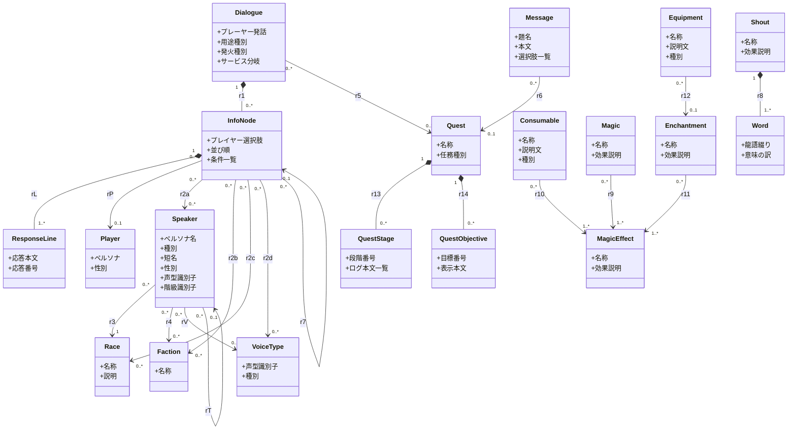
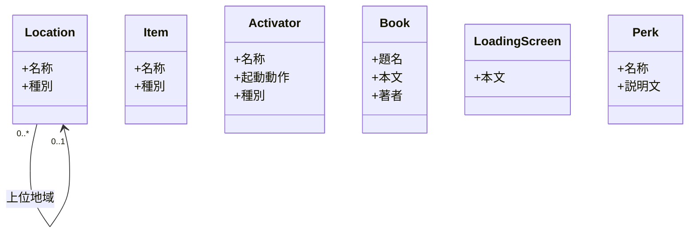

# Skyrim 構造体モデル

本書は、AITranslationEngineJp が扱う **Skyrim 世界**を、翻訳判定が要る context という基準で構造化した Skyrim 構造体モデルを固定する。「概念モデル」は別書で扱う。

実 architecture（layer 名、port、ディレクトリ）はここでは扱わない。`architecture.md` の責務。
`extractData.pas`（xEdit script）の現在の emit 状況はここでは扱わない。末尾の `実装の制約` 節で実装側の取得状況を別途整理する。

## 採用原則

- **class** = Skyrim 世界において翻訳判定 context に効く entity を捉える。世界に存在し翻訳に効くものは class に書く。`extractData.pas` の現状 emit 状況は raw data 取得の制約であり、class の存在を縛る根拠ではない（制約は制約、golden ではない）。
- **class の split 基準**: 次のいずれかを満たす時に分ける。
    - **属性集合が翻訳上 違う**: name/desc 以外に必要な field が違う。
    - **世界観として別 category**: その世界の中でカテゴリが異なる。
    - **集合度が違う**: 1 インスタンスが単一個体を表すか、個体の集合を表すかが違う。
    - 上記を満たさない差は class 分けせず、`種別` attribute で表現する。
- **個体と集合を混ぜない**: 「しゃべる人・もの」（個体）と「しゃべりうる集合の定義軸」（所属・種族・声型）は別 class にする。個体に集合定義を押し込まない。
- **edge** = 世界の中で翻訳判定 context として効く reference 関係。pas が emit しない関係でも、世界の構造として実在し翻訳判定に効くなら edge に書く。pas は raw data の取得制約として扱い、class 同士の自然な構造（hierarchy、tree、所属、構成）は本書側で構築する。**ただし「世界の構造として存在するが翻訳判定上は意味が薄い」関係は edge にしない。**
- **edge には多重度を付ける**（`"0..*"` 等）。owner 側が child を所有する構造は composition（`*--`）で示す。自己参照や tree / DAG 構造は多重度で形状を表現する。
- 関連端は 10 文字以内、A から見て B が世界で何に見えるかを書く。reverse mirror（同じことを言い換えただけ）にしない。
- 属性と関連端の合計で、その class が「世界の何であるか」を理解できる粒度にする。
- **note は最小限**にする。属性と関連端で世界の意味が立ち上がる構造を作り、説明的補足が要らないようにする。どうしても構造で表現できない opaque な convention（識別子文字列の意味解釈など）だけ note に残す。

## クラス図（v19・関連を持つ class）

他 class と関連（edge）を持つ class をこの図に置く。関連を一切持たない独立 class は次節へ分ける。

## 独立 class（関連を持たない）

他 class と edge を持たない翻訳対象 entity をここに置く。関連図に混ぜると視認の妨げになるため分離する。Location は上位地域への自己参照だけを持ち、他 class とは繋がらないためここに置く。

注: `Message` は Quest と関連（r6）を持つため関連図側に置く。ここに置く Item / Activator / Book / LoadingScreen / Perk は edge を持たない純粋な独立 entity。Location は他 class とは繋がらず、上位地域への自己参照だけを持つ。

## 話者モデルの方針

会話は 2 人の発話者で構成される。**プレイヤー選択肢**（プレイヤーが画面でクリックする台詞。DIAL:FULL、条件別の上書きは INFO:RNAM）と、**NPC 返答**（選んだ後に流れる台詞。INFO:NAM1）で、発話者が異なる。

- **プレイヤー選択肢の話者 = Player**（固定モデル）。常に主人公で、`InfoNode → Player`（rP）。音声が無く（テキストのみ）声型解決も不要で、話者解決の対象外。
- **NPC 返答の話者 = Speaker**（NPC_ / TACT）。`InfoNode` が次の 2 経路で解決する。ゲーム実行時は「集合 → 個体」で解決されるが、翻訳では「InfoNode が手掛かりを並列に持つ」前者を採る（集合の全メンバー展開は翻訳に不要で膨大なため）。
    - **名指し話者**: `InfoNode → Speaker`（r2a）。`GetIsID` / quest alias で単一個体に解決される話者。
    - **集合での絞り込み**: `InfoNode → Faction`（r2b、所属）/ `InfoNode → Race`（r2c、種族）/ `InfoNode → VoiceType`（r2d、声型）。「その集合に属す Speaker の誰か」を表す。

声は必ず話者に帰属する（`Speaker → VoiceType`、rV）。InfoNode が声を直接保持することはない。`InfoNode → VoiceType`（r2d）は「声型で候補話者を絞る」関係であって、声そのものではない。

Player と Speaker は「会話の発話者」という点で並ぶが出自が逆である。Player はレコードを持たず抽出されず、ペルソナはユーザーが翻訳設定として与える。Speaker は NPC_ / TACT から抽出し、ペルソナ名を FULL / TPLT / 声型から解決する。

## 関連端

各行 1 関連。A から見た B、B から見た A をそれぞれ 10 文字以内で書く。多重度は class 図側で表記。

| id | A | B | 関係種別 | A から見た B | B から見た A |
|---|---|---|---|---|---|
| r1 | Dialogue | InfoNode | composition | 抱える応答節 | 所属話題 |
| rL | InfoNode | ResponseLine | composition | 抱える応答行 | 所属応答節 |
| rP | InfoNode | Player | association | 選択肢の話者 | 喋る選択肢 |
| r2a | InfoNode | Speaker | association | 名指し話者 | 名指す応答節 |
| r2b | InfoNode | Faction | association | 話者所属枠 | 宛先の応答節 |
| r2c | InfoNode | Race | association | 話者種族枠 | 宛先の応答節 |
| r2d | InfoNode | VoiceType | association | 話者声型枠 | 宛先の応答節 |
| r3 | Speaker | Race | association | 生まれの種族 | 種族の体現者 |
| r4 | Speaker | Faction | association | 所属する組織 | 組織の構成員 |
| rV | Speaker | VoiceType | association | 持ち声 | 声の主 |
| rT | Speaker | Speaker | self-association | 形態の元 | 派生した形態 |
| r5 | Dialogue | Quest | association | 話題を生む任務 | 任務上の発話話題 |
| r6 | Message | Quest | association | 告知元の任務 | 任務状態の通知 |
| r7 | InfoNode | InfoNode | self-association | 先行応答節 | 後続応答節群 |
| r8 | Shout | Word | composition | 構成する龍語 | 用いる叫び |
| r9 | Magic | MagicEffect | association | 発動する効果 | 効果元の術 |
| r10 | Consumable | MagicEffect | association | 含む効果 | 効果を持つ品 |
| r11 | Enchantment | MagicEffect | association | 付与する効果 | 効果元の付与 |
| r12 | Equipment | Enchantment | association | 適用された付与 | 付与先の装備 |
| r13 | Quest | QuestStage | composition | 抱える段階 | 所属任務 |
| r14 | Quest | QuestObjective | composition | 抱える目標 | 所属任務 |

rL の多重度（`InfoNode "1" *-- "1..*" ResponseLine`）は INFO と NAM1 の関係を表す:
- 1 つの InfoNode（INFO）は **1..\* の ResponseLine（NAM1）**を抱える。NAM1 は同一 InfoNode 内で順に再生される NPC の応答行。
- prompt / 条件 / 話者解決（r2a〜d）/ 先行後続（r7）は InfoNode 単位の属性で、各 ResponseLine に複製されない。

r7 の多重度（`InfoNode "0..*" -- "0..1" InfoNode`）が tree/DAG shape を表す:
- 各 InfoNode の **先行応答節は 0..1**（INFO.PNAM single）
- 各 InfoNode の **後続応答節は 0..\***（INFO.TCLT 複数）
- 同じ先行を共有する InfoNode が複数あれば fork、複数の先行を辿る経路で同じ InfoNode に至れば DAG（PNAM 単一の縛りで通常は tree）

rT の多重度（`Speaker "0..*" -- "0..1" Speaker`）は形態 record の本体参照を表す:
- 形態 record（FULL 空、TPLT 持ち）は **本体 Speaker を 0..1** で指す（NPC_.TPLT）
- 本体は複数の形態 record から参照されうる（0..\*）

## note

属性と関連端で意味が立ち上がらない、または opaque な convention に依存する点だけ残す。

- **Speaker.種別**: 個体としての出自を表す。`固有 actor`（FULL を持つ NPC_）/ `形態 actor`（FULL 空、TPLT で本体に届く。例 `DLC1HarkonCombatMagic`）/ `プール actor`（FULL 空、TPLT 先が LVLN。例 `MQ103ImperialSoldier`）/ `声型代表`（FULL 空、VTCK のみ。例 `VoiceTypeNPCFemaleEvenToned`）/ `喋るオブジェクト`（TACT。扉・像など）。
- **Speaker.ペルソナ名**: 翻訳の話者 context に使う名前。解決優先は (1) 自身の FULL、(2) TPLT 連鎖の本体 FULL、(3) EditorID 由来の役割名（プール役割 / 声型名）。as-is 検証で「手掛かりゼロの話者」は 0 件で、どの話者も何らかのペルソナ名に解決できることを確認済み。
- **Speaker.声型識別子**: 例 `MaleNord`、`FemaleArgonian`。文字列規約から「性別 + 種族傾向 + 演技層」を読み取る Skyrim convention に依存する。rV で VoiceType に繋がる。
- **Speaker.階級識別子**: 例 `EncWarrior01Class`。文字列規約から職業傾向を読み取る convention に依存する。
- **VoiceType.種別**: `汎用人間`（例 `FemaleNord`、多数 NPC を代表）/ `生物`（例 `CrDragonVoice`）/ `キャラ専用`（例 `DLC1SeranaVoice`、単一キャラに直結）。キャラ専用 voice は rV が実質 1:1 で、単一 Speaker のペルソナに届く。
- **VoiceType.声型識別子**: VTYP record の EditorID。VTYP は FULL（表示名）を持たないため翻訳対象ではなく、話者推定の手掛かりに使う。
- **Dialogue.プレーヤー発話**: subtype が TOPIC 系では player が選ぶ topic 台詞、reaction 系（HELO / GBYE / ATCK 等）では空または trigger label となる。`発火種別` の解釈を伴う。
- **Dialogue.発火種別**: DIAL.DATA の subtype byte（TOPIC / HELO / GBYE / ATCK / FAVORS / SERVICES 等）。値の集合は SSEEdit / UESP の DIAL Subtype enum に従う。
- **InfoNode.プレイヤー選択肢**: INFO.RNAM。プレイヤーが画面でクリックする台詞の、条件別の上書き文。既定の選択肢文は話題側の DIAL:FULL（`Dialogue.プレーヤー発話`）にあり、RNAM はそれを条件で差し替える時に出る。話者は固定モデル Player（rP）。RNAM を持たない InfoNode は NPC 自発の応答節（挨拶・戦闘ボイス等）で、プレイヤー選択肢を持たない。
- **InfoNode.条件一覧**: INFO.CTDA の list。各 entry は function id、引数（faction 参照、race 参照、voice type 参照、sex 値、global 値など）、比較演算子、比較値で構成。世界側で「この応答節がどんな対象に対して発火するか」を決める。NPC 返答の話者の集合での絞り込み（r2b / r2c / r2d）と名指し（r2a）は、この条件一覧から導出される。
- **ResponseLine.応答番号**: INFO.TRDT の response number。同一 InfoNode 内で NAM1（応答本文）の再生順を示す。
- **Player.ペルソナ**: 主人公の口調・人称・背景など、プレイヤー選択肢の翻訳に効く設定。抽出データに無く、ユーザーが翻訳設定として与える。`Speaker.ペルソナ名`（抽出由来）と対をなす。
- **Player.性別**: Skyrim は主人公の性別を選択でき、プレイヤー選択肢の代名詞（`<Alias.Pronoun=Player>` 等）に影響する。ユーザー設定。
- **QuestStage.ログ本文一覧**: 1 stage（INDX）に対して 0..\* の CNAM 文字列を持つ。各 CNAM は player の Quest log に表示される 1 つの進捗 text。条件付きで発火する CNAM もあるため list で扱う。
- **Activator.種別**: 起動・採取可能なオブジェクトの record 種別を表す。`ACTI`（扉 / 鉱脈 / 賽銭箱 / レバー等の通常起動物）/ `FLOR`（採取植物。ニルンルート / 山の花 / キノコ）/ `TREE`（樹木 / 木の実）。3 種は クロスヘア表示の名称（FULL）と起動動作テキスト（RNAM）という同じ翻訳属性を持つため 1 class に統合し、種別で区別する。item（所持品）ではなく、世界に配置され起動する対象である点で Item class と分ける。
- **Activator.起動動作**: RNAM。クロスヘアを合わせた時に表示される動詞句（"開ける" / "採取" 等）。空の record もある。
- **Message.選択肢一覧**: MESG.ITXT の list。message box に並ぶ選択肢ボタンの表示 text を 0..\* で持つ。
- **Book.著者**: BOOK.CNAM。書物の著者名。表示されるため翻訳対象とする。
- **Race.説明**: RACE.DESC。character creation 画面で表示される種族説明文。
- **Word.龍語綴り**: WOOP.FULL。龍語の綴り（例 `Fus` / `Zol`）。龍文字フォントで表示するため翻訳しない（xTranslator でも Source = Dest 固定の翻訳禁止対象）。
- **Word.意味の訳**: WOOP.TNAM。その言葉が表す意味（例 `Tear`→`涙`、`Health`→`体力`）。翻訳対象はこちらで、WOOP の primary translation target は TNAM。

## 既知の弱点（指摘の入口）

| # | 論点 |
|---|---|
| 1 | **Dialogue 配下の応答 tree（r7）の context 長さ**: LLM に Dialogue 単位で tree 全体を投入する設計を取った場合、長い Dialogue（数百 InfoNode を含む quest 中心 dialogue）は context 上限を超える。tree subtree 単位の分割 or root path 抜粋などの工夫が翻訳実装で要る |
| 2 | **集合での話者絞り込み（r2b/r2c/r2d）の実体化**: 翻訳では集合を個体に展開しない方針だが、純汎用 response（声型のみで話者が決まる）では候補話者が広く、ペルソナ context をどこまで具体化するかは翻訳実装の判断が要る |
| 3 | **声型代表 Speaker と VoiceType の二重性**: `VoiceTypeNPCFemaleEvenToned`（声型代表 Speaker、NPC_ record）と `FemaleEvenToned`（VoiceType、VTYP record）が併存する。前者は個体、後者は集合定義で別 class だが、指す声型が同じため、翻訳実装でどちらを優先するかの整理が要る |

## 実装の制約（pas 抽出状況）

本書 class / edge / attribute のうち、現 `extractData.v2.pas` で raw data を populate できる範囲と、できない範囲を整理する。
本書は世界の構造を表すものであり、現 pas で populate されないからといって class や edge を削らない。pas を拡張するか、別 source（手作業 dictionary、別 script、SSEEdit プラグイン等）で補う方針は実装側で決める。

### 話者解決の as-is（5 plugin の実測で確認）

- **ANAM-Speaker はほぼ使われない**。Skyrim.esm 0.7%、Dragonborn 0.6%、調査した mod は 0%。話者は ANAM の直接指定でなく conditions（CTDA）で決まる。speaker を ANAM から取る前提は成立しない。
- **話者特定の主経路は `GetIsID`（直接 NPC / TACT）と `GetIsAliasRef`（quest alias）**。名前あり実 NPC に直結する response は base game で約半数（Skyrim 51%、Dragonborn 57%）。
- **alias は名前あり実 NPC に届く**。forced reference / unique actor で解決した分は FULL をほぼ全て持つ。external alias（別 quest 経由）は解決が複雑で、簡易解決では未解決が残る。
- **純汎用（声型のみで話者が決まる）は 1/4〜1/2**。これらは r2d（声型での絞り込み）で表す。
- **名前空話者は必ずペルソナ名に解決できる**（`editor_only` = 0）。形態（TPLT 本体名）/ プール（LVLN 役割名）/ 声型代表（声型名）のいずれか。
- **VTYP は FULL を持たない独立 record**。汎用声型・生物声・キャラ専用 voice の 3 種があり、キャラ専用 voice は単一 Speaker に直結する。

### pas が現在 populate するもの

- Dialogue（DIAL）の `プレーヤー発話`、`用途種別`、`サービス分岐`、`r1`、`r5`
- InfoNode（INFO）の `プレイヤー選択肢`（RNAM）、`並び順`、`条件一覧`（CTDA）、`r7` 両側（PNAM / TCLT）
- ResponseLine（NAM1）の `応答本文`、`応答番号`（TRDT）
- Speaker（NPC_）の `名称`（FULL）、`短名`（SHRT）、`性別`、`声型識別子`（VTCK）、`階級識別子`（CNAM）、`r3`（種族）
- Speaker の voice 解決結果（候補話者が持つ声型の集約）。現 pas は voice_types として InfoNode に集約出力する。これは「InfoNode → Speaker → VoiceType」の導出射影であり、世界の一次構造は本書の rV（Speaker → VoiceType）にある。
- Race（RACE）、Faction（FACT）の `名称`
- Quest（QUST）の `名称`、`任務種別`、QuestStage / QuestObjective
- Message（MESG）の `題名`（FULL）/ `本文`（DESC）/ `選択肢一覧`（ITXT 配列）、LoadingScreen（LSCR）、Perk（PERK）の各 text
- Race（RACE）の `説明`（DESC、`名称` と併せて出力）
- Book（BOOK）の `著者`（CNAM、`題名` / `本文` と併せて出力）
- Activator（ACTI / FLOR / TREE）の `名称`（FULL）/ `起動動作`（RNAM）/ `種別`（signature）。FLOR は v18 で items から Activator へ移動。
- Item / Equipment / Consumable / Book / Magic / Enchantment / MagicEffect / Shout / Location の各 name / desc / 種別と、解決済みの参照（r9〜r12）

### pas が現在 populate しない / 設計と差がある もの

- **InfoNode / ResponseLine の 2 階層化**: 現 pas は INFO の各 NAM1 を 1 つの response 行として並べ、INFO 単位属性（prompt / 条件 / 話者 / 前後）を各行に複製している。本書 v19 の「InfoNode（INFO）と ResponseLine（NAM1）の分離」は未反映。複製は書き戻し / 比較で id 単位の重複排除を要する。
- **Player（固定モデル）の話者付け（rP）**: 未反映。プレイヤー選択肢（DIAL:FULL / INFO:RNAM）の話者は Player だが、現 pas は話者を区別せず、Player のペルソナ設定経路（翻訳側）も未整備。
- **r2a/r2b/r2c/r2d の構造的分離**: 現 pas は speaker_id（単一）と speaker_kind（specific/generic 二分）と voice_types（集約）で話者を表す。本書の「名指し（r2a）と集合絞り込み（r2b/c/d）の分離」は未反映。特に speaker_id が voice 解決経由で名前空テンプレ NPC を拾い、speaker_kind を誤って specific にする不具合がある。
- **rT（形態 record の本体参照、NPC_.TPLT）**: 未抽出。
- **rV をキャラ専用 voice 経由で単一 Speaker に解決する経路**: 未整理。
- **VoiceType の独立 class 化と種別（汎用 / 生物 / キャラ専用）**: 未反映。
- **TACT（喋るオブジェクト）を Speaker に含める**: 未反映。
- **r8 Word / r9〜r12 の一部参照解決**、**Faction ↔ Speaker（r4）**: pas 側の拡張または別 source で補う。
- **master plugin の同時取り込み**: ESP header の MAST 宣言で参照される master record（Skyrim.esm 等）を一緒に emit していない。SSEEdit は master を先に load するため、pas を MAST 走査するよう拡張すれば取り込める。
