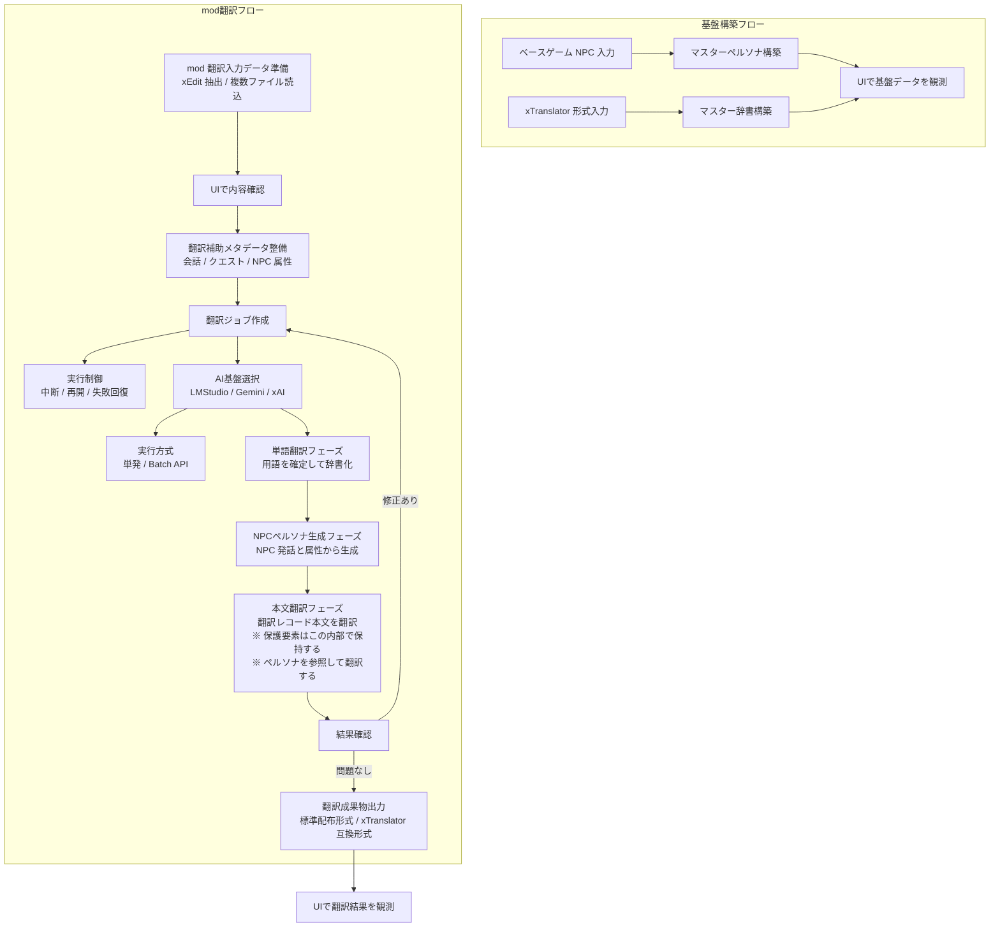
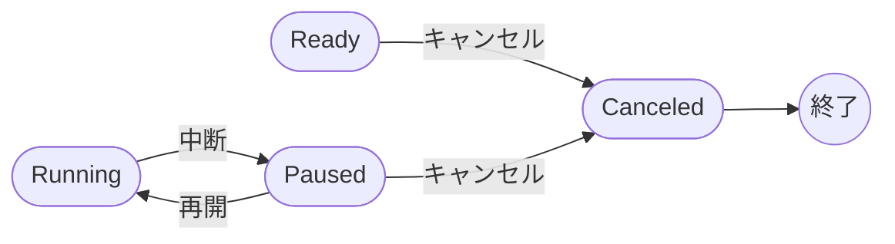
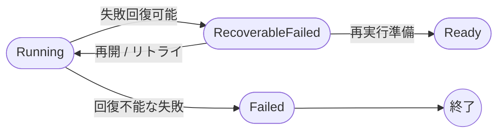

# 要件一覧

関連文書: [`index.md`](./index.md), [`core-beliefs.md`](./core-beliefs.md), [`architecture.md`](./architecture.md), [`tech-selection.md`](./tech-selection.md), [`er.md`](./er.md)

このセクションでは、システムが恒久的に満たすべき抽象レベルの要件だけを定義する。

## 1. 対象と入力

このセクションでは、システムが扱う対象と入力条件を整理する。

- APIを経由したAIを用いて､Skyrim Mod の翻訳を翻訳補助メタデータを考慮した高品質な日本語へ変換できること。
- xEditで抽出した構造化データを入力として受け取り翻訳できること｡
- 複数のファイルを入力データとして読み込み､全ての入力データを翻訳できること｡
- 1つの翻訳ジョブの中で複数の入力ファイルを束ねつつ、ファイルごとの出自を失わずに保持できること。
- 抽出JSONを正本として保持しつつ､翻訳実行時に再構築可能な実行キャッシュへ取り込めること｡

## 2. 翻訳補助メタデータと辞書

このセクションでは、翻訳品質を支える翻訳補助メタデータと辞書の要件を整理する。

- 会話構造を元に､翻訳補助メタデータとしてダイアログ補助メタデータを提供すること｡
- NPCの発言と､種族､性別情報を元に､NPCペルソナ生成フェーズでAIにペルソナを生成させられること｡
- 翻訳補助メタデータとしてペルソナを提供できること｡これは､ベースゲームNPC, mod追加NPCを対象とする｡
- modの翻訳前に､事前にベースゲームNPCのNPCペルソナ生成フェーズを実行し､マスターペルソナとして構築可能なこと｡
- クエストの進行情報を元に､翻訳補助メタデータとしてクエスト補助メタデータを提供できること｡
- 既存の用語辞書を元に､一貫した単語訳でAIに翻訳させられること｡
- modの翻訳前に､事前にxTranslator形式の翻訳ファイルを取り込み､マスター辞書として構築可能なこと｡
- 事前に単語翻訳フェーズを実行し､会話文やクエストの本文翻訳フェーズに辞書として再利用できること｡
- mod 翻訳中に生成した NPC ペルソナは、マスターペルソナとは分離してジョブ単位で保持し、再観測できること。
- 翻訳に利用する翻訳補助メタデータ､辞書､基盤データは､実行前､実行後ともにUIからユーザーが観測可能であること｡

## 3. 翻訳実行

このセクションでは、翻訳処理そのものに求める成立条件を整理する。

- 翻訳レコード種別に応じて適切な翻訳指示を構成できること｡
- `<10gold>` など､原文の構造や埋め込み要素を損なわずに翻訳を実行できること。
- 翻訳単位は、最終出力に必要な `FormID`、`EditorID`、レコード種別、フィールド種別、原文、訳文、出力ステータスを lossless に保持できること。

## 4. AI実行基盤

このセクションでは、利用可能なAI実行方式と運用要件を整理する。

- LMStudioを翻訳用AIとして利用できること｡
- Gemini, xAIを翻訳AIとして利用できること｡
- Gemini, xAIはBatchAPIが利用できること｡
- 翻訳ジョブの中断､再開､失敗回復が継続的に行えること｡
- 翻訳ジョブ､APIの実行進捗を確認できること｡
- マスターペルソナ構築､マスター辞書構築､翻訳フロー､各翻訳フェーズなど､目的に沿ったAIを選択可能であること｡
- 翻訳ジョブ完了後､未完了ジョブが参照していない入力キャッシュを削除して再構築可能な状態を維持できること｡

## 5. 出力

このセクションでは、翻訳結果の出力要件を整理する。

- 翻訳成果物を標準的な配布形式および xTranslator 互換形式で出力できること。
- xTranslator 互換形式では、各出力行について `EDID`、`REC`、`FIELD`、`FORMID`、`Source`、`Dest`、`Status` を再構成できること。

## 6. 業務フロー

このセクションでは、仕様全体を通した業務フローを整理する。

### 6.1 業務フローの要点

- 基盤構築フローでは、ベースゲーム NPC 由来のマスターペルソナと、xTranslator 取り込み済みのマスター辞書を構築する
- mod 翻訳フローでは、単語翻訳フェーズで訳語を確定し、その結果を本文翻訳フェーズで再利用する
- NPC ペルソナ生成フェーズは、本文翻訳フェーズの前に実行し、ベースゲーム NPC と mod 追加 NPC の両方に適用する
- 翻訳ジョブは中断、再開、失敗回復の対象とし、進捗は UI から観測する

## 7. 翻訳ジョブ状態遷移

このセクションでは、翻訳ジョブの状態遷移を整理する。

#### 正常系

#### 操作系

#### 異常系

### 7.1 状態の要点

- `正常系` は `Draft` から `Completed` までの主経路
- `操作系` は中断、再開、キャンセルのユーザー操作
- `異常系` は失敗回復可能な状態と回復不能な失敗状態
- `Ready` はジョブ作成後で、まだ実行していない待機状態
- `Running` は翻訳フェーズを実行中の状態
- `Paused` は中断後に再開可能な停止状態
- `RecoverableFailed` は失敗したが再開またはリトライ可能な状態
- `Completed` は翻訳と出力が完了した状態
- `Failed` は回復不能な失敗状態
- `Canceled` はユーザー操作などで終了した状態

## 8. 用語集

このセクションでは、仕様全体で共通して使う用語を定義する。以後の記述では、原則としてこの語彙に統一する。

- **入力**
  - **入力データ**: 翻訳処理に取り込むデータ全体。ファイル、抽出結果、複数データの組み合わせを含む。
  - **翻訳レコード**: 入力データ内の個別の翻訳単位。台詞、説明文、クエスト文などを含む。
- **翻訳補助情報**
  - **翻訳補助メタデータ**: 翻訳判断に使う付加情報の総称。ダイアログ補助メタデータ、クエスト補助メタデータ、NPC属性メタデータなどを含む。
  - **ダイアログ補助メタデータ**: 会話の前後関係、発話者、応答関係など、会話翻訳を支える情報。
  - **クエスト補助メタデータ**: クエストの目標、概要、進行状況など、クエスト翻訳を支える情報。
  - **NPC属性メタデータ**: 種族、性別、立場、性格傾向など、NPCの翻訳判断に使う属性情報。
  - **ペルソナ**: NPCごとの話し方、性格、属性の要約情報。翻訳時の口調や語彙選択に使う。
  - **マスターペルソナ**: ベースゲーム由来のペルソナを先に生成して蓄積した基準データ。mod追加NPCの翻訳時にも参照する。
  - **辞書**: 単語や固有名詞に対する訳語の対応表。
  - **マスター辞書**: xTranslator 形式などから事前に取り込んだ基準辞書。翻訳中に生成した語彙の再利用元にもなる。
  - **再利用語**: 確定した訳語のうち、会話文やクエスト文へ流用する対象。
- **翻訳フェーズ**
  - **NPCペルソナ生成フェーズ**: NPCの発話や属性からペルソナを生成するフェーズ。ベースゲームNPCの事前生成にも、翻訳対象NPCの生成にも使う。
  - **単語翻訳フェーズ**: 単語や固有名詞を個別に翻訳するフェーズ。本文翻訳フェーズの前段で実行し、訳語を辞書化する。
  - **本文翻訳フェーズ**: 翻訳レコード本文を翻訳するフェーズ。単語翻訳フェーズで確定した訳語を再利用する。
  - **翻訳ジョブ**: 1 回の翻訳実行単位。中断、再開、失敗回復の対象になる。
  - **翻訳指示**: 翻訳レコード種別や翻訳補助メタデータに応じて AI に与える命令文。
- **基盤データ**
  - **マスターペルソナ**: ベースゲーム由来のペルソナを先に生成して蓄積した基準データ。翻訳フェーズで再利用する。
  - **マスター辞書**: xTranslator 形式などから事前に取り込んだ基準辞書。翻訳フェーズで再利用する。
- **保持要素**
  - **埋め込み要素**: `<10gold>` のように、文字列内に埋め込まれたまま保持すべき記号列や構造要素。
- **実行基盤**
  - **AI基盤**: 翻訳に使う AI の実行方式と接続先の総称。LMStudio、Gemini、xAI などを含む。
- **出力**
  - **出力成果物**: 翻訳結果として生成されるファイル一式。
- **外部ツール**
  - **xEdit**: 構造化データを抽出するための外部ツール。
  - **xTranslator**: 翻訳ファイルのインポート、エクスポート互換を持つ外部ツール。

### 用語の使い分け

- 「辞書」は一般概念を指し、「マスター辞書」は事前取り込み済みの基準データを指す。
- 「ペルソナ」は個別 NPC の情報を指し、「マスターペルソナ」はベースゲーム由来で基準化された集合を指す。
- 「翻訳補助メタデータ」は広い上位概念であり、「ダイアログ補助メタデータ」「クエスト補助メタデータ」「NPC属性メタデータ」を含む。
- 「入力データ」は翻訳処理に取り込む全体を指し、「翻訳レコード」はその中の最小翻訳単位として使う。
- 「翻訳フロー」は `NPCペルソナ生成フェーズ`、`単語翻訳フェーズ`、`本文翻訳フェーズ` で構成する。
- 「マスターペルソナ」と「マスター辞書」は独立した基盤データであり、翻訳フローが参照する。
- 「単語翻訳フェーズ」は先に実行して訳語を確定するフェーズであり、「本文翻訳フェーズ」はその訳語を再利用して翻訳レコード本文を処理するフェーズとする。
