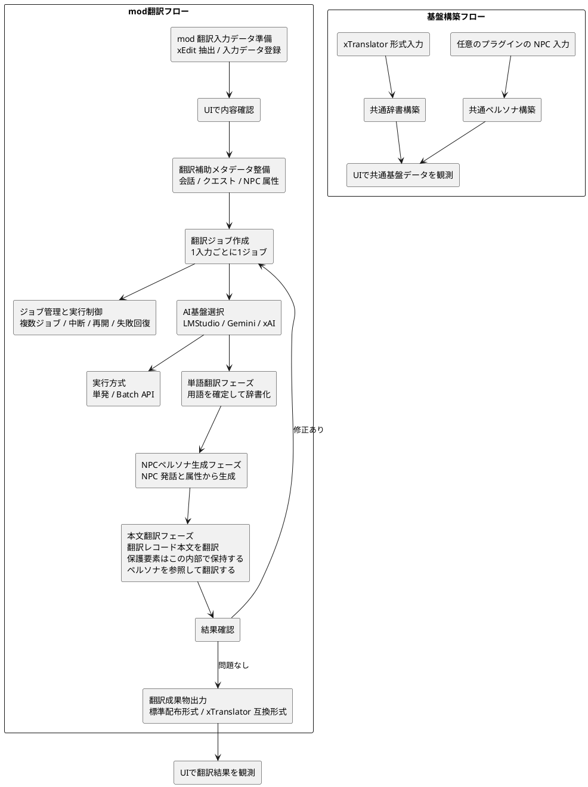
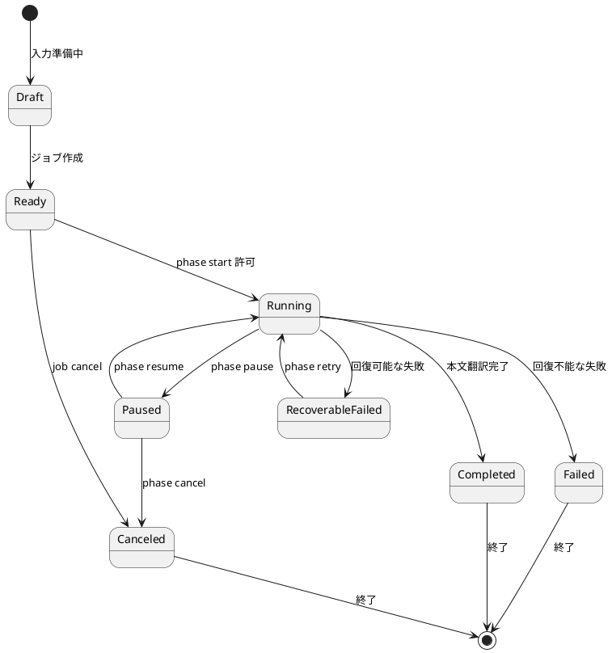
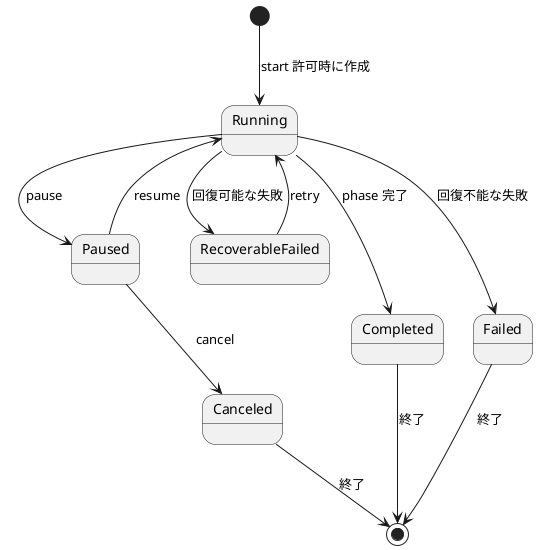

# 要件一覧

関連文書: [`index.md`](./index.md), [`core-beliefs.md`](./core-beliefs.md), [`architecture.md`](./architecture.md), [`tech-selection.md`](./tech-selection.md), [`er.md`](./er.md)

このセクションでは、システムが恒久的に満たすべき抽象レベルの要件だけを定義する。

## 1. 対象と入力

このセクションでは、システムが扱う対象と入力条件を整理する。

- APIを経由したAIを用いて､Skyrim Mod の翻訳を翻訳補助メタデータを考慮した高品質な日本語へ変換できること。
- xEditで抽出した構造化データを入力として受け取り翻訳できること｡
- 複数の入力データを登録し、それぞれの入力データを独立した翻訳ジョブとして管理できること。
- 1つの翻訳ジョブは1つのxEdit抽出データを対象とし、入力ファイルの出自を失わずに保持できること。
- 抽出JSONを正本として保持しつつ､翻訳実行時に再構築可能な実行キャッシュへ取り込めること｡

## 2. 翻訳補助メタデータと辞書

このセクションでは、翻訳品質を支える翻訳補助メタデータと辞書の要件を整理する。

- 会話構造を元に､翻訳補助メタデータとしてダイアログ補助メタデータを提供すること｡
- NPCの発言と､種族､性別情報を元に､NPCペルソナ生成フェーズでAIにペルソナを生成させられること｡
- 翻訳補助メタデータとしてペルソナを提供できること｡これは､任意のプラグインのNPC, mod追加NPCを対象とする｡
- NPCペルソナはNPCプロファイルを根に保持し、抽出スナップショットやジョブ内生成物の削除後も共通ペルソナを再利用できること。
- modの翻訳前に､事前に任意のプラグインのNPCのNPCペルソナ生成フェーズを実行し､共通ペルソナとして構築可能なこと｡
- クエストの進行情報を元に､翻訳補助メタデータとしてクエスト補助メタデータを提供できること｡
- 既存の用語辞書(xml)を元に､一貫した単語訳でAIに翻訳させられること｡
- 事前にxTranslator形式の翻訳ファイルを取り込み､共通辞書として構築可能なこと｡
- 共通辞書として登録済み、または用語翻訳で翻訳済みの対象は翻訳対象とせず、置き換えること。
    - 完全一致のみを構築済みとして扱うこと。この場合、内部の出力ステータスとして`cached`を保持できること。
    - xTranslator互換形式へ出力する場合、内部の`cached`は xTranslator の `Status=1` に写像すること。
    - 辞書置換であることは、xTranslator の `Status` とは別の内部観測情報として保持できること。
- 事前に単語翻訳フェーズを実行し､会話文やクエストの本文翻訳フェーズに辞書として再利用できること｡
- mod 翻訳中に生成した NPC ペルソナは、共通ペルソナとは分離してジョブ内ペルソナとして保持し、翻訳完了後に flush 可能なこと。
- 翻訳に利用する翻訳補助メタデータ､辞書､共通基盤データは､実行前､実行後ともにUIからユーザーが観測可能であること｡

## 3. 翻訳実行

このセクションでは、翻訳処理そのものに求める成立条件を整理する。

- 翻訳レコード種別に応じて適切な翻訳指示を構成できること｡
- `<10gold>` など､原文の構造や埋め込み要素を損なわずに翻訳を実行できること。
- 翻訳単位は、最終出力に必要な `FormID`、`EditorID`、レコード種別、フィールド種別、原文、訳文、出力ステータスを lossless に保持できること。

## 4. AI実行基盤

このセクションでは、利用可能なAI実行方式と運用要件を整理する。

- LMStudioを翻訳用AIとして利用できること｡
- Gemini, xAIを翻訳AIとして利用できること｡
- Gemini, xAIはBatchAPIが利用できること｡
    - 失敗しても特に別プロバイダフォールバックは必要ない。
- 翻訳ジョブの中断､再開､失敗回復が継続的に行えること｡
- 翻訳ジョブ､APIの実行進捗を確認できること｡
- 共通ペルソナ構築､共通辞書構築､翻訳フロー､各翻訳フェーズなど､目的に沿ったAIを選択可能であること｡
    - 各フェーズではいずれのモデルでも選択でき、ユーザーが好きにプロバイダ・モデルを選択できること。
- 各フェーズのAPI選択、APIKeyは再入力不要で保存ができること。
    - APIKeyは暗号化して保存すること。
- 翻訳ジョブ完了後､未完了ジョブが参照していない入力キャッシュを削除して再構築可能な状態を維持できること｡

## 5. 出力

このセクションでは、翻訳結果の出力要件を整理する。

- 翻訳成果物を標準的な配布形式および xTranslator 互換形式で出力できること。
- xTranslator 互換形式では、各出力行について `EDID`、`REC`、`FIELD`、`FORMID`、`Source`、`Dest`、`Status` を再構成できること。
- 標準的な配布形式はxTranslator互換の`.xml`とする。対象ゲームはSkyrimとする。

## 6. 業務フロー

このセクションでは、仕様全体を通した業務フローを整理する。

```plantuml
@startuml

top to bottom direction
skinparam packageStyle rectangle

rectangle "基盤構築フロー" as FoundationFlow {
    rectangle "任意のプラグインの NPC 入力" as FoundationNpcInput
    rectangle "共通ペルソナ構築" as SharedPersonaBuild
    rectangle "xTranslator 形式入力" as XTranslatorInput
    rectangle "共通辞書構築" as SharedDictionaryBuild
    rectangle "UIで共通基盤データを観測" as ObserveFoundationData

    FoundationNpcInput --> SharedPersonaBuild
    XTranslatorInput --> SharedDictionaryBuild
    SharedPersonaBuild --> ObserveFoundationData
    SharedDictionaryBuild --> ObserveFoundationData
}

rectangle "mod翻訳フロー" as ModTranslationFlow {
    rectangle "mod 翻訳入力データ準備\nxEdit 抽出 / 入力データ登録" as PrepareInput
    rectangle "UIで内容確認" as ConfirmInput
    rectangle "翻訳補助メタデータ整備\n会話 / クエスト / NPC 属性" as PrepareMetadata
    rectangle "翻訳ジョブ作成\n1入力ごとに1ジョブ" as CreateJob
    rectangle "ジョブ管理と実行制御\n複数ジョブ / 中断 / 再開 / 失敗回復" as ControlJob
    rectangle "AI基盤選択\nLMStudio / Gemini / xAI" as SelectAiRuntime
    rectangle "実行方式\n単発 / Batch API" as SelectExecutionMode
    rectangle "単語翻訳フェーズ\n用語を確定して辞書化" as TermTranslationPhase
    rectangle "NPCペルソナ生成フェーズ\nNPC 発話と属性から生成" as PersonaGenerationPhase
    rectangle "本文翻訳フェーズ\n翻訳レコード本文を翻訳\n保護要素はこの内部で保持する\nペルソナを参照して翻訳する" as BodyTranslationPhase
    rectangle "結果確認" as ReviewResult
    rectangle "翻訳成果物出力\n標準配布形式 / xTranslator 互換形式" as ExportArtifact

    PrepareInput --> ConfirmInput
    ConfirmInput --> PrepareMetadata
    PrepareMetadata --> CreateJob
    CreateJob --> ControlJob
    CreateJob --> SelectAiRuntime
    SelectAiRuntime --> SelectExecutionMode
    SelectAiRuntime --> TermTranslationPhase
    TermTranslationPhase --> PersonaGenerationPhase
    PersonaGenerationPhase --> BodyTranslationPhase
    BodyTranslationPhase --> ReviewResult
    ReviewResult --> CreateJob : 修正あり
    ReviewResult --> ExportArtifact : 問題なし
}

rectangle "UIで翻訳結果を観測" as ObserveTranslationResult
ExportArtifact --> ObserveTranslationResult

@enduml
```

### 6.1 業務フローの要点

- 基盤構築フローでは、任意のプラグインの NPC 由来の共通ペルソナと、xTranslator 取り込み済みの共通辞書を構築する
- mod 翻訳フローでは、単語翻訳フェーズで訳語を確定し、その結果を本文翻訳フェーズで再利用する
- NPC ペルソナ生成フェーズは、本文翻訳フェーズの前に実行し、任意のプラグインの NPC と mod 追加 NPC の両方に適用する
    - NPCペルソナ生成フェーズでの入力は原文とする。
- 翻訳ジョブは1つの入力データごとに作成し、複数入力は複数ジョブとして一覧管理する
- 各翻訳ジョブは中断、再開、失敗回復の対象とし、進捗は UI から観測する

## 7. 翻訳ジョブ状態

このセクションでは、翻訳ジョブ全体の状態とフェーズ実行状態を分けて整理する。
大枠の一覧、導線、ジョブ全体の表示は `TRANSLATION_JOB.state` を正本にする。
各フェーズ画面の操作可否は、現在フェーズの `JOB_PHASE_RUN.state` を正本にする。

### 7.1 `TRANSLATION_JOB.state`

`TRANSLATION_JOB.state` はジョブ全体の表示、一覧、導線、terminal guard に使う。
`Ready` job には `JOB_PHASE_RUN` を事前作成しない。
フェーズ開始が許可された時だけ、対象フェーズの `JOB_PHASE_RUN` を作成する。

```plantuml
@startuml

top to bottom direction

[*] --> Draft : 入力準備中
Draft --> Ready : ジョブ作成
Ready --> Running : phase start 許可
Running --> Paused : phase pause
Paused --> Running : phase resume
Running --> RecoverableFailed : 回復可能な失敗
RecoverableFailed --> Running : phase retry
Running --> Completed : 本文翻訳完了
Running --> Failed : 回復不能な失敗
Ready --> Canceled : job cancel
Paused --> Canceled : phase cancel
Completed --> [*] : 終了
Failed --> [*] : 終了
Canceled --> [*] : 終了

@enduml
```

### 7.2 `JOB_PHASE_RUN.state`

`JOB_PHASE_RUN.state` はフェーズ画面の操作可否、進捗、失敗回復に使う。
retry、resume、開始再送は同じ `JOB_PHASE_RUN` を継続する。
`RecoverableFailed` から `Ready` へ戻す経路は作らない。

```plantuml
@startuml

top to bottom direction

[*] --> Running : start 許可時に作成
Running --> Paused : pause
Paused --> Running : resume
Running --> RecoverableFailed : 回復可能な失敗
RecoverableFailed --> Running : retry
Running --> Completed : phase 完了
Running --> Failed : 回復不能な失敗
Paused --> Canceled : cancel
Completed --> [*] : 終了
Failed --> [*] : 終了
Canceled --> [*] : 終了

@enduml
```

### 7.3 共通操作規則

- `Running` の `JOB_PHASE_RUN` だけを pause できる。
- `Paused` の `JOB_PHASE_RUN` だけを resume できる。
- `RecoverableFailed` の `JOB_PHASE_RUN` だけを retry できる。
- phase 開始後の cancel は、`Paused` の対象フェーズからだけ許可する。
- terminal job では、phase run 作成、保存、readiness 更新、late response 後書きを拒否する。

### 7.4 phase 別開始前提

- 単語翻訳フェーズは、入力データと辞書生成対象を参照できる時だけ開始できる。
- NPC ペルソナ生成フェーズは、単語翻訳フェーズの完了結果を参照できる時だけ開始できる。
- 本文翻訳フェーズは、persona snapshot と翻訳対象 field を参照できる時だけ開始できる。
- phase type で分ける対象は、開始前提データ、完了判定、呼び出す service method だけにする。

### 7.5 状態の要点

- `Draft` は `TRANSLATION_JOB` 作成前の準備状態である。
- `Ready` は `TRANSLATION_JOB` 作成後で、まだ active な `JOB_PHASE_RUN` がない状態である。
- `Running` は対象フェーズを実行中の状態である。
- `Paused` は中断後に resume または cancel を判断できる状態である。
- `RecoverableFailed` は retry で同じ `JOB_PHASE_RUN` を継続できる失敗状態である。
- `Completed`、`Failed`、`Canceled` は terminal state である。

## 8. 用語集

このセクションでは、仕様全体で共通して使う用語を定義する。以後の記述では、原則としてこの語彙に統一する。

- **入力**
  - **入力データ**: 翻訳処理に取り込む1つのxEdit抽出データ。ファイルと抽出結果を含む。複数入力は複数の入力データとして管理する。
  - **翻訳レコード**: 入力データ内の個別の翻訳単位。台詞、説明文、クエスト文などを含む。
- **翻訳補助情報**
  - **翻訳補助メタデータ**: 翻訳判断に使う付加情報の総称。ダイアログ補助メタデータ、クエスト補助メタデータ、NPC属性メタデータなどを含む。
  - **ダイアログ補助メタデータ**: 会話の前後関係、発話者、応答関係など、会話翻訳を支える情報。
  - **クエスト補助メタデータ**: クエストの目標、概要、進行状況など、クエスト翻訳を支える情報。
  - **NPC属性メタデータ**: 種族、性別、立場、性格傾向など、NPCの翻訳判断に使う属性情報。
  - **NPCプロファイル**: 抽出スナップショットをまたいで同じ NPC と見なすための基準。対象プラグイン名、FormID、RecordType などで識別する。
  - **ペルソナ**: NPCごとの話し方、性格、属性の要約情報。翻訳時の口調や語彙選択に使う。
  - **共通ペルソナ**: NPCプロファイルに紐づく、ジョブをまたいで参照可能なペルソナ。
  - **ジョブ内ペルソナ**: 翻訳ジョブ内で生成され、翻訳完了後に flush 可能なペルソナ。
  - **辞書**: 単語や固有名詞に対する訳語の対応表。
  - **共通辞書**: xTranslator 形式などから事前に取り込んだ、ジョブをまたいで参照可能な辞書。
  - **ジョブ内辞書**: 翻訳ジョブ内で生成され、翻訳完了後に flush 可能な辞書。
  - **再利用語**: 確定した訳語のうち、会話文やクエスト文へ流用する対象。
- **共通基盤データ**: 共通ペルソナと共通辞書を指す。
- **標準的な配布形式**: xTranslator互換ファイルを指す。
- **出力ステータス**: 1翻訳単位の翻訳ステータスを指す。
- **翻訳フェーズ**
  - **NPCペルソナ生成フェーズ**: NPCの発話や属性からペルソナを生成するフェーズ。任意のプラグインのNPCの事前生成にも、翻訳対象NPCの生成にも使う。
  - **単語翻訳フェーズ**: 単語や固有名詞を個別に翻訳するフェーズ。本文翻訳フェーズの前段で実行し、訳語を辞書化する。
  - **本文翻訳フェーズ**: 翻訳レコード本文を翻訳するフェーズ。単語翻訳フェーズで確定した訳語を再利用する。
  - **翻訳ジョブ**: 1つの入力データに対する1回の翻訳実行単位。中断、再開、失敗回復の対象になる。
  - **翻訳指示**: 翻訳レコード種別や翻訳補助メタデータに応じて AI に与える命令文。
- **保持要素**
  - **埋め込み要素**: `<10gold>` のように、文字列内に埋め込まれたまま保持すべき記号列や構造要素。
- **実行基盤**
  - **AI基盤**: 翻訳に使う AI の実行方式と接続先の総称。LMStudio、Gemini、xAI などを含む。
- **出力**
  - **出力成果物**: 翻訳結果として生成されるファイル一式。
- **外部ツール**
  - **xEdit**: 構造化データを抽出するための外部ツール。
  - **xTranslator**: 翻訳ファイルのインポート、エクスポート互換を持つ外部ツール。

### 用語の使い分け

- 「辞書」は一般概念を指し、「共通辞書」は事前取り込み済み、またはジョブをまたいで再利用する辞書を指す。
- 「ペルソナ」は個別 NPC の情報を指し、「共通ペルソナ」は NPCプロファイルに紐づいてジョブをまたぐ情報を指す。
- 「翻訳補助メタデータ」は広い上位概念であり、「ダイアログ補助メタデータ」「クエスト補助メタデータ」「NPC属性メタデータ」を含む。
- 「入力データ」は1つのxEdit抽出データを指し、「翻訳レコード」はその中の最小翻訳単位として使う。
- 「翻訳フロー」は `単語翻訳フェーズ`、`NPCペルソナ生成フェーズ`、`本文翻訳フェーズ` で構成する。
- 「共通ペルソナ」と「共通辞書」は独立した共通基盤データであり、翻訳フローが参照する。
- 「単語翻訳フェーズ」は先に実行して訳語を確定するフェーズであり、「本文翻訳フェーズ」はその訳語を再利用して翻訳レコード本文を処理するフェーズとする。
