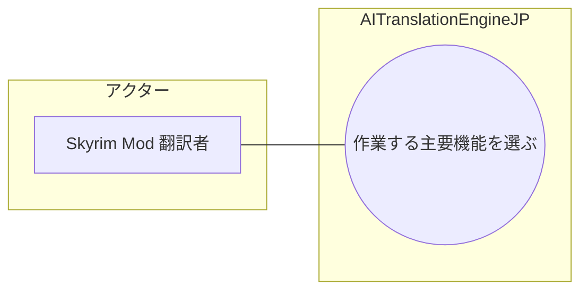

# 画面UC: ダッシュボード

## 画面

- 根拠: `docs/screen-design/screens/dashboard.md`
- 目的: 利用者が最初に移動したい主要ページを選び、共通ナビゲーションから主要ページへ切り替える。

## UML風UC図

# ユースケース: 作業する主要機能を選ぶ

## 1. 概要

- アクター: Skyrim Mod 翻訳者
- 目的: Skyrim Mod 翻訳者が、翻訳作業に必要な主要機能を選び、対象の作業画面を開ける。

## 2. 条件

- ダッシュボードを表示している。
- 移動先 route が存在する。
- 主要機能カードまたはグローバルナビゲーションを操作できる。

## 3. 主シナリオ

1. Skyrim Mod 翻訳者が、実施したい作業に対応する主要機能を選ぶ。
2. システムが、選択した主要機能と現在地を検証する。
3. システムが、選択した主要機能の作業画面へ表示を切り替える。
4. システムが、現在地表示を記録する。
5. システムが、選択中の主要機能と利用可能な作業導線を表示する。

## 4. 代替シナリオ

### A1. 現在表示中の主要機能を選ぶ

- 発生条件: Skyrim Mod 翻訳者が、現在表示中の主要機能を選択する。
- 流れ:
  1. システムが、現在地が同じであることを判定する。
  2. システムが、画面表示を維持する。
- 結果: 現在表示中の主要機能が維持される。

### A2. モバイル幅で主要機能を選ぶ

- 発生条件: Skyrim Mod 翻訳者が、主要機能一覧を折りたたむ幅で利用している。
- 流れ:
  1. Skyrim Mod 翻訳者が、主要機能一覧を表示する。
  2. システムが、移動可能な主要機能を表示する。
  3. Skyrim Mod 翻訳者が、実施したい作業に対応する主要機能を選ぶ。
- 結果: モバイル幅でも対象の作業画面を開ける。

## 5. 例外シナリオ

### E1. 選択した主要機能を開けない

- 発生条件: 主要機能定義が存在しない、または移動先 route が存在しない。
- システム応答: システムは、主要機能の切り替えを拒否し、現在の画面を維持する。
- 業務状態: 現在地は変更されない。
- 再実行条件: Skyrim Mod 翻訳者が、利用可能な主要機能を選択できる。

## 6. 完了条件

- 成功条件: 選択した主要機能の作業画面が表示され、現在地表示が更新される。
- 失敗条件: 主要機能の作業画面を開けない。
- 不変条件: 主要機能の選択は、各画面の業務データを変更しない。
