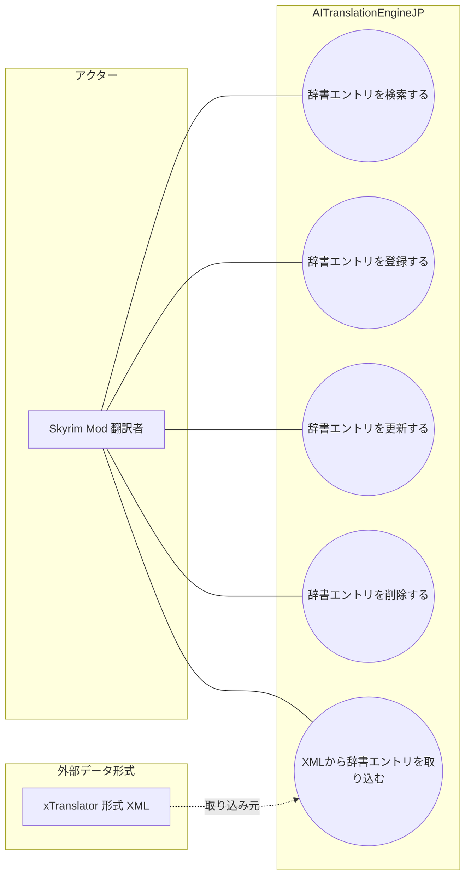

# 画面UC: マスター辞書

## 画面

- 根拠: `docs/screen-design/screens/master-dictionary.md`
- 目的: Skyrim Mod 向け翻訳の基盤データとして使うマスター辞書を検索し、詳細確認、登録、更新、削除、XML 取り込みを行う。

## UML風UC図

- 図のアクターは、画面を操作して目的を達成する人間だけに限定する。
- `xTranslator 形式 XML` は、辞書取り込みで使う外部データ形式として扱う。

# ユースケース: 辞書エントリを検索する

## 1. 概要

- アクター: Skyrim Mod 翻訳者
- 目的: Skyrim Mod 翻訳者が、翻訳時に使う辞書エントリを条件で探し、内容を確認できる。

## 2. 条件

- マスター辞書画面を開いている。
- 辞書一覧を取得できる。
- 検索語、カテゴリ、ページ位置を画面状態として保持できる。

## 3. 主シナリオ

1. Skyrim Mod 翻訳者が、検索語またはカテゴリを指定する。
2. システムが、検索条件とカテゴリ条件を検証する。
3. システムが、条件に一致する辞書エントリを抽出する。
4. システムが、検索条件、カテゴリ条件、選択状態を記録する。
5. システムが、辞書一覧、件数、ページ操作、選択エントリの詳細を表示する。

## 4. 代替シナリオ

### A1. ページを切り替える

- 発生条件: 条件に一致する辞書エントリが、現在ページの表示件数を超える。
- 流れ:
  1. Skyrim Mod 翻訳者が、前の30件または次の30件を要求する。
  2. システムが、表示ページと選択状態を更新する。
- 結果: 指定したページの辞書エントリを確認できる。

### A2. 辞書エントリが存在しない

- 発生条件: 検索条件に一致する辞書エントリがない。
- 流れ:
  1. システムが、該当なしの一覧状態を作る。
  2. システムが、詳細パネルを未選択状態にする。
- 結果: Skyrim Mod 翻訳者は、検索条件を変更できる。

## 5. 例外シナリオ

### E1. 辞書一覧を取得できない

- 発生条件: gateway 接続失敗、保存先の読込失敗、または辞書データ破損が発生する。
- システム応答: システムは、辞書一覧を更新せず、取得失敗の理由を表示する。
- 業務状態: 既に表示している一覧がある場合、既存表示を維持する。
- 再実行条件: Skyrim Mod 翻訳者が、接続状態または辞書データを回復して再表示できる。

## 6. 完了条件

- 成功条件: 条件に一致する辞書エントリ、または該当なし状態が表示される。
- 失敗条件: 辞書一覧を取得できず、検索結果を確認できない。
- 不変条件: 検索と絞り込みは、辞書エントリの登録内容を変更しない。

# ユースケース: 辞書エントリを登録する

## 1. 概要

- アクター: Skyrim Mod 翻訳者
- 目的: Skyrim Mod 翻訳者が、翻訳で再利用する原文と訳語をマスター辞書へ追加できる。

## 2. 条件

- マスター辞書画面を開いている。
- 辞書エントリの新規登録モーダルを開ける。
- 原文、カテゴリ、由来、訳語を入力できる。

## 3. 主シナリオ

1. Skyrim Mod 翻訳者が、新規登録を要求する。
2. システムが、登録モーダルの入力項目と保存可否を検証する。
3. システムが、入力された原文、カテゴリ、由来、訳語から辞書エントリを作成する。
4. システムが、辞書エントリをマスター辞書へ記録する。
5. システムが、辞書一覧と詳細パネルに登録結果を表示する。

## 4. 代替シナリオ

### A1. 登録を取り消す

- 発生条件: Skyrim Mod 翻訳者が、保存前に閉じる操作を要求する。
- 流れ:
  1. Skyrim Mod 翻訳者が、登録モーダルを閉じる。
  2. システムが、未保存の入力を破棄して一覧へ戻す。
- 結果: マスター辞書は更新されない。

## 5. 例外シナリオ

### E1. 必須項目が不足する

- 発生条件: 原文、カテゴリ、訳語など登録に必要な項目が不足している。
- システム応答: システムは、保存を拒否し、不足項目を表示する。
- 業務状態: 未保存の入力内容はモーダル内に保持される。
- 再実行条件: Skyrim Mod 翻訳者が、不足項目を入力して再度保存できる。

### E2. 辞書エントリを保存できない

- 発生条件: 保存先の書込失敗、重複制約違反、または gateway 接続失敗が発生する。
- システム応答: システムは、保存を失敗として扱い、理由を表示する。
- 業務状態: 辞書エントリはマスター辞書へ記録されない。
- 再実行条件: Skyrim Mod 翻訳者が、入力内容または接続状態を修正して再実行できる。

## 6. 完了条件

- 成功条件: 新しい辞書エントリがマスター辞書に記録され、一覧と詳細で確認できる。
- 失敗条件: 辞書エントリが記録されない。
- 不変条件: 登録に失敗した入力は、確定済み辞書エントリとして扱わない。

# ユースケース: 辞書エントリを更新する

## 1. 概要

- アクター: Skyrim Mod 翻訳者
- 目的: Skyrim Mod 翻訳者が、既存の辞書エントリの訳語や分類を修正できる。

## 2. 条件

- マスター辞書画面を開いている。
- 更新対象の辞書エントリを選択している。
- 選択中エントリの更新モーダルを開ける。

## 3. 主シナリオ

1. Skyrim Mod 翻訳者が、選択中の辞書エントリの更新を要求する。
2. システムが、更新対象、入力内容、保存可否を検証する。
3. システムが、入力内容で既存の辞書エントリを更新する。
4. システムが、更新結果をマスター辞書へ記録する。
5. システムが、辞書一覧と詳細パネルに更新結果を表示する。

## 4. 代替シナリオ

### A1. 更新を取り消す

- 発生条件: Skyrim Mod 翻訳者が、保存前に閉じる操作を要求する。
- 流れ:
  1. Skyrim Mod 翻訳者が、更新モーダルを閉じる。
  2. システムが、未保存の入力を破棄して詳細表示へ戻す。
- 結果: 既存の辞書エントリは変更されない。

## 5. 例外シナリオ

### E1. 更新対象が存在しない

- 発生条件: 選択中の辞書エントリが、更新前に削除または取得不能になっている。
- システム応答: システムは、更新を拒否し、一覧の再取得を促す。
- 業務状態: マスター辞書は変更されない。
- 再実行条件: Skyrim Mod 翻訳者が、一覧を再取得して更新対象を選び直せる。

### E2. 更新内容を保存できない

- 発生条件: 必須項目不足、制約違反、保存先の書込失敗、または gateway 接続失敗が発生する。
- システム応答: システムは、保存を失敗として扱い、理由を表示する。
- 業務状態: 更新前の辞書エントリを維持する。
- 再実行条件: Skyrim Mod 翻訳者が、入力内容または接続状態を修正して再実行できる。

## 6. 完了条件

- 成功条件: 更新後の辞書エントリがマスター辞書に記録され、一覧と詳細で確認できる。
- 失敗条件: 既存の辞書エントリが更新されない。
- 不変条件: 更新は、選択中の辞書エントリ以外へ影響しない。

# ユースケース: 辞書エントリを削除する

## 1. 概要

- アクター: Skyrim Mod 翻訳者
- 目的: Skyrim Mod 翻訳者が、不要になった辞書エントリをマスター辞書から外せる。

## 2. 条件

- マスター辞書画面を開いている。
- 削除対象の辞書エントリを選択している。
- 削除確認モーダルを開ける。

## 3. 主シナリオ

1. Skyrim Mod 翻訳者が、選択中の辞書エントリの削除を要求する。
2. システムが、削除対象と削除可否を検証する。
3. システムが、削除確認を表示し、確定操作を受け付ける。
4. システムが、確定された辞書エントリの削除を記録する。
5. システムが、削除後の一覧と次の選択状態を表示する。

## 4. 代替シナリオ

### A1. 削除を取り消す

- 発生条件: Skyrim Mod 翻訳者が、削除確認でやめる操作を要求する。
- 流れ:
  1. Skyrim Mod 翻訳者が、削除確認を閉じる。
  2. システムが、選択中エントリを維持する。
- 結果: マスター辞書は変更されない。

## 5. 例外シナリオ

### E1. 削除対象が存在しない

- 発生条件: 選択中の辞書エントリが、削除前に取得不能になっている。
- システム応答: システムは、削除を拒否し、一覧の再取得を促す。
- 業務状態: マスター辞書は変更されない。
- 再実行条件: Skyrim Mod 翻訳者が、一覧を再取得して削除対象を選び直せる。

### E2. 削除を保存できない

- 発生条件: 保存先の書込失敗、権限不足、または gateway 接続失敗が発生する。
- システム応答: システムは、削除を失敗として扱い、理由を表示する。
- 業務状態: 対象の辞書エントリは一覧に残る。
- 再実行条件: Skyrim Mod 翻訳者が、接続状態または保存先状態を回復して再実行できる。

## 6. 完了条件

- 成功条件: 削除した辞書エントリが一覧と詳細から外れる。
- 失敗条件: 削除対象の辞書エントリがマスター辞書に残る。
- 不変条件: 削除確認を確定しない限り、辞書エントリは削除しない。

# ユースケース: XMLから辞書エントリを取り込む

## 1. 概要

- アクター: Skyrim Mod 翻訳者
- 目的: Skyrim Mod 翻訳者が、xTranslator 形式 XML からマスター辞書へ辞書エントリを取り込める。

## 2. 条件

- マスター辞書画面を開いている。
- 取り込み対象の XML ファイルを選択できる。
- XML 取り込み中ではない。

## 3. 主シナリオ

1. Skyrim Mod 翻訳者が、XML ファイルを選択して取り込みを要求する。
2. システムが、XML ファイル、取り込み可否、対象エントリを検証する。
3. システムが、XML から辞書エントリを抽出して取り込む。
4. システムが、取り込み結果をマスター辞書へ記録する。
5. システムが、進捗、取り込み件数、一覧、詳細を表示する。

## 4. 代替シナリオ

### A1. XML を選び直す

- 発生条件: Skyrim Mod 翻訳者が、取り込み前に別の XML を選択する。
- 流れ:
  1. Skyrim Mod 翻訳者が、選び直す操作を要求する。
  2. システムが、選択中ファイルを解除し、新しい選択を受け付ける。
- 結果: 取り込み対象 XML が変更される。

## 5. 例外シナリオ

### E1. XML を読み込めない

- 発生条件: XML ファイルが存在しない、破損している、または形式を識別できない。
- システム応答: システムは、取り込みを中断し、読み込み失敗の理由を表示する。
- 業務状態: マスター辞書は更新されない。
- 再実行条件: Skyrim Mod 翻訳者が、読み込み可能な XML を選択して再実行できる。

### E2. 取り込み対象が許可範囲に含まれない

- 発生条件: XML 内のレコード種別または内容が、辞書取り込みの許可範囲に含まれない。
- システム応答: システムは、対象エントリの取り込みを拒否し、拒否件数または理由を表示する。
- 業務状態: 拒否されたエントリはマスター辞書へ記録されない。
- 再実行条件: Skyrim Mod 翻訳者が、取り込み対象 XML を変更して再実行できる。

## 6. 完了条件

- 成功条件: XML 由来の辞書エントリがマスター辞書へ記録され、一覧で確認できる。
- 失敗条件: XML 由来の辞書エントリが記録されない。
- 不変条件: 取り込み中は、XML 選択と取り込み開始を重複実行しない。
