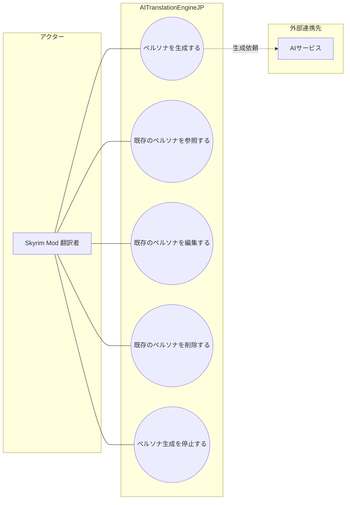

# 画面UC: マスターペルソナ

## 画面

- 根拠: `docs/screen-design/screens/master-persona.md`
- 目的: 入力 JSON と AI 設定からマスターペルソナを作成し、作成済みペルソナの検索、確認、編集、削除を行う。

## UML風UC図

- 図のアクターは、画面を操作して目的を達成する人間だけに限定する。
- `AIサービス` は、ペルソナ生成で呼び出される外部連携先として扱う。

# ユースケース: ペルソナを生成する

## 1. 概要

- アクター: Skyrim Mod 翻訳者
- 目的: Skyrim Mod 翻訳者が、入力 JSON と AI 設定から NPC のマスターペルソナを作成できる。

## 2. 条件

- マスターペルソナ画面を開いている。
- 入力 JSON を選択できる。
- AI サービス、モデル、実行方法、資格情報が生成開始条件を満たしている。

## 3. 主シナリオ

1. Skyrim Mod 翻訳者が、入力 JSON を選択し、ペルソナ作成を要求する。
2. システムが、入力 JSON、AI 設定、作成対象件数、実行状態を検証する。
3. システムが、NPC 発話と属性からマスターペルソナを生成する。
4. システムが、生成結果を NPC 識別情報に紐づけて記録する。
5. システムが、進行状況、作成件数、既存スキップ件数、生成結果一覧を表示する。

## 4. 代替シナリオ

### A1. 既存ペルソナをスキップする

- 発生条件: 入力 JSON 内の NPC に対応するマスターペルソナが既に存在する。
- 流れ:
  1. システムが、既存ペルソナを作成対象から外す。
  2. システムが、既存スキップ件数として記録する。
- 結果: 既存ペルソナを維持したまま、新規対象だけを生成する。

### A2. JSON を選び直す

- 発生条件: Skyrim Mod 翻訳者が、生成開始前に入力 JSON の変更を要求する。
- 流れ:
  1. Skyrim Mod 翻訳者が、選び直す操作を行う。
  2. システムが、選択中 JSON と候補件数を更新する。
- 結果: 新しい JSON を生成対象として確認できる。

## 5. 例外シナリオ

### E1. 入力 JSON を利用できない

- 発生条件: JSON が未選択、破損、または生成対象 NPC を識別できない状態である。
- システム応答: システムは、生成開始を拒否し、利用できない理由を表示する。
- 業務状態: マスターペルソナは生成されない。
- 再実行条件: Skyrim Mod 翻訳者が、利用可能な JSON を選択して再実行できる。

### E2. AI 設定が生成条件を満たさない

- 発生条件: AI サービス、モデル、実行方法、資格情報のいずれかが不足している。
- システム応答: システムは、生成開始を拒否し、不足している AI 設定を表示する。
- 業務状態: マスターペルソナは生成されない。
- 再実行条件: Skyrim Mod 翻訳者が、AI 設定を保存して再実行できる。

## 6. 完了条件

- 成功条件: 生成したマスターペルソナが一覧と詳細で確認できる。
- 失敗条件: マスターペルソナが生成または記録されない。
- 不変条件: 生成中は、一覧と詳細の変更操作を制限する。

# ユースケース: 既存のペルソナを参照する

## 1. 概要

- アクター: Skyrim Mod 翻訳者
- 目的: Skyrim Mod 翻訳者が、既存のマスターペルソナを検索、絞り込み、詳細確認できる。

## 2. 条件

- マスターペルソナ画面を開いている。
- ペルソナ一覧を取得できる。
- 検索語、プラグイン絞り込み、ページ位置を画面状態として保持できる。

## 3. 主シナリオ

1. Skyrim Mod 翻訳者が、検索語またはプラグインを指定する。
2. システムが、検索条件と絞り込み条件を検証する。
3. システムが、条件に一致するマスターペルソナを抽出する。
4. システムが、検索条件、絞り込み条件、選択状態を記録する。
5. システムが、ペルソナ一覧、metadata、詳細、ページ操作を表示する。

## 4. 代替シナリオ

### A1. ペルソナ行を開く

- 発生条件: 一覧に表示されたペルソナの詳細確認が必要である。
- 流れ:
  1. Skyrim Mod 翻訳者が、ペルソナ行を開く。
  2. システムが、FormID、EditorID、声、話し方、ペルソナ本文を表示する。
- 結果: 選択中ペルソナの詳細を確認できる。

### A2. ページを切り替える

- 発生条件: 条件に一致するペルソナが、現在ページの表示件数を超える。
- 流れ:
  1. Skyrim Mod 翻訳者が、前へまたは次へを要求する。
  2. システムが、表示ページと選択状態を更新する。
- 結果: 指定したページのペルソナを確認できる。

## 5. 例外シナリオ

### E1. ペルソナ一覧を取得できない

- 発生条件: gateway 接続失敗、保存先の読込失敗、またはペルソナデータ破損が発生する。
- システム応答: システムは、一覧を更新せず、取得失敗の理由を表示する。
- 業務状態: 既に表示している一覧がある場合、既存表示を維持する。
- 再実行条件: Skyrim Mod 翻訳者が、接続状態または保存先状態を回復して再表示できる。

## 6. 完了条件

- 成功条件: 条件に一致するペルソナ、または該当なし状態が表示される。
- 失敗条件: ペルソナ一覧を取得できず、参照できない。
- 不変条件: 参照、検索、ページ切り替えは、ペルソナ内容を変更しない。

# ユースケース: 既存のペルソナを編集する

## 1. 概要

- アクター: Skyrim Mod 翻訳者
- 目的: Skyrim Mod 翻訳者が、選択中のマスターペルソナの要約、話し方、本文を修正できる。

## 2. 条件

- マスターペルソナ画面を開いている。
- 編集対象のペルソナを選択している。
- 生成中などの変更不可状態ではない。

## 3. 主シナリオ

1. Skyrim Mod 翻訳者が、選択中ペルソナの編集を要求する。
2. システムが、編集対象、変更可否、入力内容を検証する。
3. システムが、要約、話し方、本文を更新する。
4. システムが、更新結果を選択中ペルソナとして記録する。
5. システムが、保存した内容を一覧と詳細へ反映する。

## 4. 代替シナリオ

### A1. 編集をキャンセルする

- 発生条件: Skyrim Mod 翻訳者が、保存前にキャンセルまたは閉じる操作を要求する。
- 流れ:
  1. Skyrim Mod 翻訳者が、編集モーダルを閉じる。
  2. システムが、未保存の入力を破棄する。
- 結果: 既存ペルソナは変更されない。

## 5. 例外シナリオ

### E1. 編集対象が変更不可である

- 発生条件: ペルソナ未選択、生成中、または保存先が変更不可状態である。
- システム応答: システムは、編集開始または保存を拒否し、変更不可理由を表示する。
- 業務状態: 既存ペルソナは変更されない。
- 再実行条件: Skyrim Mod 翻訳者が、変更可能状態になってから再実行できる。

### E2. 編集内容を保存できない

- 発生条件: 入力制約違反、保存先の書込失敗、または gateway 接続失敗が発生する。
- システム応答: システムは、保存を失敗として扱い、理由を表示する。
- 業務状態: 更新前のペルソナを維持する。
- 再実行条件: Skyrim Mod 翻訳者が、入力内容または接続状態を修正して再実行できる。

## 6. 完了条件

- 成功条件: 編集後のペルソナが記録され、一覧と詳細で確認できる。
- 失敗条件: 既存ペルソナが更新されない。
- 不変条件: 編集は、選択中ペルソナ以外へ影響しない。

# ユースケース: 既存のペルソナを削除する

## 1. 概要

- アクター: Skyrim Mod 翻訳者
- 目的: Skyrim Mod 翻訳者が、不要になったマスターペルソナを一覧から削除できる。

## 2. 条件

- マスターペルソナ画面を開いている。
- 削除対象のペルソナを選択している。
- 生成中などの変更不可状態ではない。

## 3. 主シナリオ

1. Skyrim Mod 翻訳者が、選択中ペルソナの削除を要求する。
2. システムが、削除対象と削除可否を検証する。
3. システムが、削除確認を表示し、確定操作を受け付ける。
4. システムが、確定されたペルソナの削除を記録する。
5. システムが、削除後の一覧と詳細状態を表示する。

## 4. 代替シナリオ

### A1. 削除をキャンセルする

- 発生条件: Skyrim Mod 翻訳者が、削除確認でキャンセルまたは閉じる操作を要求する。
- 流れ:
  1. Skyrim Mod 翻訳者が、削除モーダルを閉じる。
  2. システムが、選択中ペルソナを維持する。
- 結果: ペルソナ一覧は変更されない。

## 5. 例外シナリオ

### E1. 削除対象が変更不可である

- 発生条件: ペルソナ未選択、生成中、または保存先が変更不可状態である。
- システム応答: システムは、削除開始または削除確定を拒否し、変更不可理由を表示する。
- 業務状態: 対象ペルソナは一覧に残る。
- 再実行条件: Skyrim Mod 翻訳者が、変更可能状態になってから再実行できる。

### E2. 削除を保存できない

- 発生条件: 保存先の書込失敗、権限不足、または gateway 接続失敗が発生する。
- システム応答: システムは、削除を失敗として扱い、理由を表示する。
- 業務状態: 対象ペルソナは一覧に残る。
- 再実行条件: Skyrim Mod 翻訳者が、接続状態または保存先状態を回復して再実行できる。

## 6. 完了条件

- 成功条件: 削除したペルソナが一覧と詳細から外れる。
- 失敗条件: 削除対象のペルソナが一覧に残る。
- 不変条件: 削除確認を確定しない限り、ペルソナは削除しない。

# ユースケース: ペルソナ生成を停止する

## 1. 概要

- アクター: Skyrim Mod 翻訳者
- 目的: Skyrim Mod 翻訳者が、実行中のマスターペルソナ生成を一時停止または中止できる。

## 2. 条件

- マスターペルソナ画面を開いている。
- ペルソナ生成が実行中である。
- 進行状況パネルの一時停止または中止操作が有効である。

## 3. 主シナリオ

1. Skyrim Mod 翻訳者が、生成の一時停止または中止を要求する。
2. システムが、生成状態と停止可否を検証する。
3. システムが、実行中の生成処理へ停止要求を送る。
4. システムが、停止後の実行状態、処理件数、現在対象を記録する。
5. システムが、停止後の進行状況と一覧、詳細の操作可否を表示する。

## 4. 代替シナリオ

### A1. 一時停止後に再開する

- 発生条件: 生成が一時停止状態になり、再開可能な状態である。
- 流れ:
  1. Skyrim Mod 翻訳者が、生成の再開を要求する。
  2. システムが、一時停止位置から生成処理を再開する。
- 結果: ペルソナ生成が未処理対象から続行される。

## 5. 例外シナリオ

### E1. 停止対象が実行中ではない

- 発生条件: 停止要求時点で生成が完了、失敗、中止済み、または未開始である。
- システム応答: システムは、停止要求を拒否し、現在状態を表示する。
- 業務状態: 生成状態は変更されない。
- 再実行条件: ペルソナ生成が実行中になった場合に停止できる。

## 6. 完了条件

- 成功条件: 生成状態が一時停止または中止に変わり、進行状況へ反映される。
- 失敗条件: 生成状態が変更されない。
- 不変条件: 停止操作は、既に記録済みのペルソナを破棄しない。
