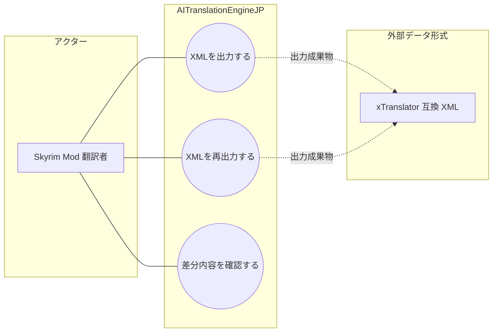

# 画面UC: 出力管理

## 画面

- 根拠: `docs/screen-design/screens/output-management.md`
- 目的: 完了済みジョブの出力準備、出力先、出力結果、差分内容を確認し、xTranslator XML を出力または再出力する。

## UML風UC図

- 図のアクターは、画面を操作して目的を達成する人間だけに限定する。
- `xTranslator 互換 XML` は、出力管理が作る外部データ形式として扱う。

# ユースケース: XMLを出力する

## 1. 概要

- アクター: Skyrim Mod 翻訳者
- 目的: Skyrim Mod 翻訳者が、選択中ジョブから xTranslator 互換 XML を出力できる。

## 2. 条件

- 出力管理画面を開いている。
- 出力可能なジョブを選択している。
- 対象ゲームと出力先 path が有効である。

## 3. 主シナリオ

1. Skyrim Mod 翻訳者が、対象ゲームと出力先 path を指定して XML 出力を要求する。
2. システムが、ジョブ状態、出力準備可否、出力先 path、送信中ではないことを検証する。
3. システムが、xTranslator 互換 XML を出力する。
4. システムが、直近結果、成果物状態、行数、ファイル path を記録する。
5. システムが、出力結果、再出力可否、差分プレビューを表示する。

## 4. 代替シナリオ

### A1. 対象ゲームを変更する

- 発生条件: Skyrim Mod 翻訳者が、出力前に対象ゲームを変更する。
- 流れ:
  1. Skyrim Mod 翻訳者が、対象ゲームを選択する。
  2. システムが、出力可否と出力条件を更新する。
- 結果: 選択した対象ゲームで XML 出力を実行できる。

## 5. 例外シナリオ

### E1. 出力条件が不足する

- 発生条件: ジョブ未選択、出力準備不可、出力先 path 不正、または送信中である。
- システム応答: システムは、XML 出力を拒否し、操作できない理由を表示する。
- 業務状態: XML 成果物は出力されない。
- 再実行条件: Skyrim Mod 翻訳者が、不足条件を解消して再実行できる。

### E2. XML 出力に失敗する

- 発生条件: ファイル書込失敗、変換失敗、または gateway 接続失敗が発生する。
- システム応答: システムは、出力を失敗として扱い、直近結果にエラー理由を表示する。
- 業務状態: 成果物状態は出力成功として扱わない。
- 再実行条件: Skyrim Mod 翻訳者が、出力先 path または接続状態を修正して再実行できる。

## 6. 完了条件

- 成功条件: xTranslator 互換 XML が出力され、直近結果で確認できる。
- 失敗条件: XML 成果物が出力されない。
- 不変条件: XML 出力は、翻訳ジョブ内の訳文を変更しない。

# ユースケース: XMLを再出力する

## 1. 概要

- アクター: Skyrim Mod 翻訳者
- 目的: Skyrim Mod 翻訳者が、既存成果物を最新条件で再出力できる。

## 2. 条件

- 出力管理画面を開いている。
- 再出力可能な成果物がある。
- 出力先 path が有効である。

## 3. 主シナリオ

1. Skyrim Mod 翻訳者が、XML 再出力を要求する。
2. システムが、成果物状態、再出力可否、出力先 path、送信中ではないことを検証する。
3. システムが、既存成果物の条件で xTranslator 互換 XML を再出力する。
4. システムが、直近結果、成果物状態、行数、ファイル path を記録する。
5. システムが、再出力結果と差分プレビューを表示する。

## 4. 代替シナリオ

### A1. 再出力不要である

- 発生条件: 既存成果物が現行版であり、再出力する必要がない。
- 流れ:
  1. システムが、再出力操作を無効にする。
  2. システムが、再出力不要の理由を表示する。
- 結果: Skyrim Mod 翻訳者は、現在の成果物を確認できる。

## 5. 例外シナリオ

### E1. 再出力条件が不足する

- 発生条件: 成果物なし、再出力不可、出力先 path 不正、または送信中である。
- システム応答: システムは、再出力を拒否し、操作できない理由を表示する。
- 業務状態: XML 成果物は更新されない。
- 再実行条件: Skyrim Mod 翻訳者が、不足条件を解消して再実行できる。

## 6. 完了条件

- 成功条件: XML 成果物が再出力され、直近結果で確認できる。
- 失敗条件: XML 成果物が再出力されない。
- 不変条件: 再出力は、翻訳ジョブ内の訳文を変更しない。

# ユースケース: 差分内容を確認する

## 1. 概要

- アクター: Skyrim Mod 翻訳者
- 目的: Skyrim Mod 翻訳者が、XML 出力に反映される原文、訳文、状態の差分を確認できる。

## 2. 条件

- 出力管理画面を開いている。
- 選択中ジョブまたは成果物の差分プレビューを取得できる。

## 3. 主シナリオ

1. Skyrim Mod 翻訳者が、差分行の確認を要求する。
2. システムが、差分プレビューと選択行を検証する。
3. システムが、翻訳単位ごとの元文、訳文、出力状態、反映結果を取得する。
4. システムが、選択中成果物 ID と選択行を記録する。
5. システムが、差分内容、互換性要約、再出力可否を表示する。

## 4. 代替シナリオ

### A1. 差分がない

- 発生条件: 差分プレビューに表示できる行がない。
- 流れ:
  1. システムが、差分なし状態を作る。
  2. システムが、差分プレビュー未取得または差分なしの理由を表示する。
- 結果: Skyrim Mod 翻訳者は、差分がないことを確認できる。

## 5. 例外シナリオ

### E1. 差分プレビューを取得できない

- 発生条件: 成果物なし、行数 0、gateway 未接続、または差分プレビュー取得失敗が発生する。
- システム応答: システムは、差分行を表示せず、取得できない理由を表示する。
- 業務状態: 選択中成果物 ID は更新されない。
- 再実行条件: Skyrim Mod 翻訳者が、成果物または接続状態を回復して再表示できる。

## 6. 完了条件

- 成功条件: 差分内容または差分なし状態を確認できる。
- 失敗条件: 差分内容を確認できない。
- 不変条件: 差分確認は、成果物や翻訳ジョブを変更しない。
