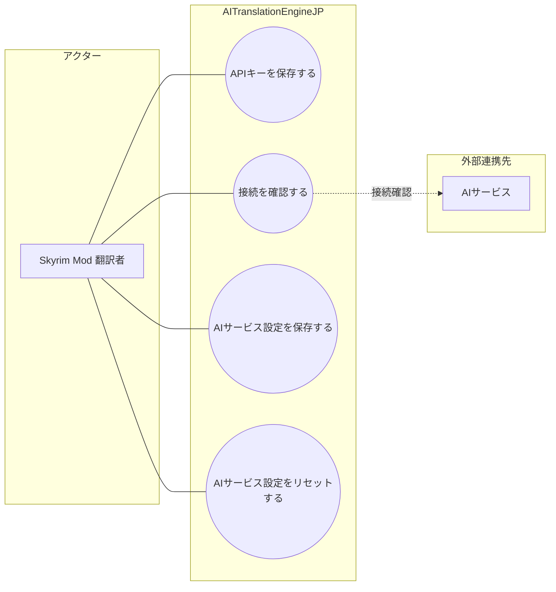

# 画面UC: AIサービス設定

## 画面

- 根拠: `docs/screen-design/screens/provider-settings.md`
- 目的: AIサービスごとのエンドポイント、APIキー状態、接続確認状態を確認し、設定を保存またはリセットする。

## UML風UC図

- 図のアクターは、画面を操作して目的を達成する人間だけに限定する。
- `AIサービス` は、接続確認で呼び出される外部連携先として扱う。

# ユースケース: APIキーを保存する

## 1. 概要

- アクター: Skyrim Mod 翻訳者
- 目的: Skyrim Mod 翻訳者が、選択中 AIサービスの APIキーを保存できる。

## 2. 条件

- AIサービス設定画面を開いている。
- APIキーが必要な AIサービスを選択している。
- APIキー入力領域を表示している。

## 3. 主シナリオ

1. Skyrim Mod 翻訳者が、APIキーを入力して保存を要求する。
2. システムが、選択中 AIサービスと APIキー入力を検証する。
3. システムが、APIキーを保存先へ記録する。
4. システムが、入力欄の値を画面状態から消す。
5. システムが、APIキー状態を保存済みとして表示する。

## 4. 代替シナリオ

### A1. APIキー入力をキャンセルする

- 発生条件: Skyrim Mod 翻訳者が、保存前にキャンセルを要求する。
- 流れ:
  1. システムが、入力中の APIキーを破棄する。
  2. システムが、APIキー入力領域を閉じる。
- 結果: APIキー状態は変更されない。

## 5. 例外シナリオ

### E1. APIキーを保存できない

- 発生条件: 保存先の書込失敗、権限不足、または選択中 AIサービスの不整合が発生する。
- システム応答: システムは、保存を失敗として扱い、エラーメッセージを表示する。
- 業務状態: APIキー状態は保存済みに更新されない。
- 再実行条件: Skyrim Mod 翻訳者が、入力内容または保存先状態を修正して再実行できる。

## 6. 完了条件

- 成功条件: APIキー状態が保存済みとして表示される。
- 失敗条件: APIキー状態が保存済みに更新されない。
- 不変条件: APIキーの生値は、保存後に画面へ残さない。

# ユースケース: 接続を確認する

## 1. 概要

- アクター: Skyrim Mod 翻訳者
- 目的: Skyrim Mod 翻訳者が、選択中 AIサービスの接続可否を確認できる。

## 2. 条件

- AIサービス設定画面を開いている。
- AIサービスを選択している。
- 接続確認中ではない。

## 3. 主シナリオ

1. Skyrim Mod 翻訳者が、接続確認を要求する。
2. システムが、選択中 AIサービス、エンドポイント、資格情報状態を検証する。
3. システムが、AIサービスへ接続確認を実行する。
4. システムが、接続確認結果を記録する。
5. システムが、接続確認状態と補足説明を表示する。

## 4. 代替シナリオ

### A1. 接続確認中に再要求する

- 発生条件: 接続確認が実行中である。
- 流れ:
  1. Skyrim Mod 翻訳者が、接続確認を再度要求する。
  2. システムが、再要求を受け付けず、接続確認中の状態を維持する。
- 結果: 接続確認は重複実行されない。

## 5. 例外シナリオ

### E1. 接続確認に失敗する

- 発生条件: エンドポイント不正、資格情報不足、通信失敗、または AIサービスの応答失敗が発生する。
- システム応答: システムは、接続確認を失敗として扱い、失敗理由を表示する。
- 業務状態: 接続確認状態は成功にならない。
- 再実行条件: Skyrim Mod 翻訳者が、設定内容を修正して再実行できる。

## 6. 完了条件

- 成功条件: 接続確認状態が成功として表示される。
- 失敗条件: 接続確認状態が失敗または未確認のままである。
- 不変条件: 接続確認は、保存済み設定を自動更新しない。

# ユースケース: AIサービス設定を保存する

## 1. 概要

- アクター: Skyrim Mod 翻訳者
- 目的: Skyrim Mod 翻訳者が、選択中 AIサービスのエンドポイントなどの設定を保存できる。

## 2. 条件

- AIサービス設定画面を開いている。
- AIサービスを選択している。
- 保存処理中ではない。

## 3. 主シナリオ

1. Skyrim Mod 翻訳者が、設定保存を要求する。
2. システムが、選択中 AIサービスと入力内容を検証する。
3. システムが、選択中 AIサービスの設定を保存する。
4. システムが、保存結果と処理状態を記録する。
5. システムが、保存通知と設定状態を表示する。

## 4. 代替シナリオ

### A1. APIキーなしで保存する

- 発生条件: 選択中 AIサービスが APIキー不要である。
- 流れ:
  1. システムが、APIキー入力を保存条件から外す。
  2. システムが、エンドポイントなどの設定だけを保存する。
- 結果: APIキー不要の AIサービス設定が保存される。

## 5. 例外シナリオ

### E1. 設定を保存できない

- 発生条件: 入力内容不正、保存先の書込失敗、または処理中の競合が発生する。
- システム応答: システムは、保存を失敗として扱い、エラーメッセージを表示する。
- 業務状態: 保存済み設定は更新されない。
- 再実行条件: Skyrim Mod 翻訳者が、入力内容または保存先状態を修正して再実行できる。

## 6. 完了条件

- 成功条件: 選択中 AIサービスの設定状態が保存済みとして表示される。
- 失敗条件: 選択中 AIサービスの設定が保存されない。
- 不変条件: 保存は、選択中 AIサービス以外の設定を変更しない。

# ユースケース: AIサービス設定をリセットする

## 1. 概要

- アクター: Skyrim Mod 翻訳者
- 目的: Skyrim Mod 翻訳者が、選択中 AIサービスの設定を初期状態へ戻せる。

## 2. 条件

- AIサービス設定画面を開いている。
- AIサービスを選択している。
- リセット処理中ではない。

## 3. 主シナリオ

1. Skyrim Mod 翻訳者が、設定リセットを要求する。
2. システムが、選択中 AIサービスとリセット可否を検証する。
3. システムが、選択中 AIサービスの設定を初期状態へ戻す。
4. システムが、APIキー入力中の値と保存待ち設定を消す。
5. システムが、リセット後の設定状態を表示する。

## 4. 代替シナリオ

### A1. 入力中の APIキーだけがある

- 発生条件: APIキー入力領域に未保存の値がある。
- 流れ:
  1. システムが、未保存の APIキー入力を破棄する。
  2. システムが、保存済み設定を初期状態へ戻す。
- 結果: 入力中の秘匿値は画面から消える。

## 5. 例外シナリオ

### E1. 設定をリセットできない

- 発生条件: 保存先の書込失敗、権限不足、または処理中の競合が発生する。
- システム応答: システムは、リセットを失敗として扱い、エラーメッセージを表示する。
- 業務状態: 保存済み設定は維持される。
- 再実行条件: Skyrim Mod 翻訳者が、保存先状態を回復して再実行できる。

## 6. 完了条件

- 成功条件: 選択中 AIサービスの設定が初期状態として表示される。
- 失敗条件: 選択中 AIサービスの設定がリセットされない。
- 不変条件: リセットは、選択中 AIサービス以外の設定を変更しない。
