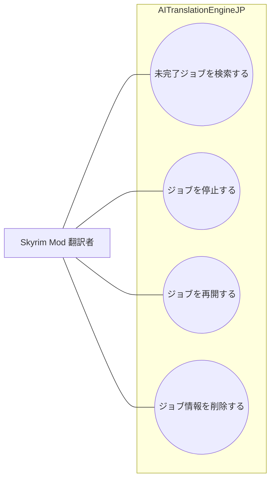
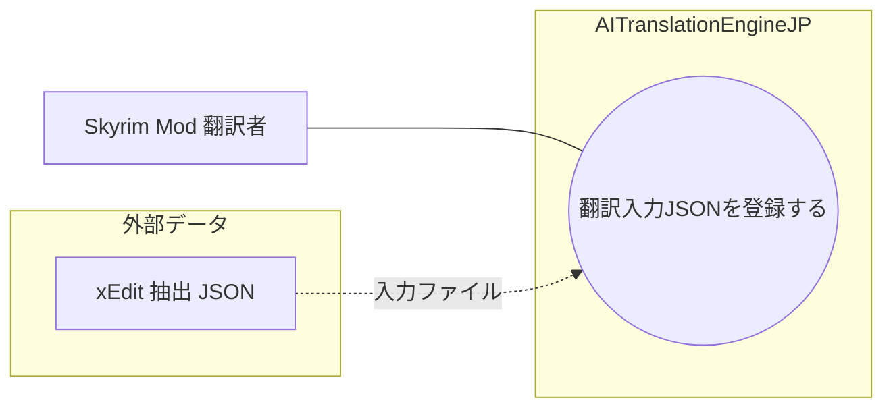
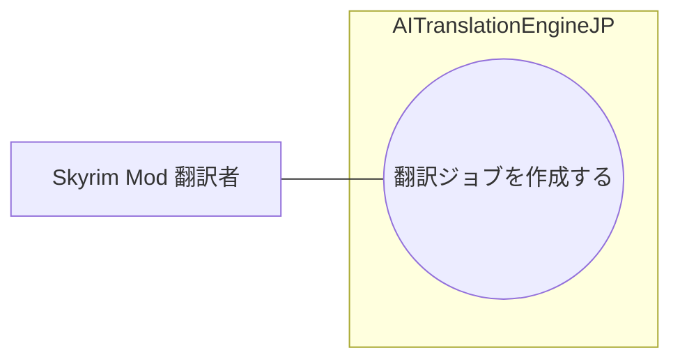
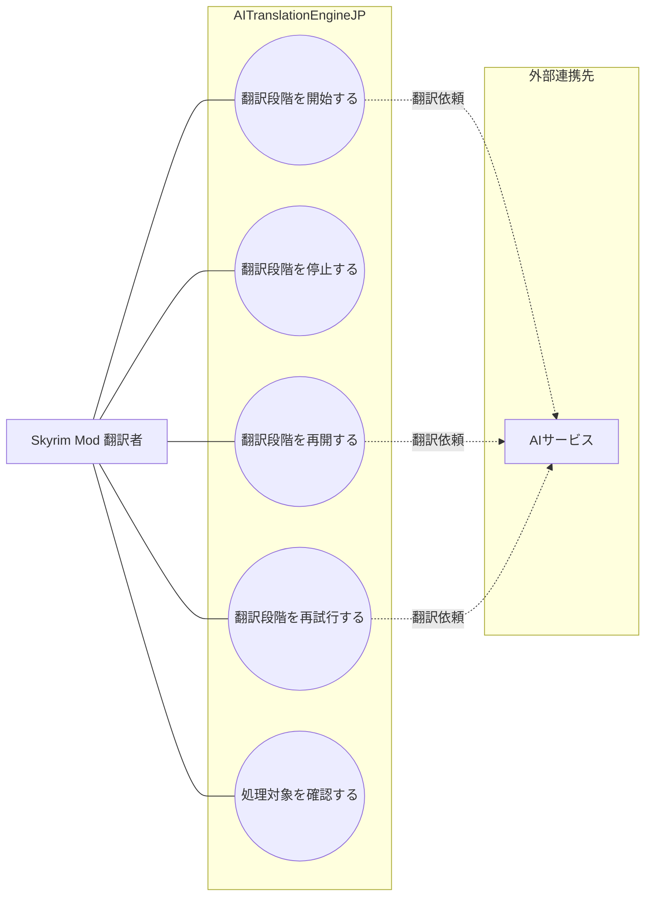
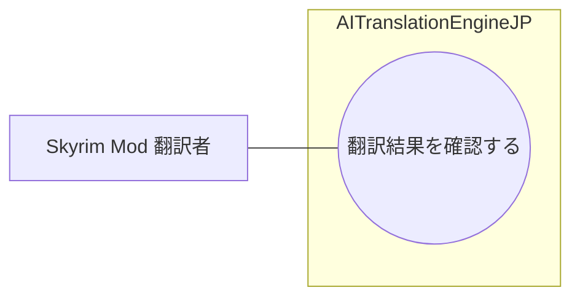

# 画面UC: 翻訳管理

## 画面

- 根拠: `docs/screen-design/screens/translation-management.md` と翻訳管理配下の各フェーズ画面
- 目的: 未完了ジョブ一覧、新規翻訳開始、入力データ確認、ジョブ作成、翻訳段階実行、翻訳結果確認を同じ翻訳管理シェルで扱う。

## 図の共通事項

- 図のアクターは、画面を操作して目的を達成する人間だけに限定する。
- `xEdit 抽出 JSON` は、翻訳入力登録で選択される外部データとして扱う。
- `AIサービス` は、翻訳処理で呼び出される外部連携先として扱う。

## フェーズ: 未完了ジョブ一覧

### UML風UC図

### ユースケース: 未完了ジョブを検索する

#### 1. 概要

- アクター: Skyrim Mod 翻訳者
- 目的: Skyrim Mod 翻訳者が、未完了ジョブを検索、絞り込み、現在段階を確認できる。

#### 2. 条件

- 未完了ジョブ一覧画面を開いている。
- 未完了ジョブ一覧を取得できる。
- 検索語と状態フィルタを画面状態として保持できる。

#### 3. 主シナリオ

1. Skyrim Mod 翻訳者が、検索語または状態フィルタを指定する。
2. システムが、検索条件と状態フィルタを検証する。
3. システムが、条件に一致する未完了ジョブを抽出する。
4. システムが、検索条件、状態フィルタ、選択状態を記録する。
5. システムが、ジョブカード、状態ラベル、現在段階、操作可否、無効理由を表示する。

#### 4. 代替シナリオ

##### A1. 現在の翻訳段階へ進む

- 発生条件: 表示中ジョブが、現在の翻訳段階を開ける状態である。
- 流れ:
  1. Skyrim Mod 翻訳者が、現在の翻訳段階へ進む操作を要求する。
  2. システムが、選択ジョブの翻訳実行画面を表示する。
- 結果: 選択ジョブの現在段階を確認できる。

##### A2. 管理対象がない

- 発生条件: 未完了ジョブが存在しない、または検索条件に一致しない。
- 流れ:
  1. システムが、空状態を作る。
  2. システムが、新規翻訳開始の導線を表示する。
- 結果: Skyrim Mod 翻訳者は、新規翻訳開始へ進める。

#### 5. 例外シナリオ

##### E1. 未完了ジョブ一覧を取得できない

- 発生条件: gateway 接続失敗、保存先の読込失敗、またはジョブデータ破損が発生する。
- システム応答: システムは、一覧を更新せず、取得失敗の通知を表示する。
- 業務状態: 既に表示している一覧がある場合、既存表示を維持する。
- 再実行条件: Skyrim Mod 翻訳者が、接続状態または保存先状態を回復して再表示できる。

#### 6. 完了条件

- 成功条件: 条件に一致する未完了ジョブ、または空状態が表示される。
- 失敗条件: 未完了ジョブ一覧を取得できない。
- 不変条件: 検索と絞り込みは、翻訳ジョブの状態を変更しない。

### ユースケース: ジョブを停止する

#### 1. 概要

- アクター: Skyrim Mod 翻訳者
- 目的: Skyrim Mod 翻訳者が、未完了ジョブ一覧から実行中ジョブを停止できる。

#### 2. 条件

- 未完了ジョブ一覧画面を開いている。
- 対象ジョブが実行中である。
- 停止操作が有効である。

#### 3. 主シナリオ

1. Skyrim Mod 翻訳者が、ジョブ停止を要求する。
2. システムが、対象ジョブ、実行状態、停止可否を検証する。
3. システムが、実行中ジョブへ停止要求を送る。
4. システムが、停止後のジョブ状態と通知を記録する。
5. システムが、停止結果、再開可否、無効理由を表示する。

#### 4. 代替シナリオ

##### A1. 停止できない理由を確認する

- 発生条件: 対象ジョブの停止操作が無効である。
- 流れ:
  1. システムが、停止できない理由をジョブカードへ表示する。
  2. Skyrim Mod 翻訳者が、対象ジョブの状態を確認する。
- 結果: Skyrim Mod 翻訳者は、停止できない理由を判断できる。

#### 5. 例外シナリオ

##### E1. 停止対象が実行中ではない

- 発生条件: 停止要求時点で対象ジョブが未開始、完了、失敗、キャンセル済み、または削除済みである。
- システム応答: システムは、停止要求を拒否し、現在状態と無効理由を表示する。
- 業務状態: 対象ジョブの状態は変更されない。
- 再実行条件: 対象ジョブが実行中になった場合に停止できる。

#### 6. 完了条件

- 成功条件: 対象ジョブが停止状態になり、再開可否が表示される。
- 失敗条件: 対象ジョブの状態が変更されない。
- 不変条件: 停止操作は、既に記録済みの翻訳結果を破棄しない。

### ユースケース: ジョブを再開する

#### 1. 概要

- アクター: Skyrim Mod 翻訳者
- 目的: Skyrim Mod 翻訳者が、中断中または再開可能な失敗状態のジョブを未完了ジョブ一覧から再開できる。

#### 2. 条件

- 未完了ジョブ一覧画面を開いている。
- 対象ジョブが再開可能である。
- 再開操作が有効である。

#### 3. 主シナリオ

1. Skyrim Mod 翻訳者が、ジョブ再開を要求する。
2. システムが、対象状態、再開位置、AI 設定、送信中ではないことを検証する。
3. システムが、停止位置または失敗位置から処理を再開する。
4. システムが、再開後の状態、進捗、処理件数を記録する。
5. システムが、必要に応じて翻訳実行画面を表示する。

#### 4. 代替シナリオ

##### A1. 一覧に留まる

- 発生条件: 再開後も翻訳実行画面へ自動遷移しない状態である。
- 流れ:
  1. システムが、一覧上のジョブ状態を更新する。
  2. システムが、再開通知を表示する。
- 結果: Skyrim Mod 翻訳者は、未完了ジョブ一覧で再開状態を確認できる。

#### 5. 例外シナリオ

##### E1. 再開条件が不足する

- 発生条件: 対象ジョブが再開可能ではない、AI 設定が不足している、または送信中である。
- システム応答: システムは、再開要求を拒否し、無効理由を表示する。
- 業務状態: 対象ジョブの状態は変更されない。
- 再実行条件: Skyrim Mod 翻訳者が、再開可能状態または不足条件を満たして再実行できる。

#### 6. 完了条件

- 成功条件: 対象ジョブが実行中になり、進行状況が更新される。
- 失敗条件: 対象ジョブが再開されない。
- 不変条件: 再開操作は、停止位置または失敗位置より前の確定済み結果を上書きしない。

### ユースケース: ジョブ情報を削除する

#### 1. 概要

- アクター: Skyrim Mod 翻訳者
- 目的: Skyrim Mod 翻訳者が、不要になった未完了ジョブの管理情報を一覧から削除できる。

#### 2. 条件

- 未完了ジョブ一覧画面を開いている。
- 削除対象の未完了ジョブが存在する。
- 削除操作が有効である。

#### 3. 主シナリオ

1. Skyrim Mod 翻訳者が、対象ジョブの削除を要求する。
2. システムが、削除対象、削除可否、削除処理中ではないことを検証する。
3. システムが、削除確認を表示し、削除確定を受け付ける。
4. システムが、対象ジョブの管理情報削除を記録する。
5. システムが、削除後の未完了ジョブ一覧と通知を表示する。

#### 4. 代替シナリオ

##### A1. 削除を取り消す

- 発生条件: Skyrim Mod 翻訳者が、削除確認で戻る操作を要求する。
- 流れ:
  1. Skyrim Mod 翻訳者が、削除確認を閉じる。
  2. システムが、対象ジョブを一覧に維持する。
- 結果: 未完了ジョブ一覧は変更されない。

#### 5. 例外シナリオ

##### E1. 削除できない状態である

- 発生条件: 対象ジョブが削除不可、処理中、取得不能、または既に削除済みである。
- システム応答: システムは、削除操作を拒否し、無効理由を表示する。
- 業務状態: 対象ジョブは一覧に残る。
- 再実行条件: Skyrim Mod 翻訳者が、削除可能な状態になってから再実行できる。

#### 6. 完了条件

- 成功条件: 対象ジョブが未完了ジョブ一覧から外れる。
- 失敗条件: 対象ジョブが未完了ジョブ一覧に残る。
- 不変条件: 削除確認を確定しない限り、ジョブ情報は削除しない。

## フェーズ: 入力データ確認

### UML風UC図

### ユースケース: 翻訳入力JSONを登録する

#### 1. 概要

- アクター: Skyrim Mod 翻訳者
- 目的: Skyrim Mod 翻訳者が、xEdit 抽出 JSON を登録し、翻訳ジョブ作成に使える入力データを得る。

#### 2. 条件

- 翻訳入力レビュー画面を開いている。
- xEdit 抽出 JSON を選択できる。
- 登録処理が実行中ではない。

#### 3. 主シナリオ

1. Skyrim Mod 翻訳者が、JSON を選択して登録を要求する。
2. システムが、JSON ファイル、登録状態、内容ハッシュ、翻訳対象を検証する。
3. システムが、JSON を読み込み済みデータとして登録する。
4. システムが、登録結果、概要、問題区分を記録する。
5. システムが、読み込み済みデータ一覧、選択データ詳細、次の作業を表示する。

#### 4. 代替シナリオ

##### A1. JSON を選び直す

- 発生条件: Skyrim Mod 翻訳者が、登録前に別の JSON を選択する。
- 流れ:
  1. Skyrim Mod 翻訳者が、選択中 JSON を取り消す。
  2. システムが、登録前のファイル情報を未選択に戻す。
- 結果: 別の JSON を登録対象として選択できる。

#### 5. 例外シナリオ

##### E1. JSON を登録できない

- 発生条件: JSON が存在しない、破損している、登録条件を満たさない、または保存に失敗する。
- システム応答: システムは、登録を失敗として扱い、理由を表示する。
- 業務状態: 翻訳ジョブ作成に使える入力データは作成されない。
- 再実行条件: Skyrim Mod 翻訳者が、登録可能な JSON を選択して再実行できる。

#### 6. 完了条件

- 成功条件: 入力データが登録済みまたは警告ありの状態になり、翻訳設定へ進める。
- 失敗条件: 入力データが登録されず、翻訳設定へ進めない。
- 不変条件: 登録処理は、既存の翻訳ジョブを変更しない。

## フェーズ: 翻訳ジョブ設定

### UML風UC図

### ユースケース: 翻訳ジョブを作成する

#### 1. 概要

- アクター: Skyrim Mod 翻訳者
- 目的: Skyrim Mod 翻訳者が、登録済み入力データと翻訳段階ごとの AI 設定から翻訳ジョブを作成できる。

#### 2. 条件

- 翻訳ジョブ設定画面を開いている。
- 登録済み入力データを選択できる。
- 単語翻訳、NPC ペルソナ生成、本文翻訳の AI 設定を確認できる。

#### 3. 主シナリオ

1. Skyrim Mod 翻訳者が、入力データと翻訳段階ごとの AI 設定を指定してジョブ作成を要求する。
2. システムが、入力データ、AI サービス、モデル、資格情報、作成前確認を検証する。
3. システムが、1つの入力データに対して1つの翻訳ジョブを作成する。
4. システムが、作成済みジョブ、入力データ、翻訳段階ごとの AI 設定を記録する。
5. システムが、作成済み要約と次の翻訳段階へ進める状態を表示する。

#### 4. 代替シナリオ

##### A1. 入力データ確認へ戻る

- 発生条件: 入力データに確認不足がある。
- 流れ:
  1. Skyrim Mod 翻訳者が、入力データの確認へ戻る。
  2. システムが、翻訳入力レビュー画面を表示する。
- 結果: Skyrim Mod 翻訳者は、入力データを確認できる。

##### A2. 保存済み AI 設定を選び直す

- 発生条件: 翻訳段階ごとの AI 設定が作成目的に合わない。
- 流れ:
  1. Skyrim Mod 翻訳者が、保存済み AI 設定から別の設定を選ぶ。
  2. システムが、翻訳段階ごとの作成条件を再評価する。
- 結果: 翻訳段階ごとの AI 設定をジョブ作成条件に合わせられる。

#### 5. 例外シナリオ

##### E1. 作成条件が不足する

- 発生条件: 入力データ、AI 設定、資格情報、作成前確認のいずれかが不足している。
- システム応答: システムは、作成操作を無効にし、作成できない理由を表示する。
- 業務状態: 翻訳ジョブは作成されない。
- 再実行条件: Skyrim Mod 翻訳者が、不足条件を解消して再実行できる。

##### E2. ジョブ作成に失敗する

- 発生条件: 保存先の書込失敗、既存 job 状態の制約違反、または gateway 接続失敗が発生する。
- システム応答: システムは、作成を失敗として扱い、理由を表示する。
- 業務状態: 作成済みジョブとして扱わない。
- 再実行条件: Skyrim Mod 翻訳者が、接続状態または入力条件を修正して再実行できる。

#### 6. 完了条件

- 成功条件: 翻訳ジョブが作成され、作成済み要約で確認できる。
- 失敗条件: 翻訳ジョブが作成されない。
- 不変条件: 1つの翻訳ジョブは、1つの入力データだけを対象にする。

## フェーズ: 翻訳実行

### UML風UC図

### ユースケース: 翻訳段階を開始する

#### 1. 概要

- アクター: Skyrim Mod 翻訳者
- 目的: Skyrim Mod 翻訳者が、単語翻訳、NPC ペルソナ生成、本文翻訳の現在段階を開始できる。

#### 2. 条件

- 翻訳実行シェルで選択ジョブを開いている。
- 現在段階が開始可能である。
- 現在段階の AI 設定が開始条件を満たしている。

#### 3. 主シナリオ

1. Skyrim Mod 翻訳者が、現在段階の開始を要求する。
2. システムが、ジョブ状態、段階状態、AI 設定、送信中ではないことを検証する。
3. システムが、現在段階の翻訳処理を開始する。
4. システムが、段階状態、進捗、処理済み件数、成功件数、失敗件数を記録する。
5. システムが、進行状況、処理対象一覧、操作可否を表示する。

#### 4. 代替シナリオ

##### A1. 開始後に次の段階へ進む

- 発生条件: 現在段階が完了し、次の段階へ進む条件を満たす。
- 流れ:
  1. Skyrim Mod 翻訳者が、次へ進む操作を要求する。
  2. システムが、次の段階画面を表示する。
- 結果: 翻訳ジョブは次の翻訳段階で処理を続けられる。

#### 5. 例外シナリオ

##### E1. 開始条件が不足する

- 発生条件: ジョブ状態、段階状態、AI 設定、資格情報、または処理対象が開始条件を満たさない。
- システム応答: システムは、開始操作を拒否し、開始できない理由を表示する。
- 業務状態: 現在段階は開始されない。
- 再実行条件: Skyrim Mod 翻訳者が、不足条件を解消して再実行できる。

##### E2. 翻訳処理の開始に失敗する

- 発生条件: AIサービスの呼び出し、保存先の書込、または gateway 接続に失敗する。
- システム応答: システムは、段階状態を失敗として扱い、エラー文を状態概要へ表示する。
- 業務状態: 失敗した段階は、出力可能な完了状態として扱わない。
- 再実行条件: Skyrim Mod 翻訳者が、失敗理由を解消してリトライできる。

#### 6. 完了条件

- 成功条件: 現在段階が実行中または完了状態になり、進行状況が更新される。
- 失敗条件: 現在段階が開始されない、または失敗状態になる。
- 不変条件: 開始操作は、選択ジョブの現在段階だけを対象にする。

### ユースケース: 翻訳段階を停止する

#### 1. 概要

- アクター: Skyrim Mod 翻訳者
- 目的: Skyrim Mod 翻訳者が、実行中の翻訳段階を中断またはキャンセルできる。

#### 2. 条件

- 翻訳実行シェルで選択ジョブを開いている。
- 現在段階が実行中である。
- 中断またはキャンセル操作が有効である。

#### 3. 主シナリオ

1. Skyrim Mod 翻訳者が、中断またはキャンセルを要求する。
2. システムが、現在段階、停止可否、送信中ではないことを検証する。
3. システムが、実行中の翻訳段階へ停止要求を送る。
4. システムが、停止後の段階状態と進捗を記録する。
5. システムが、停止結果、再開可否、無効理由を表示する。

#### 4. 代替シナリオ

##### A1. NPC ペルソナ生成または本文翻訳をキャンセルする

- 発生条件: 現在段階がキャンセル可能である。
- 流れ:
  1. Skyrim Mod 翻訳者が、キャンセルを要求する。
  2. システムが、段階状態をキャンセル後の状態として記録する。
- 結果: 現在段階はキャンセル済みとして扱われる。

#### 5. 例外シナリオ

##### E1. 停止対象が実行中ではない

- 発生条件: 停止要求時点で現在段階が未開始、完了、失敗、またはキャンセル済みである。
- システム応答: システムは、停止要求を拒否し、現在状態を表示する。
- 業務状態: 現在段階の状態は変更されない。
- 再実行条件: 現在段階が実行中になった場合に停止できる。

#### 6. 完了条件

- 成功条件: 現在段階が中断またはキャンセル後の状態になり、進行状況へ反映される。
- 失敗条件: 現在段階の状態が変更されない。
- 不変条件: 停止操作は、既に記録済みの翻訳結果を破棄しない。

### ユースケース: 翻訳段階を再開する

#### 1. 概要

- アクター: Skyrim Mod 翻訳者
- 目的: Skyrim Mod 翻訳者が、中断中または再開可能な失敗状態の翻訳段階を再開できる。

#### 2. 条件

- 翻訳実行シェルで選択ジョブを開いている。
- 現在段階が再開可能である。
- 再開操作が有効である。

#### 3. 主シナリオ

1. Skyrim Mod 翻訳者が、現在段階の再開を要求する。
2. システムが、対象状態、再開位置、AI 設定、送信中ではないことを検証する。
3. システムが、停止位置または失敗位置から処理を再開する。
4. システムが、再開後の状態、進捗、処理件数を記録する。
5. システムが、進行状況、処理対象一覧、操作可否を表示する。

#### 4. 代替シナリオ

##### A1. 再開後に処理対象を確認する

- 発生条件: 再開後の現在段階に処理対象一覧がある。
- 流れ:
  1. システムが、現在段階の処理対象一覧を表示する。
  2. Skyrim Mod 翻訳者が、再開後の処理対象を確認する。
- 結果: 再開処理の対象範囲を確認できる。

#### 5. 例外シナリオ

##### E1. 再開条件が不足する

- 発生条件: 現在段階が再開可能ではない、AI 設定が不足している、または送信中である。
- システム応答: システムは、再開要求を拒否し、無効理由を表示する。
- 業務状態: 現在段階の状態は変更されない。
- 再実行条件: Skyrim Mod 翻訳者が、再開可能状態または不足条件を満たして再実行できる。

#### 6. 完了条件

- 成功条件: 現在段階が実行中になり、進行状況が更新される。
- 失敗条件: 現在段階が再開されない。
- 不変条件: 再開操作は、停止位置または失敗位置より前の確定済み結果を上書きしない。

### ユースケース: 翻訳段階を再試行する

#### 1. 概要

- アクター: Skyrim Mod 翻訳者
- 目的: Skyrim Mod 翻訳者が、再試行可能な失敗状態の翻訳段階をリトライできる。

#### 2. 条件

- 翻訳実行シェルで選択ジョブを開いている。
- 現在段階が再試行可能な失敗状態である。
- リトライ操作が有効である。

#### 3. 主シナリオ

1. Skyrim Mod 翻訳者が、現在段階のリトライを要求する。
2. システムが、失敗状態、再試行可否、AI 設定、送信中ではないことを検証する。
3. システムが、失敗した処理対象または段階を再試行する。
4. システムが、再試行後の状態、進捗、成功件数、失敗件数を記録する。
5. システムが、状態概要、進行状況、エラー文を更新する。

#### 4. 代替シナリオ

##### A1. 一部の処理対象だけが失敗している

- 発生条件: 現在段階に成功済み対象と失敗対象が混在している。
- 流れ:
  1. システムが、再試行対象を失敗対象に限定する。
  2. システムが、成功済み対象を維持したまま再試行結果を記録する。
- 結果: 成功済み結果を保持したまま、失敗対象を再処理できる。

#### 5. 例外シナリオ

##### E1. 再試行できない失敗である

- 発生条件: 失敗状態が回復不能、入力破損、または再試行条件外である。
- システム応答: システムは、リトライ操作を無効にし、再試行できない理由を表示する。
- 業務状態: 現在段階は失敗状態のまま維持される。
- 再実行条件: Skyrim Mod 翻訳者が、入力または設定を修正して再開可能な状態にできる場合に再実行できる。

#### 6. 完了条件

- 成功条件: 再試行後の処理結果が記録され、現在段階が実行中または完了状態になる。
- 失敗条件: 現在段階が再試行されない、または再び失敗状態になる。
- 不変条件: リトライ操作は、成功済みの確定結果を不要に再翻訳しない。

### ユースケース: 処理対象を確認する

#### 1. 概要

- アクター: Skyrim Mod 翻訳者
- 目的: Skyrim Mod 翻訳者が、現在段階で処理、生成、確認する対象を検索し、詳細を確認できる。

#### 2. 条件

- 翻訳実行シェルで選択ジョブを開いている。
- 現在段階に処理対象一覧がある。
- 検索語、ページ位置、行展開状態を画面状態として保持できる。

#### 3. 主シナリオ

1. Skyrim Mod 翻訳者が、検索語、ページ切り替え、または処理対象行の開閉を要求する。
2. システムが、現在段階、処理対象一覧、検索条件を検証する。
3. システムが、条件に一致する処理対象を抽出する。
4. システムが、検索語、ページ位置、行展開状態を記録する。
5. システムが、処理対象名、処理対象詳細、metadata、ページ操作を表示する。

#### 4. 代替シナリオ

##### A1. 処理対象がない

- 発生条件: 現在段階に表示できる処理対象がない。
- 流れ:
  1. システムが、空状態を表示する。
  2. システムが、現在段階の進行状況を維持する。
- 結果: Skyrim Mod 翻訳者は、処理対象がないことを確認できる。

#### 5. 例外シナリオ

##### E1. 処理対象を表示できない

- 発生条件: 選択ジョブがない、現在段階の画面状態がない、または処理対象取得に失敗する。
- システム応答: システムは、処理対象一覧を表示せず、未完了一覧へ戻る導線または取得失敗理由を表示する。
- 業務状態: 現在段階の処理状態は変更されない。
- 再実行条件: Skyrim Mod 翻訳者が、選択ジョブまたは接続状態を回復して再表示できる。

#### 6. 完了条件

- 成功条件: 処理対象一覧または空状態を確認できる。
- 失敗条件: 処理対象一覧を確認できない。
- 不変条件: 処理対象確認は、翻訳結果や段階状態を変更しない。

## フェーズ: 翻訳完了確認

### UML風UC図

### ユースケース: 翻訳結果を確認する

#### 1. 概要

- アクター: Skyrim Mod 翻訳者
- 目的: Skyrim Mod 翻訳者が、本文翻訳完了後の原文と訳文を確認できる。

#### 2. 条件

- 翻訳完了確認画面を開いている。
- 本文翻訳段階が完了している。
- 翻訳結果をページ単位で表示できる。

#### 3. 主シナリオ

1. Skyrim Mod 翻訳者が、翻訳結果の確認を要求する。
2. システムが、選択ジョブ、本文翻訳状態、表示対象ページを検証する。
3. システムが、翻訳項目単位の原文、訳文、出力状態を取得する。
4. システムが、表示ページ、開閉状態、選択状態を記録する。
5. システムが、翻訳結果行、原文、訳文、ページ操作、出力管理への導線を表示する。

#### 4. 代替シナリオ

##### A1. 原文または訳文を開閉する

- 発生条件: Skyrim Mod 翻訳者が、翻訳結果行の原文または訳文の詳細確認を要求する。
- 流れ:
  1. Skyrim Mod 翻訳者が、原文または訳文を開閉する。
  2. システムが、対象行の表示状態を更新する。
- 結果: 必要な翻訳結果だけを展開して確認できる。

##### A2. 結果ページを切り替える

- 発生条件: 翻訳結果が複数ページに分かれている。
- 流れ:
  1. Skyrim Mod 翻訳者が、前へまたは次へを要求する。
  2. システムが、表示ページを更新する。
- 結果: 別ページの翻訳結果を確認できる。

#### 5. 例外シナリオ

##### E1. 翻訳結果を表示できない

- 発生条件: 選択ジョブがない、本文翻訳段階の状態がない、または翻訳結果を取得できない。
- システム応答: システムは、翻訳結果を表示せず、未完了一覧へ戻る導線または取得失敗理由を表示する。
- 業務状態: XML 出力対象にできるかの判断は完了しない。
- 再実行条件: Skyrim Mod 翻訳者が、選択ジョブまたは本文翻訳状態を回復して再表示できる。

#### 6. 完了条件

- 成功条件: 原文と訳文を確認でき、XML 出力対象にできるか判断できる。
- 失敗条件: 翻訳結果を表示できない。
- 不変条件: 翻訳結果確認は、訳文や出力状態を変更しない。
